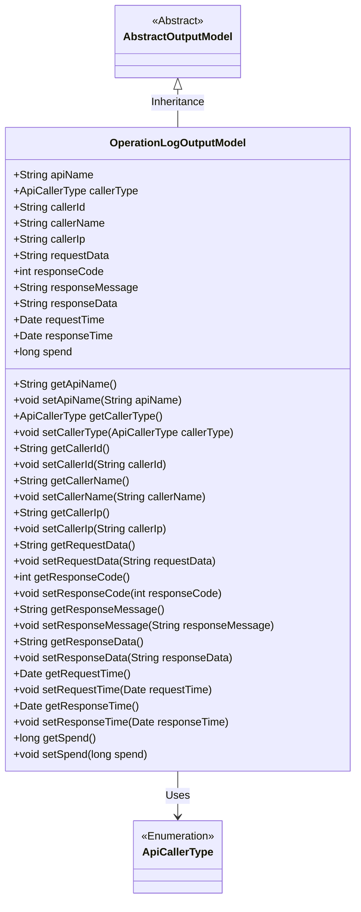

# Basic Information

|      |      |
|------|------|
| Name | OperationLogOutputModel |
| Language | .java |
| Code Path | WeFe/fusion/fusion-service/src/main/java/com/welab/wefe/data/fusion/service/dto/entity/OperationLogOutputModel.java |
| Package Name | com.welab.wefe.data.fusion.service.dto.entity |
| Dependencies | ['com.welab.wefe.common.fieldvalidate.annotation.Check', 'com.welab.wefe.common.web.delegate.api_log.ApiCallerType', 'org.apache.commons.lang3.StringUtils', 'java.util.Date'] |
| Brief Description | The OperationLogOutputModel class records API operation logs, including fields such as interface name, caller information, request/response data, and time consumption. |

# Description

The `OperationLogOutputModel` class inherits from `AbstractOutputModel` and is used to record API operation logs. It includes fields such as the requested interface name, caller type, ID, name, IP address, request parameters, response code, message, content, request time, response time, and duration. Each field has corresponding getter and setter methods for easy data access. The default caller type is `User`. This class comprehensively records key information of API calls, facilitating the tracking and analysis of operation logs.

# Class Summary

| Name   | Type  | Description |
|-------|------|-------------|
| OperationLogOutputModel | class | The OperationLogOutputModel class records API operation logs, including fields such as interface name, caller information, request/response data, and time consumption. |

## Class OperationLogOutputModel

|      |      |
|------|------|
| Access Modifier | public |
| Type | class |
| Name | OperationLogOutputModel |
| Description | The OperationLogOutputModel class records API operation logs, including fields such as interface name, caller information, request/response data, and time consumption. |

### UML Class Diagram

This code defines an operation log output model `OperationLogOutputModel`, which inherits from the abstract class `AbstractOutputModel`. The class contains various API call-related attributes such as interface name, caller information, request/response data, timestamps, etc., and provides complete getter/setter methods. The `callerType` attribute uses the enumeration type `ApiCallerType`. This model is primarily used to record complete API call operation log information for subsequent auditing and analysis.

### Internal Method Call Graph

```mermaid
graph TD
    A["Class OperationLogOutputModel"]
    B["Inherits: AbstractOutputModel"]
    C["Property: String apiName"]
    D["Property: ApiCallerType callerType"]
    E["Property: String callerId"]
    F["Property: String callerName"]
    G["Property: String callerIp"]
    H["Property: String requestData"]
    I["Property: int responseCode"]
    J["Property: String responseMessage"]
    K["Property: String responseData"]
    L["Property: Date requestTime"]
    M["Property: Date responseTime"]
    N["Property: long spend"]
    O["Method: getter/setter group"]

    A --> B
    A --> C
    A --> D
    A --> E
    A --> F
    A --> G
    A --> H
    A --> I
    A --> J
    A --> K
    A --> L
    A --> M
    A --> N
    A --> O
```

This flowchart illustrates the structure of the OperationLogOutputModel class, which inherits from AbstractOutputModel and contains 12 property fields (such as apiName, callerType, etc.) along with corresponding getter/setter method groups. All properties are public fields designed to record comprehensive API operation log information, including request parameters, response data, and key metrics like processing time. The class follows the standard JavaBean pattern, with property access uniformly managed through method groups.

### Field List

| Name  | Type  | Description |
|-------|-------|------|
| responseTime | Date | Declare a public variable responseTime of type Date. |
| requestData | String | Declare a public string variable requestData. |
| callerIp | String | Declare a public string variable callerIp to store the caller's IP address. |
| callerName | String | Common string variable storing the caller name. |
| requestTime | Date | Declare a public Date type variable named requestTime. |
| responseCode | int | Define an integer variable responseCode to store the response code. |
| spend | long | The variable `spend` is of type long integer, used to store expenditure amounts. |
| callerType = ApiCallerType.User | ApiCallerType | API caller type is set to user. |
| apiName | String | Defined a public string-type variable apiName. |
| responseMessage | String | The public string variable responseMessage is used to store response messages. |
| callerId | String | A public string variable `callerId` is defined to store caller identification information. |
| responseData | String | The public string variable responseData is used to store response data. |

### Method List

| Name  | Type  | Description |
|-------|-------|------|
| setResponseMessage | void | Methods for setting response messages, assigning the input parameters to the member variable responseMessage of the class. |
| getCallerName | String | The method getCallerName returns the string value of callerName. |
| setRequestTime | void | This is a Java method used to set the request time. The method is named setRequestTime, which takes a Date-type parameter requestTime and assigns it to the class's member variable of the same name. |
| setResponseData | void | Method for setting response data, which assigns the input string to the responseData member variable of the class. |
| getResponseData | String | Methods to obtain response data, returning a string-type variable `responseData`. |
| getCallerIp | String | Methods to obtain the caller's IP address, returning a string-type value `callerIp`. |
| getRequestData | String | Methods to obtain request data, returns requestData of string type. |
| getResponseMessage | String | Methods to obtain the response message, returning a string-type variable `responseMessage`. |
| getCallerId | String | Methods to obtain the caller ID, returning a string-type callerId. |
| setResponseTime | void | The method to set the response time assigns the incoming date parameter to the `responseTime` property of the class. |
| setResponseCode | void | Methods for setting HTTP response status codes, assigning the incoming integer value to the class's responseCode member variable. |
| setCallerIp | void | Methods for setting the caller IP address. |
| setCallerId | void | The method to set the caller ID assigns the parameter `callerId` to the `callerId` field of the current object. |
| getResponseCode | int | Methods to obtain HTTP response status codes, returning the integer value of the variable `responseCode`. |
| getApiName | String | This is a Java method that returns the value of the apiName property as a string. |
| setApiName | void | Method to set the API name, assigning the input parameter to the class member variable apiName. |
| getSpend | long | The method returns the value of the spend variable. |
| setCallerType | void | This method is used to set the caller type, assigning the passed ApiCallerType parameter to the class's callerType member variable. |
| getCallerType | ApiCallerType | Methods to obtain the caller type, returns an ApiCallerType object. |
| getRequestTime | Date | Methods to obtain the request time, returning a Date type value. |
| getResponseTime | Date | Methods to obtain the response time, returning a Date type value. |
| setRequestData | void | Java Method: Set Request Data, assigns the input string to the class member variable requestData. |
| setCallerName | void | The method to set the caller name assigns the parameter `callerName` to the `callerName` property of the current object. |
| setSpend | void | The method to set the spending amount assigns the parameter value to the class variable `spend`. |

