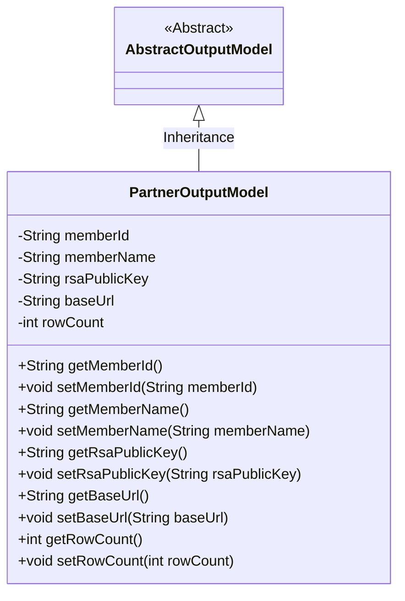

# Basic Information

|      |      |
|------|------|
| Name | PartnerOutputModel |
| Language | .java |
| Code Path | WeFe/fusion/fusion-service/src/main/java/com/welab/wefe/data/fusion/service/dto/entity/PartnerOutputModel.java |
| Package Name | com.welab.wefe.data.fusion.service.dto.entity |
| Dependencies | [] |
| Brief Description | The PartnerOutputModel class inherits from AbstractOutputModel and includes member fields such as ID, name, RSA public key, base URL, and row number, providing getter and setter methods for each attribute. |

# Description

The `PartnerOutputModel` class inherits from `AbstractOutputModel` and includes five attributes: `memberId` represents the member ID, `memberName` denotes the member name, `rsaPublicKey` stores the RSA public key, `baseUrl` records the base URL, and `rowCount` holds the row count. Each attribute has corresponding getter and setter methods for read and write operations.

# Class Summary

| Name   | Type  | Description |
|-------|------|-------------|
| PartnerOutputModel | class | The PartnerOutputModel class inherits from AbstractOutputModel and includes member fields such as ID, name, RSA public key, base URL, and row number, along with their corresponding getter/setter methods. |

## Class PartnerOutputModel

|      |      |
|------|------|
| Access Modifier | public |
| Type | class |
| Name | PartnerOutputModel |
| Description | The PartnerOutputModel class inherits from AbstractOutputModel and includes member fields such as ID, name, RSA public key, base URL, and row number, along with their corresponding getter/setter methods. |

### UML Class Diagram

This code defines a `PartnerOutputModel` class that inherits from the abstract class `AbstractOutputModel`. The class contains five private fields: `memberId`, `memberName`, `rsaPublicKey`, `baseUrl`, and `rowCount`, along with public getter and setter methods for each field. This class is primarily used to encapsulate partner-related output data models, including member ID, name, RSA public key, base URL, and row count information. Through the inheritance relationship, it extends the functionality of the base output model.

### Internal Method Call Graph

```mermaid
graph TD
    A["Class PartnerOutputModel"]
    B["Inherits from: AbstractOutputModel"]
    C["Property: String memberId"]
    D["Property: String memberName"]
    E["Property: String rsaPublicKey"]
    F["Property: String baseUrl"]
    G["Property: int rowCount"]
    H["Method: getMemberId()/setMemberId()"]
    I["Method: getMemberName()/setMemberName()"]
    J["Method: getRsaPublicKey()/setRsaPublicKey()"]
    K["Method: getBaseUrl()/setBaseUrl()"]
    L["Method: getRowCount()/setRowCount()"]

    A --> B
    A --> C
    A --> D
    A --> E
    A --> F
    A --> G
    A --> H
    A --> I
    A --> J
    A --> K
    A --> L
```

This flowchart illustrates the structure of the PartnerOutputModel class, including its inheritance relationship and member properties. The class inherits from AbstractOutputModel and contains 5 private properties (memberId, memberName, etc.) along with their corresponding getter/setter methods. Each property and method is connected to the main class via arrows, clearly demonstrating the hierarchical relationships of data encapsulation and access control.

### Field List

| Name  | Type  | Description |
|-------|-------|------|
| memberName | String | Declare a member variable of string type named memberName. |
| rowCount | int | Declare an integer variable rowCount to record the number of rows. |
| memberId | String | Member ID string variable |
| baseUrl | String | Define a string variable baseUrl to store the base URL address. |
| rsaPublicKey | String | RSA public key string variable. |

### Method List

| Name  | Type  | Description |
|-------|-------|------|
| setMemberName | void | The method to set the member variable memberName, with a parameter of type String. |
| setMemberId | void | The method to set the member ID assigns the parameter memberId to the memberId property of the current object. |
| getRsaPublicKey | String | Methods to obtain the RSA public key, returning a string-type rsaPublicKey. |
| getRowCount | int | Methods to get the current row count, returning the rowCount value. |
| getMemberName | String | Methods to obtain the member name, returning the memberName string. |
| getBaseUrl | String | The method returns the baseUrl string. |
| setBaseUrl | void | The method to set the base URL assigns the input parameter `baseUrl` to the class member variable `baseUrl`. |
| setRsaPublicKey | void | The method to set the RSA public key assigns the input string to the class's rsaPublicKey member variable. |
| getMemberId | String | Methods to obtain the member ID, which returns a string-type memberId. |
| setRowCount | void | The method `setRowCount` is used to set the number of rows, with the parameter `rowCount` being directly assigned to the member variable `this.rowCount`. |

