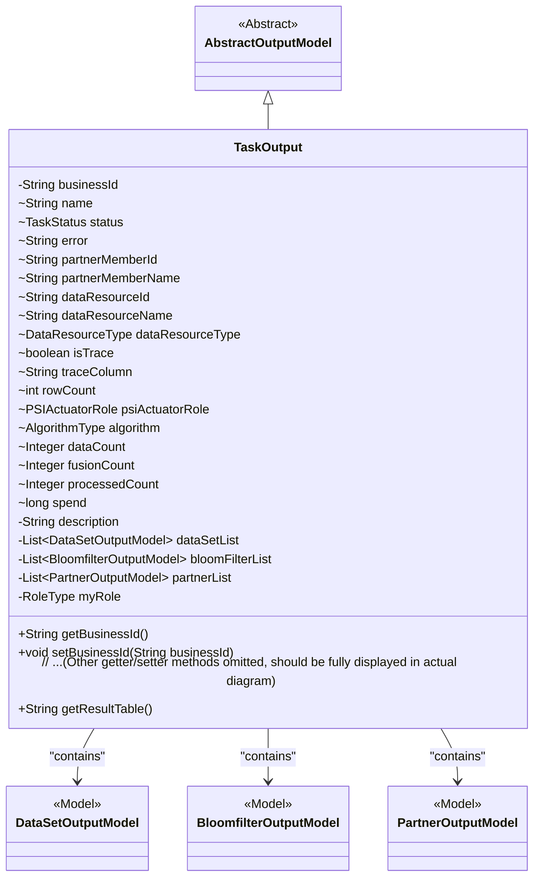

# Basic Information

|      |      |
|------|------|
| Name | TaskOutput |
| Language | .java |
| Code Path | WeFe/fusion/fusion-service/src/main/java/com/welab/wefe/data/fusion/service/dto/entity/TaskOutput.java |
| Package Name | com.welab.wefe.data.fusion.service.dto.entity |
| Dependencies | ['com.welab.wefe.data.fusion.service.dto.entity.bloomfilter.BloomfilterOutputModel', 'com.welab.wefe.data.fusion.service.dto.entity.dataset.DataSetOutputModel', 'com.welab.wefe.data.fusion.service.enums', 'java.util.List'] |
| Brief Description | The TaskOutput class inherits from AbstractOutputModel and includes attributes such as task ID, name, status, error message, data resources, tracking tags, row count, algorithm type, processing count, time consumption, and dataset list, which are used to manage task output data. |

# Description

The `TaskOutput` class is a model class that inherits from `AbstractOutputModel`, used to represent task output information. This class includes multiple fields, such as business ID, task name, status, error message, partner member ID and name, data resource ID, name and type, tracking-related fields, row count, PSI execution role, algorithm type, data count, fusion count, processing count, time consumption, description, dataset list, Bloom filter list, partner list, and role type. Additionally, it provides getter and setter methods for all fields, as well as a method that returns the result table name based on the task status and fusion count.

# Class Summary

| Name   | Type  | Description |
|-------|------|-------------|
| TaskOutput | class | The TaskOutput class contains task ID, name, status, error message, member and resource information, data statistics, algorithm type, dataset list, and result table generation method. |

## Class TaskOutput

|      |      |
|------|------|
| Access Modifier | public |
| Type | class |
| Name | TaskOutput |
| Description | The TaskOutput class contains task ID, name, status, error message, member and resource information, data statistics, algorithm type, dataset list, and result table generation method. |

### UML Class Diagram

This code defines a `TaskOutput` class that inherits from `AbstractOutputModel`, representing a complex data structure for task output results. The class includes basic task information (e.g., business ID, name, status), resource details (data resource ID/name/type), execution metrics (data volume/fusion count/processing time), and three associated model lists (dataset/Bloom filter/partner). Notably, it provides the `getResultTable()` method to generate a result table name upon task success, reflecting tight integration between business logic and data models.

### Internal Method Call Graph

```mermaid
graph TD
    A["Class TaskOutput"]
    B["Inherits: AbstractOutputModel"]
    C["Property: String businessId"]
    D["Property: String name"]
    E["Property: TaskStatus status"]
    F["Property: String error"]
    G["Property: String partnerMemberId"]
    H["Property: String partnerMemberName"]
    I["Property: String dataResourceId"]
    J["Property: String dataResourceName"]
    K["Property: DataResourceType dataResourceType"]
    L["Property: boolean isTrace"]
    M["Property: String traceColumn"]
    N["Property: int rowCount"]
    O["Property: PSIActuatorRole psiActuatorRole"]
    P["Property: AlgorithmType algorithm"]
    Q["Property: Integer dataCount"]
    R["Property: Integer fusionCount"]
    S["Property: Integer processedCount"]
    T["Property: long spend"]
    U["Property: String description"]
    V["Property: List<DataSetOutputModel> dataSetList"]
    W["Property: List<BloomfilterOutputModel> bloomFilterList"]
    X["Property: List<PartnerOutputModel> partnerList"]
    Y["Property: RoleType myRole"]
    Z["Method: getResultTable()"]

    A --> B
    A --> C
    A --> D
    A --> E
    A --> F
    A --> G
    A --> H
    A --> I
    A --> J
    A --> K
    A --> L
    A --> M
    A --> N
    A --> O
    A --> P
    A --> Q
    A --> R
    A --> S
    A --> T
    A --> U
    A --> V
    A --> W
    A --> X
    A --> Y
    A --> Z
```

This code defines a class named TaskOutput, which inherits from AbstractOutputModel and is primarily used to encapsulate task output-related properties and methods. The class includes multiple properties such as business ID, task status, error messages, data resource information, etc., along with corresponding getter and setter methods. Notably, the getResultTable method returns the result table name based on the task status and fusion count. The class has a clear structure, with properties covering various aspects of task output, making it convenient to manage and manipulate task data.

### Field List

| Name  | Type  | Description |
|-------|-------|------|
| spend | long | The variable `spend` is of type long integer, used to store expenditure amounts. |
| myRole | RoleType | The private role type variable myRole. |
| dataResourceName | String | String type data resource name variable. |
| psiActuatorRole | PSIActuatorRole | Define a variable psiActuatorRole of type PSIActuatorRole. |
| partnerMemberId | String | partnerMemberId is a string-type variable used to identify the partner member ID. |
| partnerMemberName | String | Declare a string variable `partnerMemberName` to store the partner member name. |
| processedCount | Integer | Processed count, integer type. |
| rowCount | int | The variable rowCount is used to record the number of rows. |
| error | String | The variable `error` is used to store error messages of the string type. |
| bloomFilterList | List<BloomfilterOutputModel> | The private variable bloomFilterList, which is a list of type BloomfilterOutputModel. |
| dataResourceType | DataResourceType | A variable dataResourceType with the data type DataResourceType. |
| dataSetList | List<DataSetOutputModel> | Private dataset list, storing DataSetOutputModel objects. |
| partnerList | List<PartnerOutputModel> | Private member variable storing the list of partner output models. |
| isTrace | boolean | The boolean variable isTrace is used to indicate whether the trace function is enabled. |
| businessId | String | Define a private string type variable businessId. |
| traceColumn | String | The variable `traceColumn`, of type `String`, is used to store trace column information. |
| description | String | Private string type variable description |
| dataCount | Integer | Declare a public integer variable named dataCount. |
| name | String | Declare a string variable named name |
| status | TaskStatus | The type of the variable status is TaskStatus. |
| algorithm | AlgorithmType | Declare a variable named algorithm of type AlgorithmType. |
| dataResourceId | String | String type data resource identifier. |
| fusionCount | Integer | The variable fusionCount is of integer type, used to store counting data. |

### Method List

| Name  | Type  | Description |
|-------|-------|------|
| setDataSetList | void | This is a Java method used to set the dataset list property. The method takes a list parameter of type DataSetOutputModel and assigns it to the class member variable dataSetList. |
| setTraceColumn | void | Set the value of the tracking column field. |
| getDataCount | Integer | Methods for obtaining data count, returns an integer value dataCount. |
| getSpend | long | This is a Java method that returns the value of a long-type variable named spend. |
| getRowCount | int | Methods to get the current row number, with the return value being the integer rowCount. |
| getName | String | This is a Java method that returns the value of the private variable name. |
| setRowCount | void | Method to set the number of rows: assign the input parameter rowCount to the member variable rowCount of the class. |
| setDataResourceType | void | The method for setting the data resource type assigns the input parameter to the class member variable `dataResourceType`. |
| setError | void | This is a Java method used to set error messages. The method is named setError, which takes a String parameter called error and assigns it to the error property of the current object. |
| getDataSetList | List<DataSetOutputModel> | Methods to obtain the dataset list, returning a list of type DataSetOutputModel. |
| getDataResourceId | String | Methods to obtain the data resource ID, returning a string-type value `dataResourceId`. |
| setPartnerMemberName | void | This is a Java method used to set the value of the member variable partnerMemberName. The method takes a string parameter and assigns it to the partnerMemberName property of the current object. |
| setAlgorithm | void | The method to set the algorithm type assigns the passed algorithm type to the `algorithm` property of the current object. |
| setStatus | void | The method `setStatus` is used to set the task status, assigning the passed `status` parameter to the `status` property of the current object. |
| setBusinessId | void | The method to set the business ID assigns the input parameter to the class member variable businessId. |
| getError | String | String methods for retrieving error messages. |
| setDescription | void | The method for setting description information assigns the input parameter to the `description` property of the object. |
| getDataResourceType | DataResourceType | This is a Java method that returns an object of type DataResourceType named dataResourceType. |
| getPartnerMemberName | String | Method to obtain the partner member name, returns a string-type variable `partnerMemberName`. |
| getAlgorithm | AlgorithmType | Methods to obtain the current algorithm type. |
| getTraceColumn | String | Common methods for obtaining traceColumn values. |
| setDataResourceId | void | The method for setting the data resource ID assigns the input parameter to the class member variable `dataResourceId`. |
| getFusionCount | Integer | This method returns an integer value fusionCount. |
| setBloomFilterList | void | This method is used to set the list of Bloom filters, accepting a list parameter of type BloomfilterOutputModel and assigning it to the member variable bloomFilterList of the class. |
| getBusinessId | String | Common methods for obtaining businessId. |
| setFusionCount | void | This is a Java method used to set the value of the fusionCount property. The method takes an Integer parameter and assigns it to the class's member variable fusionCount. |
| setDataResourceName | void | The method for setting the data resource name assigns the input parameter to the member variable of the class. |
| getDescription | String | Methods to obtain descriptive information, returning the description content as a string type. |
| getBloomFilterList | List<BloomfilterOutputModel> | The method to retrieve the list of Bloom filters returns a list of type BloomfilterOutputModel. |
| getPartnerList | List<PartnerOutputModel> | The method to obtain the list of partners returns a list of type PartnerOutputModel. |
| setPartnerList | void | This is a Java method used to set the partner list property, which accepts a list parameter of type PartnerOutputModel. |
| getResultTable | String | The method getResultTable returns "task_result_" concatenated with businessId when the task status is Success and fusionCount is greater than 0; otherwise, it returns an empty string. |
| getMyRole | RoleType | Methods to obtain the current role type, returns the value of the myRole variable. |
| setMyRole | void | The method to set the current role type assigns the input parameter `myRole` to the class member variable `this.myRole`. |
| setPartnerMemberId | void | The method to set the partner member ID assigns the parameter value to the class member variable `partnerMemberId`. |
| setPsiActuatorRole | void | Set the PSI executor role. |
| setProcessedCount | void | Method to set the processed quantity, with an integer parameter processedCount. |
| setDataCount | void | Defines a public method setDataCount for setting the value of the integer-type dataCount property. |
| getStatus | TaskStatus | Methods to obtain the current task status, returning a status value of type TaskStatus. |
| getProcessedCount | Integer | Get the integer value of the processed quantity. |
| getDataResourceName | String | Methods for obtaining data resource names, returning string-type values. |
| setSpend | void | This is a Java method used to set the value of the class member variable 'spend'. The method accepts a parameter of type long and assigns it to the 'spend' property of the current object. |
| setName | void | This is a Java method used to set the name property of an object. The method takes a string parameter name and assigns it to the name field of the current object. |
| setTrace | void | Method to set the trace state, assigning the boolean parameter `trace` to the `isTrace` variable. |
| getPsiActuatorRole | PSIActuatorRole | Get the PSI executor role object. |
| isTrace | boolean | This is a Java method that returns the state of the boolean value isTrace. |
| getPartnerMemberId | String | Methods to obtain partner member IDs, returns the member ID string. |

