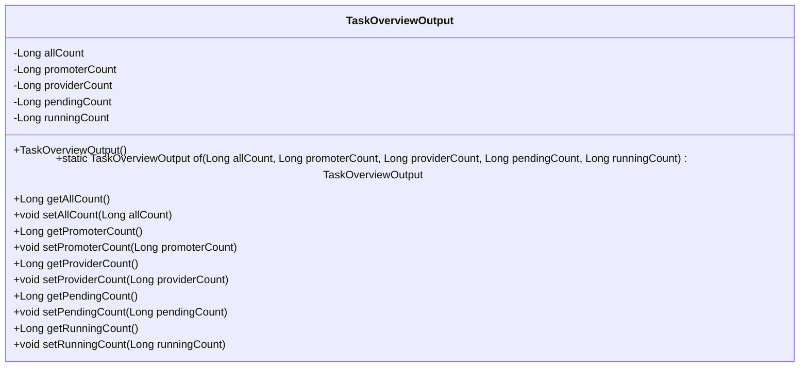

# Basic Information

|      |      |
|------|------|
| Name | TaskOverviewOutput |
| Language | .java |
| Code Path | WeFe/fusion/fusion-service/src/main/java/com/welab/wefe/data/fusion/service/dto/entity/TaskOverviewOutput.java |
| Package Name | com.welab.wefe.data.fusion.service.dto.entity |
| Dependencies | [] |
| Brief Description | The TaskOverviewOutput class is used to collect task overview data, including the total number of tasks, the number of initiators, the number of providers, the number of pending tasks, and the number of running tasks, providing constructors and getter/setter methods. |

# Description

TaskOverviewOutput is a Java class designed to encapsulate statistical information for task overviews. It contains five private fields of type Long: allCount (total task count), promoterCount (initiator task count), providerCount (provider task count), pendingCount (pending task count), and runningCount (running task count). The class provides a static factory method `of` for instance creation, along with corresponding getter and setter methods for each field to access and modify these statistical values.

# Class Summary

| Name   | Type  | Description |
|-------|------|-------------|
| TaskOverviewOutput | class | The TaskOverviewOutput class includes the total number of tasks, the number of initiators, the number of providers, the number of pending tasks, and the number of running tasks, providing get/set methods and static factory methods. |

## Class TaskOverviewOutput

|      |      |
|------|------|
| Access Modifier | public |
| Type | class |
| Name | TaskOverviewOutput |
| Description | The TaskOverviewOutput class includes the total number of tasks, the number of initiators, the number of providers, the number of pending tasks, and the number of running tasks, providing get/set methods and static factory methods. |

### UML Class Diagram

This code defines a class named `TaskOverviewOutput` for encapsulating task overview statistics. The class contains five private `Long` type fields: `allCount` (total task count), `promoterCount` (promoter task count), `providerCount` (provider task count), `pendingCount` (pending task count), and `runningCount` (running task count). It provides a static factory method `of()` for quick instance creation and standard getter/setter methods to access the fields. The class diagram clearly illustrates its data structure and public interfaces, making it suitable for business scenarios requiring multi-dimensional task status statistics.

### Internal Method Call Graph

```mermaid
graph TD
    A["Class TaskOverviewOutput"]
    B["Property: Long allCount"]
    C["Property: Long promoterCount"]
    D["Property: Long providerCount"]
    E["Property: Long pendingCount"]
    F["Property: Long runningCount"]
    G["Static factory method: of(Long allCount, Long promoterCount, Long providerCount, Long pendingCount, Long runningCount)"]
    H["Getter method: getAllCount()"]
    I["Setter method: setAllCount(Long)"]
    J["Getter method: getPromoterCount()"]
    K["Setter method: setPromoterCount(Long)"]
    L["Getter method: getProviderCount()"]
    M["Setter method: setProviderCount(Long)"]
    N["Getter method: getPendingCount()"]
    O["Setter method: setPendingCount(Long)"]
    P["Getter method: getRunningCount()"]
    Q["Setter method: setRunningCount(Long)"]

    A --> B
    A --> C
    A --> D
    A --> E
    A --> F
    A --> G
    A --> H
    A --> I
    A --> J
    A --> K
    A --> L
    A --> M
    A --> N
    A --> O
    A --> P
    A --> Q
```

This code defines a class named TaskOverviewOutput, primarily used to encapsulate task overview statistics. The class contains five Long-type properties: allCount, promoterCount, providerCount, pendingCount, and runningCount, representing the total task count, promoter task count, provider task count, pending task count, and running task count respectively. The static factory method of() allows for creating and initializing object instances, while standard getter and setter methods are provided for property access and modification. This class is suitable as a DTO (Data Transfer Object) for transmitting task statistics between systems.

### Field List

| Name  | Type  | Description |
|-------|-------|------|
| runningCount | Long | Private long integer variable, recording the number of runs. |
| pendingCount | Long | The private long integer variable pendingCount is used to record the number of pending items. |
| providerCount | Long | Private long integer variable, recording the number of providers. |
| promoterCount | Long | Private long integer variable promoterCount, used to record the number of promoters. |
| allCount | Long | Private long integer variable, recording the total count. |

### Method List

| Name  | Type  | Description |
|-------|-------|------|
| of | TaskOverviewOutput | Create a TaskOverviewOutput object, set the total number of tasks, the number of initiators, the number of providers, the number of pending tasks, and the number of running tasks, then return this object. |
| getAllCount | Long | The method returns a Long-type variable value named allCount. |
| getPendingCount | Long | Methods to obtain the number of pending tasks, returning a long integer value `pendingCount`. |
| setPromoterCount | void | Method to set the number of promoters, with the parameter being a long integer promoterCount. |
| getRunningCount | Long | The method to obtain the running count value, which returns a long integer variable runningCount. |
| setRunningCount | void | Java method: Set the value of the runningCount property, with the parameter being of type Long. |
| getProviderCount | Long | The method to obtain the number of providers returns a long integer value providerCount. |
| setAllCount | void | Java Method: Set the value of the allCount property. |
| getPromoterCount | Long | Method to obtain the number of promoters, returns a long integer value promoterCount. |
| setProviderCount | void | The method to set the number of service providers assigns the input parameter to the class variable providerCount. |
| setPendingCount | void | Method for setting the pending count value, which assigns the input value to the class member variable pendingCount. |

