# Basic Information

|      |      |
|------|------|
| Name | entity |
| Language | .java |
| Code Path | WeFe/fusion/fusion-service/src/main/java/com/welab/wefe/data/fusion/service/dto/entity |
| Package Name | docs.fusion.fusion-service.src.main.java.com.welab.wefe.data.fusion.service.dto.entity |
| Brief Description | Manage modules such as Bloom filters, global configurations, datasets, and tasks, providing data models, state tracking, and operation log functionalities to support the full lifecycle management of federated learning systems. |

# Description

## Overview  
This module serves as the core data management component of the federated learning system, adopting a configuration-center-like pattern to uniformly manage Bloom filters, datasets, tasks, and member information. The interface specification follows the Getter/Setter pattern, achieving standardized output through inheritance of AbstractOutputModel. Key data structures include Bloomfilter series models, DataSet series models, and business entities like TaskOutput. External dependencies are limited to Java base class libraries. For instance, DataSetPreviewOutputModel uses a Map structure to store raw data, resembling a NoSQL document model.  

The module provides two core functionalities: 1) Basic attribute management (e.g., configuration triplets in GlobalConfigInput); 2) Extended feature support (e.g., complete call chain tracking in OperationLogOutputModel). All models support chained operations, such as first retrieving a TaskOutput summary and then loading Detail data as needed.  

## Key Business Scenarios  
The module supports full lifecycle management of federated learning, with primary workflows including: 1) Member registration and approval (relying on RSA public key verification in MemberInfoModel); 2) Asynchronous task monitoring (tracking progress via processCount in TaskOutput); 3) Data fusion (e.g., Bloom filter creation and PSI role assignment). A typical interaction pattern involves DTO object transfer, such as using DataSourceOverviewOutput to quickly obtain data source statistics.  

Core scenarios can be summarized as: 1) Configuration management (e.g., controlling service ports via openSocketPort); 2) Status tracking (e.g., recording processing states in DataSetStateOutputModel); 3) Audit analysis (e.g., logging complete API call histories in OperationLogOutputModel). API types cover CRUD operations and statistical queries, forming a microservice governance-like solution.

### Package Internal Structure View

```mermaid
graph TD
    entity --> bloomfilter
    entity --> globalconfig
    entity --> dataset
    entity --> DataSourceOverviewOutput.java
    entity --> TaskOverviewOutput.java
    entity --> OperationLogOutputModel.java
    entity --> PartnerOutputModel.java
    entity --> AbstractOutputModel.java
    entity --> TaskOutput.java
    bloomfilter --> BloomfilterOutputModel.java
    bloomfilter --> BloomfilterDetailOutputModel.java
    globalconfig --> GlobalConfigInput.java
    globalconfig --> MemberInfoModel.java
    globalconfig --> FusionConfigModel.java
    dataset --> DataSetOutputModel.java
    dataset --> DataSetPreviewOutputModel.java
    dataset --> DataSetDetailOutputModel.java
    dataset --> DataSetStateOutputModel.java
```

This flowchart illustrates the hierarchical structure of DTO entity classes in the WeFe data fusion service. The root node "entity" contains four main child nodes: bloomfilter, globalconfig, dataset, and multiple independent output model files. Each child node further expands into specific model class files, such as bloomfilter comprising two output models, globalconfig containing three configuration class files, and dataset including four dataset-related models. Additionally, there are six independent output model files directly under the entity node.

# File List

| Name   | Type  | Description |
|-------|------|-------------|
| [DataSourceOverviewOutput.java](DataSourceOverviewOutput.md) | file | The DataSourceOverviewOutput class includes dataset count and Bloom filter count attributes, providing constructor methods and getter/setter. |
| [TaskOverviewOutput.java](TaskOverviewOutput.md) | file | The TaskOverviewOutput class is used to collect task overview statistics, including the total number of tasks, the number of initiators, the number of providers, the number of pending tasks, and the number of running tasks. It provides constructors and getter/setter methods. |
| [OperationLogOutputModel.java](OperationLogOutputModel.md) | file | The OperationLogOutputModel class records API operation logs, containing fields such as interface name, caller information, request/response data, and time consumption. |
| [PartnerOutputModel.java](PartnerOutputModel.md) | file | The PartnerOutputModel class inherits from AbstractOutputModel and includes member fields such as ID, name, RSA public key, base URL, and row number, providing getter and setter methods for each attribute. |
| [AbstractOutputModel.java](AbstractOutputModel.md) | file | The AbstractOutputModel class inherits from AbstractApiOutput and includes fields such as ID, creator, creation time, updater, and update time, while automatically setting the nicknames of the creator and updater. |
| [TaskOutput.java](TaskOutput.md) | file | The TaskOutput class inherits from AbstractOutputModel and includes attributes such as task ID, name, status, error message, data resources, tracking tags, row count, algorithm type, processing count, time consumed, and dataset list, used for managing task output data. |
| [dataset](dataset/_module.md) | package | The DataSetOutputModel class inherits from AbstractOutputModel and includes attributes such as dataset name and row count, providing getter/setter methods. The DataSetPreviewOutputModel class is used for dataset previews, containing field lists, metadata, and raw data. DataSetDetailOutputModel inherits from AbstractOutputModel and includes detailed dataset information along with preview data. The DataSetStateOutputModel class represents the dataset state, containing data source ID, row count, and processing count. |
| [globalconfig](globalconfig/_module.md) | package | The GlobalConfigInput class contains three string attributes: group, name, and value, used for global configuration input. The MemberInfoModel class defines federated member information, including fields such as ID, name, email, and RSA keys. The FusionConfigModel class includes three configuration parameters: intranet URL, registration approval switch, and socket port number. |
| [bloomfilter](bloomfilter/_module.md) | package | The BloomfilterOutputModel class inherits from AbstractOutputModel and includes attributes such as name and data source ID, with the default data resource type being BloomFilter. The BloomfilterDetailOutputModel class inherits from AbstractOutputModel, extending the preview data model to support comprehensive management of Bloom filter data. |

