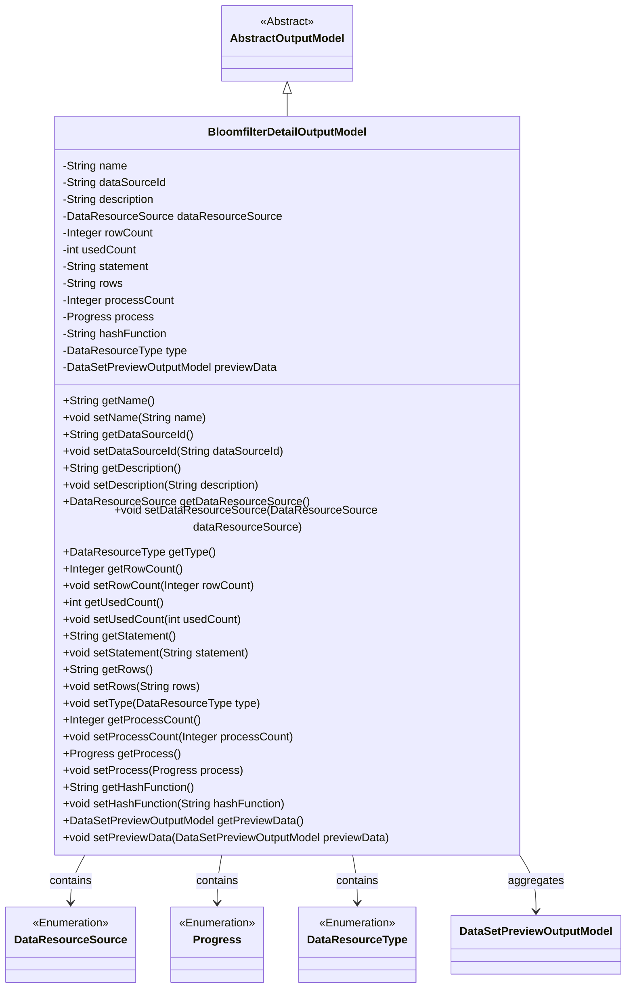

# Basic Information

|      |      |
|------|------|
| Name | BloomfilterDetailOutputModel |
| Language | .java |
| Code Path | WeFe/fusion/fusion-service/src/main/java/com/welab/wefe/data/fusion/service/dto/entity/bloomfilter/BloomfilterDetailOutputModel.java |
| Package Name | com.welab.wefe.data.fusion.service.dto.entity.bloomfilter |
| Dependencies | ['com.welab.wefe.data.fusion.service.dto.entity.AbstractOutputModel', 'com.welab.wefe.data.fusion.service.dto.entity.dataset.DataSetPreviewOutputModel', 'com.welab.wefe.data.fusion.service.enums.DataResourceSource', 'com.welab.wefe.data.fusion.service.enums.DataResourceType', 'com.welab.wefe.data.fusion.service.enums.Progress', 'javax.persistence.EnumType', 'javax.persistence.Enumerated'] |
| Brief Description | The BloomfilterDetailOutputModel class includes attributes such as name, data source ID, description, data origin, row count, usage count, SQL statement, column selection, progress bar, and primary key hashing method, which are used to represent the detailed information of a Bloom filter. |

# Description

The BloomfilterDetailOutputModel class inherits from AbstractOutputModel and is used to represent detailed information about a Bloom filter. It includes the name, data source ID, description, data resource source enumeration, row count, usage count, SQL statement, selected columns, progress bar value, progress status enumeration, primary key hashing method, data resource type (default BloomFilter), and preview data model. It provides getter and setter methods for each attribute, supporting comprehensive management of Bloom filter-related data.

# Class Summary

| Name   | Type  | Description |
|-------|------|-------------|
| BloomfilterDetailOutputModel | class | The BloomfilterDetailOutputModel class inherits from AbstractOutputModel and includes attributes such as name, data source ID, description, data origin, row count, usage count, SQL statement, selected columns, progress bar count, progress status, hash functions, and preview data. |

## Class BloomfilterDetailOutputModel

|      |      |
|------|------|
| Access Modifier | public |
| Type | class |
| Name | BloomfilterDetailOutputModel |
| Description | The BloomfilterDetailOutputModel class inherits from AbstractOutputModel and includes attributes such as name, data source ID, description, data origin, row count, usage count, SQL statement, selected columns, progress bar count, progress status, hash functions, and preview data. |

### UML Class Diagram

This class diagram illustrates that BloomfilterDetailOutputModel inherits from AbstractOutputModel and contains multiple attributes and methods for managing detailed information of a Bloom filter. It includes enumeration types DataResourceSource, Progress, and DataResourceType, as well as an aggregated dataset preview model DataSetPreviewOutputModel. The class primarily stores and manipulates metadata, usage statistics, progress status, and preview data of the Bloom filter, providing access and modification to these attributes through getter and setter methods.

### Internal Method Call Graph

```mermaid
graph TD
    A["Class BloomfilterDetailOutputModel"]
    B["Inherits: AbstractOutputModel"]
    C["Property: String name"]
    D["Property: String dataSourceId"]
    E["Property: String description"]
    F["Property: DataResourceSource dataResourceSource"]
    G["Property: Integer rowCount"]
    H["Property: int usedCount"]
    I["Property: String statement"]
    J["Property: String rows"]
    K["Property: Integer processCount"]
    L["Property: Progress process"]
    M["Property: String hashFunction"]
    N["Property: DataResourceType type"]
    O["Property: DataSetPreviewOutputModel previewData"]
    P["Getter/Setter Method Group"]

    A --> B
    A --> C
    A --> D
    A --> E
    A --> F
    A --> G
    A --> H
    A --> I
    A --> J
    A --> K
    A --> L
    A --> M
    A --> N
    A --> O
    A --> P

    P --> C
    P --> D
    P --> E
    P --> F
    P --> G
    P --> H
    P --> I
    P --> J
    P --> K
    P --> L
    P --> M
    P --> N
    P --> O
```

This flowchart illustrates the complete structure of the BloomfilterDetailOutputModel class, including its inheritance from AbstractOutputModel, 12 property fields (encompassing enum types and custom object types), and the corresponding getter/setter method group. All properties are managed through a unified Getter/Setter method group, where dataResourceSource uses the @Enumerated annotation for enum serialization, and the type property is initialized as BloomFilter by default. The class structure clearly reflects the data composition of the Bloom filter detailed output model, containing core elements such as basic information, data source configuration, usage statistics, and preview data.

### Field List

| Name  | Type  | Description |
|-------|-------|------|
| type = DataResourceType.BloomFilter | DataResourceType | Data type is Bloom filter. |
| rows | String | Define a string type variable rows. |
| hashFunction | String | The private string variable hashFunction is used to store the name of the hash function. |
| previewData | DataSetPreviewOutputModel | Preview output model variable `previewData` for private datasets. |
| dataSourceId | String | The private string variable dataSourceId is used to identify the data source. |
| dataResourceSource | DataResourceSource | Define an enum type field `dataResourceSource`, using string values for storage instead of default numeric values. |
| usedCount = 0 | int | The private integer variable usedCount has an initial value of 0. |
| name | String | Private string variable name. |
| process | Progress | Private progress object process |
| processCount | Integer | Define a private integer variable processCount to record or control the number of processes. |
| description | String | Private string type variable description. |
| statement | String | Declare a private string variable statement. |
| rowCount = 0 | Integer | Declare a private integer variable rowCount with an initial value of 0. |

### Method List

| Name  | Type  | Description |
|-------|-------|------|
| getName | String | This method returns the value of the name variable, which is of string type. |
| getDataResourceSource | DataResourceSource | The method returns the data resource source object dataResourceSource. |
| setDescription | void | The method for setting description information assigns the input parameter to the object's description property. |
| setStatement | void | Methods for setting statement content. |
| setRows | void | This is a Java method used to set the value of the class's `rows` attribute. It accepts a string parameter `rows` and assigns it to the class's member variable `rows`. |
| setDataSourceId | void | The method to set the data source ID assigns the input parameter to the class member variable dataSourceId. |
| setRowCount | void | Method for setting the number of rows, used to update the row count value of an object. |
| getProcessCount | Integer | Methods to obtain the current number of processes, returning an integer-type process count value. |
| setUsedCount | void | The method to set the number of times used assigns the parameter usedCount to the member variable usedCount. |
| setProcess | void | This is a Java method used to set the process attribute of a class. The method accepts a parameter of type Progress and assigns it to the process member variable of the current object. |
| getDescription | String | This is a Java method that returns the value of the description attribute of type String. |
| getRows | String | Methods to obtain the rows string. |
| getType | DataResourceType | The method returns a variable named type of the DataResourceType type. |
| setType | void | This is a Java method used to set the data resource type. The method is named setType, which accepts a parameter of type DataResourceType and assigns it to the type property of the current object. |
| setName | void | Methods for setting the object name, assigning the parameter `name` to the `name` property of the object. |
| getStatement | String | Methods to obtain the statement string. |
| getRowCount | Integer | Methods to obtain the number of lines, returning an integer value of the line count. |
| setProcessCount | void | This is a Java method used to set the value of the processCount variable. The method takes an Integer parameter and assigns it to the class's member variable processCount. |
| setDataResourceSource | void | The method for setting the data resource source assigns the input parameters to the member variables of the class. |
| getHashFunction | String | This method returns the hashFunction value of string type. |
| setHashFunction | void | This is a Java method used to set the name of the hash function. The method accepts a string parameter `hashFunction` and assigns it to the member variable of the same name in the class. |
| getPreviewData | DataSetPreviewOutputModel | This is a Java method that returns a DataSetPreviewOutputModel object named previewData. |
| setPreviewData | void | This method is used to set preview data, which takes a parameter named previewData of type DataSetPreviewOutputModel and assigns it to the previewData property of the current object. |
| getDataSourceId | String | The method to obtain the data source ID returns the value of the member variable dataSourceId. |
| getProcess | Progress | Methods to obtain the current progress object. |
| getUsedCount | int | The method returns the value of the used count variable. |

