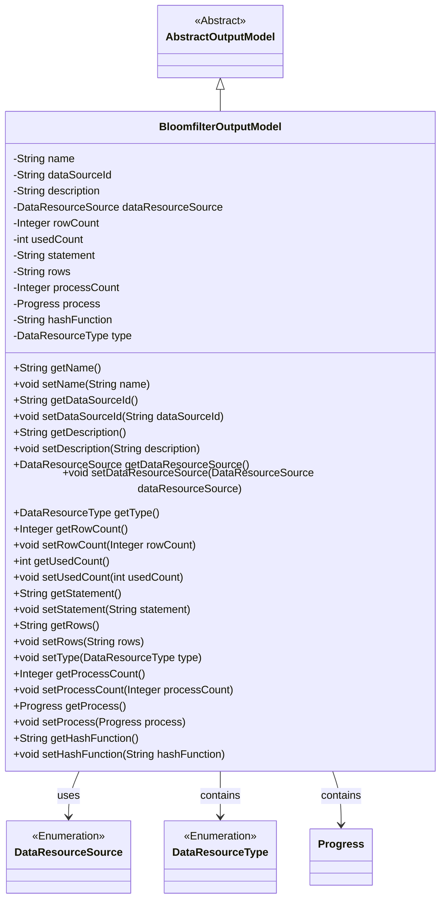

# Basic Information

|      |      |
|------|------|
| Name | BloomfilterOutputModel |
| Language | .java |
| Code Path | WeFe/fusion/fusion-service/src/main/java/com/welab/wefe/data/fusion/service/dto/entity/bloomfilter/BloomfilterOutputModel.java |
| Package Name | com.welab.wefe.data.fusion.service.dto.entity.bloomfilter |
| Dependencies | ['com.welab.wefe.data.fusion.service.dto.entity.AbstractOutputModel', 'com.welab.wefe.data.fusion.service.enums.DataResourceSource', 'com.welab.wefe.data.fusion.service.enums.DataResourceType', 'com.welab.wefe.data.fusion.service.enums.Progress', 'javax.persistence.EnumType', 'javax.persistence.Enumerated'] |
| Brief Description | The BloomfilterOutputModel class inherits from AbstractOutputModel and includes attributes such as name, data source ID, description, data resource source, row count, usage count, SQL statement, selected columns, progress bar count, progress status, primary key hashing method, and resource type, along with their corresponding getter/setter methods. |

# Description

The BloomfilterOutputModel class inherits from AbstractOutputModel and includes attributes such as name, data source ID, description, data resource source enumeration, row count, usage count, SQL statement, selected columns, progress bar value, progress status enumeration, primary key hashing method, and data resource type. It provides getter and setter methods for all attributes, with the default data resource type being BloomFilter.

# Class Summary

| Name   | Type  | Description |
|-------|------|-------------|
| BloomfilterOutputModel | class | The BloomfilterOutputModel class includes attributes such as name, data source ID, description, data source type, row count, usage count, SQL statement, selected columns, progress bar count, progress status, and primary key hashing method. |

## Class BloomfilterOutputModel

|      |      |
|------|------|
| Access Modifier | public |
| Type | class |
| Name | BloomfilterOutputModel |
| Description | The BloomfilterOutputModel class includes attributes such as name, data source ID, description, data source type, row count, usage count, SQL statement, selected columns, progress bar count, progress status, and primary key hashing method. |

### UML Class Diagram

This class diagram illustrates that BloomfilterOutputModel inherits from AbstractOutputModel and includes multiple private fields with corresponding getter/setter methods. The class primarily manages attributes related to the Bloom filter output model, such as name, data source ID, description, resource source type, row count statistics, usage count, SQL statement, column selection, progress count, progress status, and hash function. The enumeration types DataResourceSource and DataResourceType are used to constrain the value ranges of certain fields, while the Progress class is employed to manage progress status.

### Internal Method Call Graph

```mermaid
graph TD
    A["Class BloomfilterOutputModel"]
    B["Inherits: AbstractOutputModel"]
    C["Property: String name"]
    D["Property: String dataSourceId"]
    E["Property: String description"]
    F["Property: DataResourceSource dataResourceSource"]
    G["Property: Integer rowCount"]
    H["Property: int usedCount"]
    I["Property: String statement"]
    J["Property: String rows"]
    K["Property: Integer processCount"]
    L["Property: Progress process"]
    M["Property: String hashFunction"]
    N["Property: DataResourceType type"]
    O["Method: getName/setName"]
    P["Method: getDataSourceId/setDataSourceId"]
    Q["Method: getDescription/setDescription"]
    R["Method: getDataResourceSource/setDataResourceSource"]
    S["Method: getType/setType"]
    T["Method: getRowCount/setRowCount"]
    U["Method: getUsedCount/setUsedCount"]
    V["Method: getStatement/setStatement"]
    W["Method: getRows/setRows"]
    X["Method: getProcessCount/setProcessCount"]
    Y["Method: getProcess/setProcess"]
    Z["Method: getHashFunction/setHashFunction"]

    A --> B
    A --> C
    A --> D
    A --> E
    A --> F
    A --> G
    A --> H
    A --> I
    A --> J
    A --> K
    A --> L
    A --> M
    A --> N
    A --> O
    A --> P
    A --> Q
    A --> R
    A --> S
    A --> T
    A --> U
    A --> V
    A --> W
    A --> X
    A --> Y
    A --> Z
```

This flowchart illustrates the complete structure of the BloomfilterOutputModel class, including its inheritance relationship, 12 property fields, and corresponding getter/setter methods. The class inherits from AbstractOutputModel, with key properties such as data source identifier, description information, resource type enumeration, row counters, etc. All properties follow the standard JavaBean specification for access methods. The diagram clearly presents the hierarchical relationship between class members and methods, reflecting the structural design of this model class for managing Bloom filter-related output data.

### Field List

| Name  | Type  | Description |
|-------|-------|------|
| type = DataResourceType.BloomFilter | DataResourceType | The data type is a Bloom filter. |
| statement | String | Private string variable statement. |
| dataSourceId | String | The private string variable of the data source ID. |
| description | String | Private string type variable description. |
| hashFunction | String | Declare a private string variable hashFunction. |
| rows | String | Declare a private string variable rows. |
| process | Progress | Private progress object `process`. |
| name | String | private String variable name |
| usedCount = 0 | int | The private integer variable usedCount, with an initial value of 0. |
| processCount | Integer | Private integer variable used to record the number of processes. |
| rowCount = 0 | Integer | The private integer variable rowCount is initialized to 0. |
| dataResourceSource | DataResourceSource | The enumeration field dataResourceSource uses a string type for storage. |

### Method List

| Name  | Type  | Description |
|-------|-------|------|
| setRows | void | This is a Java method used to set the `rows` property value of an object to the passed string parameter. |
| getProcessCount | Integer | Methods to obtain the number of processes, returns an integer value processCount. |
| setName | void | Methods for setting the object name, assigning the parameter `name` to the `name` property of the current object. |
| setDescription | void | This is a Java method used to set the description information of an object. The method takes a string parameter, description, and assigns it to the description property of the current object. |
| setProcess | void | Set the progress object. |
| getProcess | Progress | Get the current progress object. |
| setUsedCount | void | The method to set the number of times used assigns the parameter usedCount to the class member variable usedCount. |
| getType | DataResourceType | The method returns a variable named type of the DataResourceType type. |
| getUsedCount | int | Method returns the number of times used. |
| setProcessCount | void | Methods for setting the number of processes, with the parameter being of integer type. |
| getRows | String | Methods to obtain the rows string. |
| getDataResourceSource | DataResourceSource | Methods for obtaining data resource sources, returning a dataResourceSource object. |
| setRowCount | void | Method to set the number of rows, with parameter as integer rowCount, assigned to the class member variable rowCount. |
| getName | String | This is a Java method that returns the value of the string variable named "name". |
| setHashFunction | void | This is a Java method used to set the hashFunction property value of an object. The method accepts a string parameter hashFunction and assigns it to the property of the same name in the current object. |
| setStatement | void | Set the value of the statement attribute as a string type. |
| getRowCount | Integer | Methods to obtain the number of lines, returning an integer value of the line count. |
| getDescription | String | Methods for obtaining descriptive information, returning a string-type description content. |
| getDataSourceId | String | The method to obtain the data source ID, which returns a string-type variable dataSourceId. |
| setType | void | The method for setting the data resource type assigns the input parameter `type` to the `type` property of the current object. |
| setDataSourceId | void | The method to set the data source ID assigns the input parameter to the class member variable `dataSourceId`. |
| getStatement | String | Methods to obtain the statement string. |
| setDataResourceSource | void | Methods for setting data resource sources, assigning the passed parameters to the member variables of the class. |
| getHashFunction | String | Methods to Obtain Hash Function Names. |

