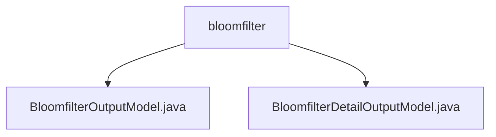

# Basic Information

|      |      |
|------|------|
| Name | bloomfilter |
| Language | .java |
| Code Path | WeFe/fusion/fusion-service/src/main/java/com/welab/wefe/data/fusion/service/dto/entity/bloomfilter |
| Package Name | docs.fusion.fusion-service.src.main.java.com.welab.wefe.data.fusion.service.dto.entity.bloomfilter |
| Brief Description | The BloomfilterOutputModel class inherits from AbstractOutputModel and includes attributes such as name and data source ID, with the default data resource type being BloomFilter. The BloomfilterDetailOutputModel class inherits from AbstractOutputModel, extending the preview data model to support comprehensive management of Bloom filter data. |

# Description

## Overview  
The core responsibility of this module is to manage the Bloom filter data model, providing two output models: basic attributes and detailed information. The interface specification includes unified attribute access methods and supports enumeration-type operations such as data resource sources and progress statuses. Key data structures include BloomfilterOutputModel and BloomfilterDetailOutputModel, with the latter extending the functionality to preview data. External dependencies are limited to the Java base class library. For example, BloomfilterDetailOutputModel enhances basic capabilities through a preview data model.  

## Primary Business Scenarios  
The module is primarily used for the full lifecycle management of Bloom filter data, similar to a configuration center model. The business process covers a complete operation chain from basic information maintenance to detailed data preview, supporting core functionalities such as SQL statement configuration and progress tracking. Typical applications include Bloom filter creation and monitoring in data integration scenarios. For example, asynchronous task status updates are achieved through progress status enumerations.

### Package Internal Structure View

This flowchart illustrates the structure of two Java file entity classes under the bloomfilter directory. BloomfilterOutputModel.java and BloomfilterDetailOutputModel.java, as sibling file nodes, both belong to the parent bloomfilter directory, forming a simple two-level tree relationship. This structure is commonly used for storing DTO entity classes to describe Bloom filter-related data output models.

# File List

| Name   | Type  | Description |
|-------|------|-------------|
| [BloomfilterOutputModel.java](BloomfilterOutputModel.md) | file | The `BloomfilterOutputModel` class inherits from `AbstractOutputModel` and includes attributes such as name, data source ID, description, data resource origin, row count, usage count, SQL statement, selected columns, progress bar count, progress status, primary key hashing method, and resource type, along with their corresponding getter and setter methods. |
| [BloomfilterDetailOutputModel.java](BloomfilterDetailOutputModel.md) | file | The BloomfilterDetailOutputModel class includes attributes such as name, data source ID, description, data origin, row count, usage count, SQL statement, column selection, progress bar, and primary key hashing method, which are used to represent the detailed information of a Bloom filter. |

