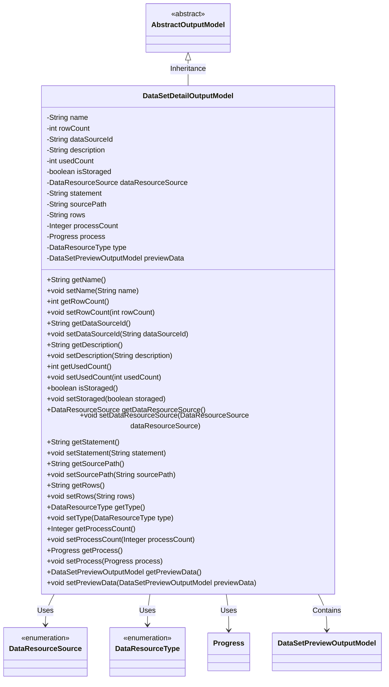

# Basic Information

|      |      |
|------|------|
| Name | DataSetDetailOutputModel |
| Language | .java |
| Code Path | WeFe/fusion/fusion-service/src/main/java/com/welab/wefe/data/fusion/service/dto/entity/dataset/DataSetDetailOutputModel.java |
| Package Name | com.welab.wefe.data.fusion.service.dto.entity.dataset |
| Dependencies | ['com.welab.wefe.data.fusion.service.database.entity.DataSetColumnOutputModel', 'com.welab.wefe.data.fusion.service.dto.entity.AbstractOutputModel', 'com.welab.wefe.data.fusion.service.enums.DataResourceSource', 'com.welab.wefe.data.fusion.service.enums.DataResourceType', 'com.welab.wefe.data.fusion.service.enums.Progress', 'javax.persistence.EnumType', 'javax.persistence.Enumerated', 'java.util.ArrayList', 'java.util.List', 'java.util.Map'] |
| Brief Description | Dataset details output model, including name, row count, data source ID, description, usage count, storage status, data origin, SQL statement, source file path, column selection, progress count, progress status, type, and preview data. |

# Description

The DataSetDetailOutputModel class inherits from AbstractOutputModel and is used to represent dataset details. It includes attributes such as name, row count, data source ID, description, usage count, storage status, data resource origin, SQL statement, source file path, selected columns, progress count, and progress status. The default type is DataSet, and it contains a preview data model. Getter and setter methods are provided for all attributes.

# Class Summary

| Name   | Type  | Description |
|-------|------|-------------|
| DataSetDetailOutputModel | class | Dataset details output model, including name, row count, data source ID, description, usage count, storage status, data source, SQL statement, source file path, selected columns, progress count, progress status, type, and preview data. |

## Class DataSetDetailOutputModel

|      |      |
|------|------|
| Access Modifier | public |
| Type | class |
| Name | DataSetDetailOutputModel |
| Description | Dataset details output model, including name, row count, data source ID, description, usage count, storage status, data source, SQL statement, source file path, selected columns, progress count, progress status, type, and preview data. |

### UML Class Diagram

Class Diagram Description: This diagram illustrates that the DataSetDetailOutputModel class inherits from the abstract class AbstractOutputModel and contains multiple private fields with their corresponding getter/setter methods. The class utilizes the enumeration types DataResourceSource and DataResourceType, as well as the Progress class and DataSetPreviewOutputModel class. DataSetDetailOutputModel is primarily used to represent detailed dataset information, including attributes such as name, row count, data source ID, description, usage count, storage status, data resource source, SQL statement, source file path, row data, process count, progress status, and preview data.

### Internal Method Call Graph

```mermaid
graph TD
    A["Class DataSetDetailOutputModel"]
    B["Inheritance: AbstractOutputModel"]
    C["Property: String name"]
    D["Property: int rowCount"]
    E["Property: String dataSourceId"]
    F["Property: String description"]
    G["Property: int usedCount"]
    H["Property: boolean isStoraged"]
    I["Property: DataResourceSource dataResourceSource"]
    J["Property: String statement"]
    K["Property: String sourcePath"]
    L["Property: String rows"]
    M["Property: Integer processCount"]
    N["Property: Progress process"]
    O["Property: DataResourceType type"]
    P["Property: DataSetPreviewOutputModel previewData"]
    Q["Getter/Setter Methods Group"]

    A --> B
    A --> C
    A --> D
    A --> E
    A --> F
    A --> G
    A --> H
    A --> I
    A --> J
    A --> K
    A --> L
    A --> M
    A --> N
    A --> O
    A --> P
    A --> Q

    Q -->|name| C
    Q -->|rowCount| D
    Q -->|dataSourceId| E
    Q -->|description| F
    Q -->|usedCount| G
    Q -->|isStoraged| H
    Q -->|dataResourceSource| I
    Q -->|statement| J
    Q -->|sourcePath| K
    Q -->|rows| L
    Q -->|processCount| M
    Q -->|process| N
    Q -->|type| O
    Q -->|previewData| P
```

This flowchart illustrates the complete structure of the DataSetDetailOutputModel class, including its inheritance from AbstractOutputModel, 14 property fields with their data types, and the corresponding Getter/Setter methods group. All properties are accessed through a unified methods group, encompassing various data types such as String, Integer, Boolean, Enum, and custom objects. Particularly noteworthy are the two complex-type properties: the Progress object and the DataSetPreviewOutputModel preview data object.

### Field List

| Name  | Type  | Description |
|-------|-------|------|
| rows | String | Private string variable rows. |
| dataSourceId | String | The private string variable dataSourceId is used to identify the data source. |
| description | String | The private string type variable `description` is used to store descriptive information. |
| type = DataResourceType.DataSet | DataResourceType | The data type is a dataset. |
| process | Progress | Private Progress Handling Object |
| sourcePath | String | The private string variable `sourcePath` is used to store path information. |
| statement | String | Private string variable statement declaration. |
| isStoraged = false | boolean | The variable `isStoraged` is of boolean type, with an initial value of `false`, indicating an unstored state. |
| rowCount | int | Private integer variable used to record the number of rows. |
| dataResourceSource | DataResourceSource | The enumeration field dataResourceSource uses a string type for storage. |
| name | String | Private string variable name. |
| previewData | DataSetPreviewOutputModel | Preview output model instance `previewData` for private datasets. |
| usedCount | int | Private integer variable, recording the number of uses. |
| processCount | Integer | The private integer variable processCount is used to record or control the number of processes. |

### Method List

| Name  | Type  | Description |
|-------|-------|------|
| getType | DataResourceType | The method returns a variable named type of the DataResourceType type. |
| getSourcePath | String | This is a Java method that returns the value of the string-type variable sourcePath. |
| setStoraged | void | Define the method setStoraged to set the value of the boolean variable isStoraged. |
| getRowCount | int | The method returns the value of rowCount, which represents the number of rows. |
| getName | String | Methods to obtain the name, returning the value of the string-type name variable. |
| setRows | void | The method to set the rows property assigns the parameter rows to the class's member variable rows. |
| setDescription | void | The method for setting the description content assigns the input parameter to the object's description property. |
| getRows | String | This method returns the value of the rows variable as a string type. |
| setUsedCount | void | The method to set the number of times used assigns the parameter `usedCount` to the member variable `usedCount`. |
| getUsedCount | int | This is a Java method that returns the value of the integer variable usedCount. |
| setSourcePath | void | This is a Java method used to set the value of the sourcePath property of a class. The method takes a string parameter sourcePath and assigns it to the member variable of the same name in the class. |
| isStoraged | boolean | Boolean method to check storage status, returns the isStoraged value. |
| setDataSourceId | void | The method to set the data source ID assigns the input parameter to the class member variable dataSourceId. |
| setStatement | void | This is a Java method used to set the value of the class member variable `statement`. The method takes a string parameter and assigns it to the `statement` property of the current object. |
| getDescription | String | String methods for obtaining descriptive information. |
| setDataResourceSource | void | The method for setting the data resource source assigns the input parameter to the class member variable `dataResourceSource`. |
| getDataSourceId | String | The method to obtain the data source ID directly returns the value of the member variable dataSourceId. |
| setRowCount | void | Method for setting the number of rows: Assign the parameter rowCount to the class's member variable rowCount. |
| setName | void | The method to set the object name assigns the parameter `name` to the `name` property of the object. |
| getDataResourceSource | DataResourceSource | Methods for obtaining data resource source objects, returns the current data resource source instance. |
| getStatement | String | Get the current statement string. |
| setType | void | The method for setting the data resource type assigns the input parameter `type` to the `type` property of the current object. |
| getProcessCount | Integer | Methods to obtain the number of processes, returns an integer variable processCount. |
| setProcessCount | void | Methods for setting the number of processes, with the parameter being of integer type. |
| getProcess | Progress | Methods to obtain the process object, returning a process variable of type Progress. |
| setProcess | void | Method to set the progress object, which assigns the incoming `process` to the `process` property of the current object. |
| getPreviewData | DataSetPreviewOutputModel | The method to obtain preview data, which returns a result of type DataSetPreviewOutputModel. |
| setPreviewData | void | This method is used to set preview data, which takes a parameter of type DataSetPreviewOutputModel and assigns it to the member variable previewData. |

