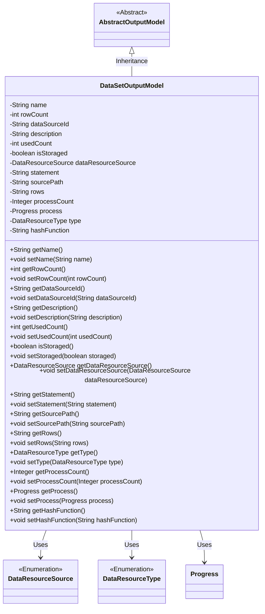

# Basic Information

|      |      |
|------|------|
| Name | DataSetOutputModel |
| Language | .java |
| Code Path | WeFe/fusion/fusion-service/src/main/java/com/welab/wefe/data/fusion/service/dto/entity/dataset/DataSetOutputModel.java |
| Package Name | com.welab.wefe.data.fusion.service.dto.entity.dataset |
| Dependencies | ['com.welab.wefe.data.fusion.service.dto.entity.AbstractOutputModel', 'com.welab.wefe.data.fusion.service.enums.DataResourceSource', 'com.welab.wefe.data.fusion.service.enums.DataResourceType', 'com.welab.wefe.data.fusion.service.enums.Progress', 'javax.persistence.EnumType', 'javax.persistence.Enumerated'] |
| Brief Description | The `DataSetOutputModel` class inherits from `AbstractOutputModel` and includes attributes such as dataset name, row count, data source ID, description, usage count, storage status, data source, SQL statement, source file path, column selection, progress count, progress status, resource type, and hash function, along with their corresponding getter/setter methods. |

# Description

The `DataSetOutputModel` class inherits from `AbstractOutputModel` and includes attributes such as dataset name, row count, data source ID, description, usage count, and storage status. The enum type `dataResourceSource` indicates the data source, `statement` stores SQL statements, `sourcePath` records file paths, and `rows` holds column information. `processCount` and `process` represent progress value and status respectively, with `type` defaulting to `DataSet`. It provides getter and setter methods for each attribute, and `hashFunction` is used for hash computation.

# Class Summary

| Name   | Type  | Description |
|-------|------|-------------|
| DataSetOutputModel | class | The `DataSetOutputModel` class inherits from `AbstractOutputModel` and includes attributes such as name, row count, data source ID, description, usage count, storage status, data source, SQL statement, source path, row selection, progress count, progress status, resource type, and hash function, along with their corresponding getter/setter methods. |

## Class DataSetOutputModel

|      |      |
|------|------|
| Access Modifier | public |
| Type | class |
| Name | DataSetOutputModel |
| Description | The `DataSetOutputModel` class inherits from `AbstractOutputModel` and includes attributes such as name, row count, data source ID, description, usage count, storage status, data source, SQL statement, source path, row selection, progress count, progress status, resource type, and hash function, along with their corresponding getter/setter methods. |

### UML Class Diagram

This code defines a dataset output model class DataSetOutputModel, which inherits from the abstract class AbstractOutputModel. The class contains multiple private fields such as name, row count, data source ID, description, usage count, etc., along with corresponding getter and setter methods. Among them, DataResourceSource and DataResourceType are enumeration types, and Progress is a class. This class is primarily used to manage various attributes and states of dataset output, including data source, storage status, processing progress, and other information, providing access and modification methods for these attributes.

### Internal Method Call Graph

This code defines a DataSetOutputModel class that inherits from AbstractOutputModel, containing multiple attributes and corresponding getter/setter methods. The class is primarily used to manage dataset output models, including information such as name, row count, data source ID, description, usage count, storage status, data resource source, SQL statement, source file path, row selection, process count, progress status, resource type, and hash function. Each attribute has corresponding access methods to facilitate external operations and data retrieval.

### Field List

| Name  | Type  | Description |
|-------|-------|------|
| statement | String | Private string variable `statement`. |
| dataSourceId | String | Private string variable storing the data source ID. |
| dataResourceSource | DataResourceSource | Use the @Enumerated annotation to store the enum type DataResourceSource as a string. |
| rowCount | int | Private integer variable, recording the number of rows. |
| isStoraged = false | boolean | The variable `isStoraged` is of boolean type, with an initial value of `false`, indicating an unstored state. |
| usedCount | int | Private integer variable, recording the number of uses. |
| type = DataResourceType.DataSet | DataResourceType | Define a data type variable named "type" and assign it the value "DataSet". |
| description | String | Private string type variable description. |
| hashFunction | String | Declaration of string hash function variables. |
| processCount | Integer | Private integer variable used to record the number of processes. |
| process | Progress | Private progress handler object. |
| rows | String | Declare a private string variable rows. |
| sourcePath | String | Declare a private string variable sourcePath. |
| name | String | Declare a private string variable named name. |

### Method List

| Name  | Type  | Description |
|-------|-------|------|
| getType | DataResourceType | The method returns an object type of DataResourceType. |
| setUsedCount | void | Function to set the used count, with the parameter usedCount, assigned to the class member variable usedCount. |
| setRows | void | This is a Java method used to set the value of the rows property of a class. The method accepts a string parameter named rows and assigns it to the member variable of the same name in the class. |
| getName | String | Methods to get the name, returning the value of the name variable of string type. |
| setRowCount | void | Set the number of rows to the specified value. |
| getSourcePath | String | Methods to obtain the source path, returning the value of the sourcePath variable as a string type. |
| getDataSourceId | String | Methods to obtain the data source ID, returning a string-type variable dataSourceId. |
| setType | void | The method for setting the data resource type assigns the passed parameter to the object property `type`. |
| getProcessCount | Integer | Methods to obtain the number of processes, returning an integer value processCount. |
| setProcessCount | void | Methods for setting the number of processes, where the parameter is of integer type. |
| getProcess | Progress | Methods to obtain the current progress object. |
| setProcess | void | This is a Java method used to set the member variable `process` of type `Progress`. The method is named `setProcess` and accepts a `Progress` parameter. |
| getHashFunction | String | Methods to obtain the hash function name, returns a string type. |
| setHashFunction | void | This is a Java method used to set the hashFunction property of an object. The method accepts a string parameter and assigns it to a member variable. |
| setDataSourceId | void | The method for setting the data source ID assigns the input parameter to the class member variable `dataSourceId`. |
| setStatement | void | Methods for setting statement content. |
| setStoraged | void | Methods for setting the storage state, assigning the value of the passed `storaged` parameter to `isStoraged`. |
| getStatement | String | Methods to obtain the statement string. |
| getRows | String | Methods to obtain the rows string. |
| isStoraged | boolean | Check the boolean method for storage status, returning the isStoraged value. |
| setDescription | void | This is a Java method used to set the description information of an object. The method takes a string parameter named description and assigns it to the description property of the object. |
| getDataResourceSource | DataResourceSource | This is a Java method that returns a data resource source object named dataResourceSource. |
| getDescription | String | Methods to obtain descriptive information, returning the description value of string type. |
| setSourcePath | void | The method to set the source path assigns the input parameter to the `sourcePath` member variable of the class. |
| setName | void | The method to set the object name assigns the parameter `name` to the object's `name` property. |
| getRowCount | int | Methods to obtain the number of lines, returning the value of the variable rowCount. |
| getUsedCount | int | The method returns an integer value representing the number of times it has been used. |
| setDataResourceSource | void | The method for setting the data resource source assigns the passed-in dataResourceSource to the property of the same name on the current object. |

