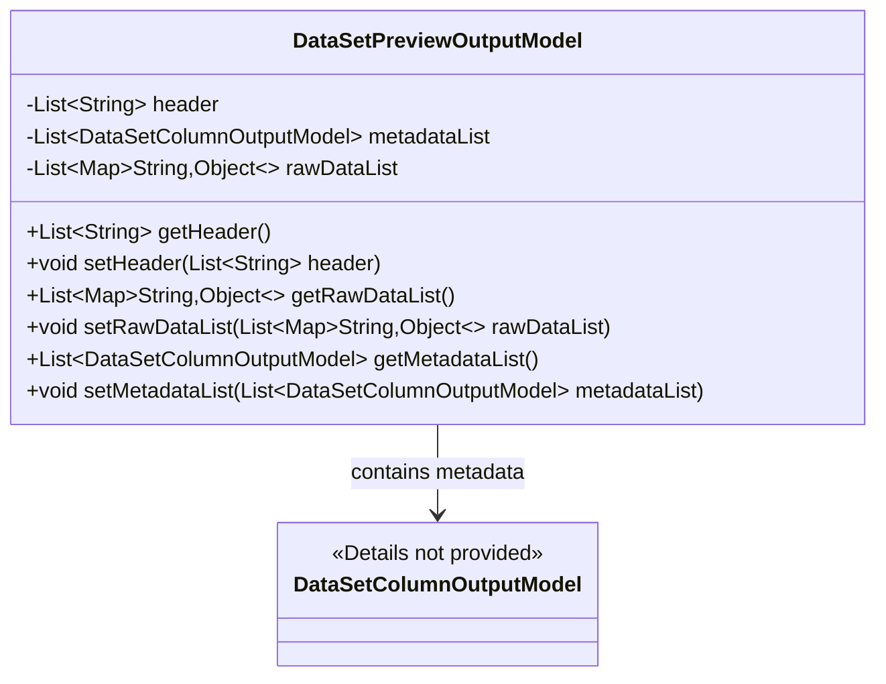
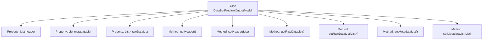

# Basic Information

|      |      |
|------|------|
| Name | DataSetPreviewOutputModel |
| Language | .java |
| Code Path | WeFe/fusion/fusion-service/src/main/java/com/welab/wefe/data/fusion/service/dto/entity/dataset/DataSetPreviewOutputModel.java |
| Package Name | com.welab.wefe.data.fusion.service.dto.entity.dataset |
| Dependencies | ['com.welab.wefe.common.fieldvalidate.annotation.Check', 'com.welab.wefe.data.fusion.service.database.entity.DataSetColumnOutputModel', 'java.util.ArrayList', 'java.util.List', 'java.util.Map'] |
| Brief Description | Dataset preview output model, containing field lists, metadata information, and raw data lists, with corresponding getter and setter methods provided. |

# Description

The `DataSetPreviewOutputModel` class is used to represent dataset preview output, containing three main fields: `header` stores the list of fields, `metadataList` stores metadata information, and `rawDataList` stores the list of raw data. Each field has corresponding getter and setter methods for easy access and modification of data. `header` is a list of strings, `metadataList` is a list of `DataSetColumnOutputModel` objects, and `rawDataList` is a list of key-value pair mappings. The class structure is clear, its functionality is well-defined, and it is suitable for handling dataset preview-related operations.

# Class Summary

| Name   | Type  | Description |
|-------|------|-------------|
| DataSetPreviewOutputModel | class | Dataset preview output model, including field list, metadata information, and raw data list, with corresponding getter and setter methods provided. |

## Class DataSetPreviewOutputModel

|      |      |
|------|------|
| Access Modifier | public |
| Type | class |
| Name | DataSetPreviewOutputModel |
| Description | Dataset preview output model, including field list, metadata information, and raw data list, with corresponding getter and setter methods provided. |

### UML Class Diagram

This class diagram illustrates the data structure of DataSetPreviewOutputModel, which is a model class containing dataset preview information. It has three core fields: header stores the field list, metadataList stores column metadata information, and rawDataList stores raw data records. All fields are validated via @Check annotation and exposed through standard getter/setter methods. The metadataList field has an association relationship with the DataSetColumnOutputModel class, indicating that the specific structure of metadata is defined by this model. The overall design adopts a typical JavaBean pattern, making it suitable for data transfer as a DTO.

### Internal Method Call Graph

This code defines a class named DataSetPreviewOutputModel, which encapsulates the output model for dataset preview. The class contains three main properties: header (field list), metadataList (metadata information), and rawDataList (raw data list), each annotated with @Check for validation. Corresponding getter and setter methods are provided to access and modify these properties. This model is primarily used for structured storage and transmission of dataset preview-related information, facilitating operations and validation within data processing workflows.

### Field List

| Name  | Type  | Description |
|-------|-------|------|
| rawDataList = new ArrayList<>() | List<Map<String, Object>> | Define a private variable `rawDataList` of type `List<Map<String, Object>>`, initialized as an empty ArrayList, and annotated with `@Check` as "Raw Data List". |
| metadataList = new ArrayList<>() | List<DataSetColumnOutputModel> | A private list variable named metadataList is defined in the Java code to store metadata information, initialized as an empty ArrayList. |
| header = new ArrayList<>() | List<String> | Define a private field `header`, with the type as a list of strings, initialized as an empty list, and annotated with `@Check` to mark the field name as "Field List". |

### Method List

| Name  | Type  | Description |
|-------|-------|------|
| getRawDataList | List<Map<String, Object>> | The method returns a raw data list, where each element is a key-value pair mapping. |
| getHeader | List<String> | The method getHeader returns a list of strings named header. |
| setMetadataList | void | Methods for setting the metadata list, assigning the input parameters to the member variable metadataList of the class. |
| getMetadataList | List<DataSetColumnOutputModel> | This method returns a list metadataList containing DataSetColumnOutputModel objects. |
| setHeader | void | Setting method: Assign the input string list to the header property of the class. |
| setRawDataList | void | The method `setRawDataList` accepts a List parameter whose elements are Maps, and assigns it to the class's member variable `rawDataList`. |

