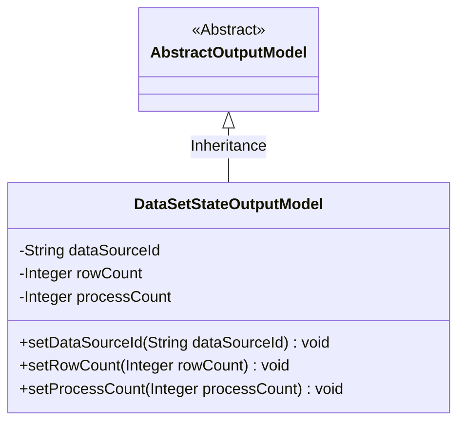
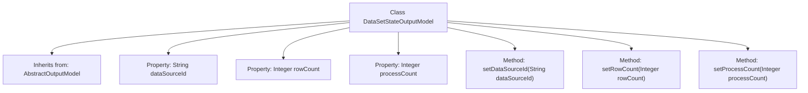

# Basic Information

|      |      |
|------|------|
| Name | DataSetStateOutputModel |
| Language | .java |
| Code Path | WeFe/fusion/fusion-service/src/main/java/com/welab/wefe/data/fusion/service/dto/entity/dataset/DataSetStateOutputModel.java |
| Package Name | com.welab.wefe.data.fusion.service.dto.entity.dataset |
| Dependencies | ['com.welab.wefe.data.fusion.service.dto.entity.AbstractOutputModel'] |
| Brief Description | Dataset status output model class, containing three attributes: data source ID, row count, and processed count, along with their corresponding setter methods. |

# Description

The `DataSetStateOutputModel` is a Java class that extends `AbstractOutputModel`, designed to represent a dataset state output model. This class includes three private attributes: `dataSourceId` for storing the data source identifier, `rowCount` to record the number of rows, and `processCount` indicating the processing count. It provides three public setter methods for assigning values to these attributes respectively.

# Class Summary

| Name   | Type  | Description |
|-------|------|-------------|
| DataSetStateOutputModel | class | Dataset status output model class, containing three attributes: data source ID, row count, and processed count, along with their corresponding setter methods. |

## Class DataSetStateOutputModel

|      |      |
|------|------|
| Access Modifier | public |
| Type | class |
| Name | DataSetStateOutputModel |
| Description | Dataset status output model class, containing three attributes: data source ID, row count, and processed count, along with their corresponding setter methods. |

### UML Class Diagram

This class diagram illustrates the structure where DataSetStateOutputModel inherits from the abstract class AbstractOutputModel. The DataSetStateOutputModel contains three private attributes: dataSourceId (String type), rowCount and processCount (both Integer wrapper classes), along with their corresponding public setter methods. This class is designed to encapsulate dataset state output information, leveraging inheritance to reuse parent class functionality. It is typically used in data processing workflows to record metadata such as data source identifiers, total row counts, and processed row counts.

### Internal Method Call Graph

This code illustrates a class named `DataSetStateOutputModel`, which inherits from `AbstractOutputModel`. The class contains three private properties: `dataSourceId` (String type), `rowCount`, and `processCount` (both Integer types). It also provides three public setter methods for assigning values to these properties. The flowchart clearly depicts the class inheritance, property definitions, and method structure, reflecting the core functionality and data encapsulation characteristics of the class.

### Field List

| Name  | Type  | Description |
|-------|-------|------|
| dataSourceId | String | Private string variable dataSourceId. |
| rowCount | Integer | The integer variable rowCount is used to record the number of rows. |
| processCount | Integer | Private integer variable used to record the number of processes. |

### Method List

| Name  | Type  | Description |
|-------|-------|------|
| setRowCount | void | The method setRowCount is used to set the number of rows, with the parameter being an Integer type rowCount, which is assigned to the class member variable this.rowCount. |
| setDataSourceId | void | The method to set the data source ID assigns the input parameter to the class member variable `dataSourceId`. |
| setProcessCount | void | Methods for setting the number of processes, with the parameter being of integer type. |

