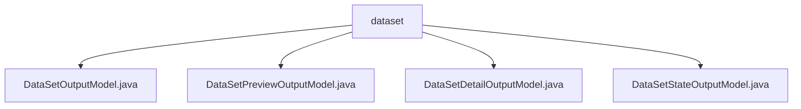

# Basic Information

|      |      |
|------|------|
| Name | dataset |
| Language | .java |
| Code Path | WeFe/fusion/fusion-service/src/main/java/com/welab/wefe/data/fusion/service/dto/entity/dataset |
| Package Name | docs.fusion.fusion-service.src.main.java.com.welab.wefe.data.fusion.service.dto.entity.dataset |
| Brief Description | The DataSetOutputModel class inherits from AbstractOutputModel and includes attributes such as dataset name and row count, providing getter/setter methods. The DataSetPreviewOutputModel class is used for dataset previews, containing field lists, metadata, and raw data. DataSetDetailOutputModel inherits from AbstractOutputModel and includes detailed dataset information along with preview data. The DataSetStateOutputModel class represents the dataset state, containing data source ID, row count, and processing count. |

# Description

## Overview  
The core responsibility of this module is to manage the full lifecycle state of datasets, including basic information storage, preview display, and detailed status tracking. The interface specification uniformly adopts the Getter/Setter pattern, achieving standardized output through inheritance of AbstractOutputModel. Key data structures include DataSetOutputModel (basic attributes), DataSetPreviewOutputModel (preview structure), DataSetDetailOutputModel (extended details), and DataSetStateOutputModel (processing status). External dependencies are limited to the Java standard library. For example, DataSetPreviewOutputModel uses Map to store raw data, resembling a NoSQL document structure.  

## Primary Business Scenarios  
The module supports dataset metadata management (e.g., recording row counts/sources), dynamic previews (such as separating field lists from raw data displays), and asynchronous processing monitoring (e.g., processCount progress tracking). A typical interaction pattern involves chained operations: first obtaining a summary via DataSetOutputModel, then loading Preview or Detail models as needed. Full functionality covers unified encapsulation from SQL query results to file path data—for instance, DataSetDetailOutputModel integrates both SQL statements and local file paths. All API types are POJO entity classes, suitable for RESTful interface serialization.

### Package Internal Structure View

This flowchart illustrates the hierarchical relationships between four Java files under the `dataset` directory. `dataset` serves as the parent node, containing four child node files: DataSetOutputModel.java, DataSetPreviewOutputModel.java, DataSetDetailOutputModel.java, and DataSetStateOutputModel.java. These files belong to the DTO entity classes of the data fusion service, handling different output models for datasets.

# File List

| Name   | Type  | Description |
|-------|------|-------------|
| [DataSetOutputModel.java](DataSetOutputModel.md) | file | The `DataSetOutputModel` class inherits from `AbstractOutputModel` and includes attributes such as dataset name, row count, data source ID, description, usage count, storage status, data origin, SQL statement, source file path, column selection, progress count, progress status, resource type, and hash function, along with their corresponding getter/setter methods. |
| [DataSetPreviewOutputModel.java](DataSetPreviewOutputModel.md) | file | Dataset preview output model, including field list, metadata information, and raw data list, with corresponding getter and setter methods provided. |
| [DataSetDetailOutputModel.java](DataSetDetailOutputModel.md) | file | Dataset details output model, including name, row count, data source ID, description, usage count, storage status, data origin, SQL statement, source file path, column selection, progress count, progress status, type, and preview data. |
| [DataSetStateOutputModel.java](DataSetStateOutputModel.md) | file | Dataset status output model class, containing three attributes: data source ID, row count, and processed count, along with their corresponding setter methods. |

