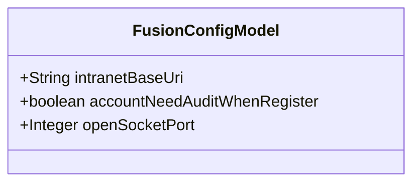
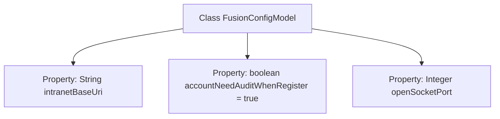

# Basic Information

|      |      |
|------|------|
| Name | FusionConfigModel |
| Language | .java |
| Code Path | WeFe/fusion/fusion-service/src/main/java/com/welab/wefe/data/fusion/service/dto/entity/globalconfig/FusionConfigModel.java |
| Package Name | com.welab.wefe.data.fusion.service.dto.entity.globalconfig |
| Dependencies | [] |
| Brief Description | The `FusionConfigModel` class includes the intranet base URL, the flag indicating whether new accounts require approval, and the open Socket port configuration. |

# Description

The FusionConfigModel class contains three configuration parameters: intranetBaseUri represents the internal network base URL of the fusion service; accountNeedAuditWhenRegister defaults to true, controlling whether newly registered accounts require administrator approval; openSocketPort is used to set the open socket port number.

# Class Summary

| Name   | Type  | Description |
|-------|------|-------------|
| FusionConfigModel | class | The FusionConfigModel class includes the intranet base URL, the flag indicating whether new account registration requires review, and the configuration for open Socket ports. |

## Class FusionConfigModel

|      |      |
|------|------|
| Access Modifier | public |
| Type | class |
| Name | FusionConfigModel |
| Description | The FusionConfigModel class includes the intranet base URL, the flag indicating whether new account registration requires review, and the configuration for open Socket ports. |

### UML Class Diagram

This class diagram illustrates a configuration model class `FusionConfigModel`, which contains three public fields: `intranetBaseUri` represents the intranet base URL address, `accountNeedAuditWhenRegister` controls whether newly registered accounts require administrator approval (default value is true), and `openSocketPort` stores the open Socket port number. This is a simple data transfer object designed to centrally manage configuration parameters for fusion services. All fields are publicly accessible without encapsulation methods, making it suitable as a carrier class for configuration information.

### Internal Method Call Graph

This flowchart illustrates the structure of the FusionConfigModel class, which contains three main properties: intranetBaseUri stores the intranet base URL address, accountNeedAuditWhenRegister controls the audit switch for new account registration (enabled by default), and openSocketPort records the open Socket port number. The class defines no methods, directly exposing configuration parameters through public fields—a design typically used for simple configuration data encapsulation scenarios. Each property is accompanied by JavaDoc comments explaining its purpose, reflecting the fundamental characteristics of a configuration class.

### Field List

| Name  | Type  | Description |
|-------|-------|------|
| accountNeedAuditWhenRegister = true | boolean | Account requires approval upon registration |
| intranetBaseUri | String | Declare a public string variable intranetBaseUri to store the intranet base URI. |
| openSocketPort | Integer | Defined a public integer variable openSocketPort, used to represent the opened socket port number. |

### Method List

| Name  | Type  | Description |
|-------|-------|------|

