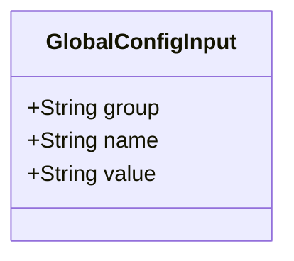
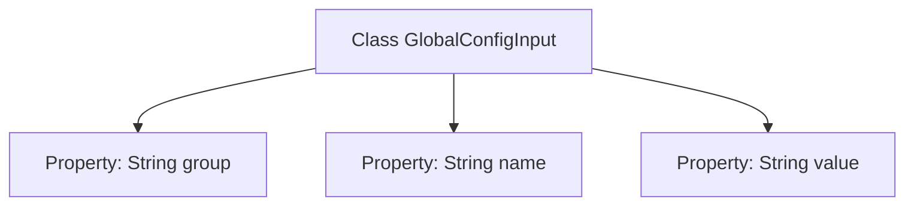

# Basic Information

|      |      |
|------|------|
| Name | GlobalConfigInput |
| Language | .java |
| Code Path | WeFe/fusion/fusion-service/src/main/java/com/welab/wefe/data/fusion/service/dto/entity/globalconfig/GlobalConfigInput.java |
| Package Name | com.welab.wefe.data.fusion.service.dto.entity.globalconfig |
| Dependencies | [] |
| Brief Description | The GlobalConfigInput class contains three string attributes: group, name, and value, which are used for the grouping, name, and value of configuration items. |

# Description

GlobalConfigInput is a public class used to represent the input information of global configurations. This class contains three public string-type properties: group indicates the group to which the configuration belongs, name represents the name of the configuration, and value denotes the value of the configuration. The structure of this class is simple and clear, making it suitable for storing and transmitting data related to global configurations.

# Class Summary

| Name   | Type  | Description |
|-------|------|-------------|
| GlobalConfigInput | class | The GlobalConfigInput class contains three string attributes: group, name, and value. |

## Class GlobalConfigInput

|      |      |
|------|------|
| Access Modifier | public |
| Type | class |
| Name | GlobalConfigInput |
| Description | The GlobalConfigInput class contains three string attributes: group, name, and value. |

### UML Class Diagram

This class diagram depicts a simple global configuration input class named GlobalConfigInput, which contains three public string fields: "group" representing the configuration category, "name" indicating the configuration item's identifier, and "value" storing the configuration data. Serving as a Data Transfer Object (DTO), this class encapsulates no logic and is solely designed for structured storage of configuration data. All fields are publicly accessible, making it suitable for scenarios requiring rapid read/write operations of configuration information, commonly seen in system initialization or dynamic configuration loading processes.

### Internal Method Call Graph

This flowchart illustrates the structure of the GlobalConfigInput class, which is a simple data carrier class containing three public string-type properties: group, name, and value. The class defines no methods and solely stores the configuration item's group name, name, and value through its properties. This design is typically used in DTO (Data Transfer Object) or configuration parameter encapsulation scenarios, where publicly exposed properties facilitate direct access but lack encapsulation protection.

### Field List

| Name  | Type  | Description |
|-------|-------|------|
| name | String | Common string variable name |
| group | String | A public string variable `group` is defined. |
| value | String | Declare a public string variable named value. |

### Method List

| Name  | Type  | Description |
|-------|-------|------|

