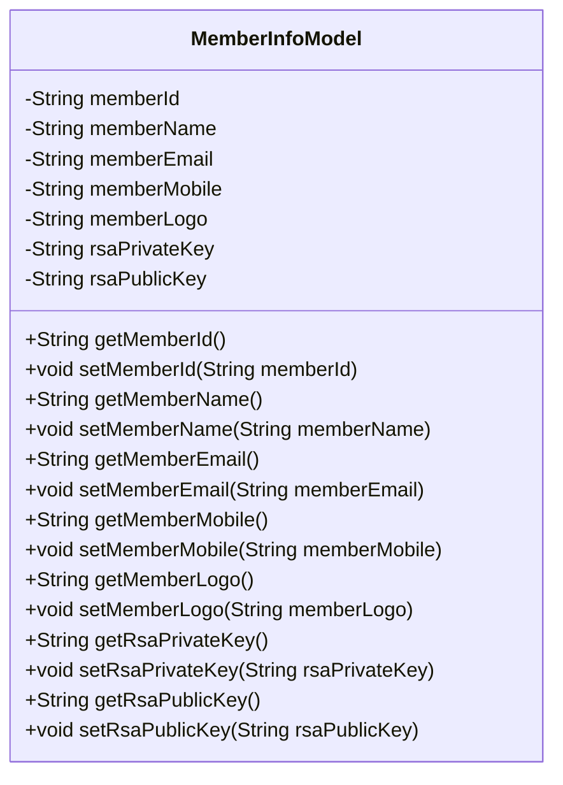

# Basic Information

|      |      |
|------|------|
| Name | MemberInfoModel |
| Language | .java |
| Code Path | WeFe/fusion/fusion-service/src/main/java/com/welab/wefe/data/fusion/service/dto/entity/globalconfig/MemberInfoModel.java |
| Package Name | com.welab.wefe.data.fusion.service.dto.entity.globalconfig |
| Dependencies | ['com.welab.wefe.common.fieldvalidate.annotation.Check'] |
| Brief Description | The MemberInfoModel class contains fields for member ID, name, email, phone, avatar, and RSA public/private keys, all of which provide getter/setter methods. |

# Description

The MemberInfoModel class defines the data structure for federated member information, including basic details such as member ID (globally unique, defaulting to uuid), name, email, phone number, avatar, as well as RSA public and private key fields. Each field is annotated with the @Check annotation to specify its Chinese name and description. The class provides standard getter and setter methods for all fields, enabling read and write operations on these attributes. This model is used to encapsulate and manage data related to federated members.

# Class Summary

| Name   | Type  | Description |
|-------|------|-------------|
| MemberInfoModel | class | The MemberInfoModel class contains fields for member ID, name, email, phone, avatar, and RSA public/private keys, providing getter/setter methods. |

## Class MemberInfoModel

|      |      |
|------|------|
| Access Modifier | public |
| Type | class |
| Name | MemberInfoModel |
| Description | The MemberInfoModel class contains fields for member ID, name, email, phone, avatar, and RSA public/private keys, providing getter/setter methods. |

### UML Class Diagram

This code defines a class named `MemberInfoModel`, which represents the information model of a federation member. The class includes multiple private fields such as member ID, name, email, phone, avatar, and RSA public/private keys, each paired with corresponding getter and setter methods. The `@Check` annotation provides descriptive labels for the fields, indicating their purposes and constraints. The overall design complies with the JavaBean specification, facilitating data encapsulation and access control.

### Internal Method Call Graph

```mermaid
graph TD
    A["Class MemberInfoModel"]
    B["Property: String memberId"]
    C["Property: String memberName"]
    D["Property: String memberEmail"]
    E["Property: String memberMobile"]
    F["Property: String memberLogo"]
    G["Property: String rsaPrivateKey"]
    H["Property: String rsaPublicKey"]
    I["Method: getMemberId()"]
    J["Method: setMemberId(String)"]
    K["Method: getMemberName()"]
    L["Method: setMemberName(String)"]
    M["Method: getMemberEmail()"]
    N["Method: setMemberEmail(String)"]
    O["Method: getMemberMobile()"]
    P["Method: setMemberMobile(String)"]
    Q["Method: getMemberLogo()"]
    R["Method: setMemberLogo(String)"]
    S["Method: getRsaPrivateKey()"]
    T["Method: setRsaPrivateKey(String)"]
    U["Method: getRsaPublicKey()"]
    V["Method: setRsaPublicKey(String)"]

    A --> B
    A --> C
    A --> D
    A --> E
    A --> F
    A --> G
    A --> H
    A --> I
    A --> J
    A --> K
    A --> L
    A --> M
    A --> N
    A --> O
    A --> P
    A --> Q
    A --> R
    A --> S
    A --> T
    A --> U
    A --> V
```

This flowchart illustrates the complete structure of the MemberInfoModel class, comprising 7 private properties and their corresponding 14 getter/setter methods. All properties are annotated with @Check for validation, covering basic member information (such as ID, name, contact details) and security credentials (RSA key pairs). Each property achieves encapsulation through paired accessor methods, forming a standard data model class structure suitable for federated member information storage and validation scenarios.

### Field List

| Name  | Type  | Description |
|-------|-------|------|
| memberId | String | Federated Member ID, globally unique, default value is uuid. |
| memberEmail | String | The code defines a private string variable named memberEmail, which is annotated with @Check and labeled as "Federal Member Name". |
| memberName | String | Define a private string variable memberName, and validate the federate name using the @Check annotation. |
| rsaPublicKey | String | The class member variable `rsaPublicKey` is annotated with `@Check` as "public key" and has a type of `String`. |
| memberLogo | String | Member avatar field, marked with the @Check annotation. |
| memberMobile | String | The class member variable `memberMobile` is validated using the `@Check` annotation for federation member phone numbers. |
| rsaPrivateKey | String | The private string variable `rsaPrivateKey`, labeled as the private key inspection item. |

### Method List

| Name  | Type  | Description |
|-------|-------|------|
| setRsaPrivateKey | void | The method to set the RSA private key assigns the input string to the class's private variable `rsaPrivateKey`. |
| getRsaPrivateKey | String | Methods to obtain an RSA private key, returning the private key value as a string. |
| getMemberLogo | String | Method for obtaining the string value of a member's Logo. |
| setMemberMobile | void | This is a Java method used to set a member's mobile number, assigning the passed-in memberMobile to the class's member variable of the same name. |
| setRsaPublicKey | void | Method to set the RSA public key, assigning the input string to the class member variable rsaPublicKey. |
| setMemberId | void | The method to set the member ID assigns the input parameter to the class's member variable `memberId`. |
| getMemberEmail | String | Methods to retrieve member email, returns the member email string. |
| setMemberEmail | void | This is a Java method used to set the member email attribute. The method takes a string parameter memberEmail and assigns it to the class's member variable memberEmail. |
| getRsaPublicKey | String | Methods to Obtain an RSA Public Key. |
| getMemberId | String | Methods to obtain member ID, returns a string-type memberId. |
| getMemberMobile | String | Methods to obtain a member's phone number, returns the member's phone number as a string. |
| setMemberLogo | void | The method to set the member logo is to assign the input string to the member variable memberLogo. |
| getMemberName | String | The method returns the value of the member variable memberName. |
| setMemberName | void | Methods for setting member names, assigning input parameters to member variables. |

