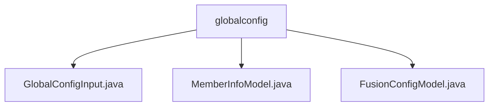

# Basic Information

|      |      |
|------|------|
| Name | globalconfig |
| Language | .java |
| Code Path | WeFe/fusion/fusion-service/src/main/java/com/welab/wefe/data/fusion/service/dto/entity/globalconfig |
| Package Name | docs.fusion.fusion-service.src.main.java.com.welab.wefe.data.fusion.service.dto.entity.globalconfig |
| Brief Description | The GlobalConfigInput class contains three string attributes: group, name, and value, used for global configuration input. The MemberInfoModel class defines federated member information, including fields such as ID, name, email, and RSA keys. The FusionConfigModel class includes three configuration parameters: intranet URL, registration approval switch, and socket port number. |

# Description

## Overview  
The core responsibility of this module is to manage the global configuration and member information of the federated learning system, functioning similarly to a configuration center. The interface specifications are uniformly encapsulated in Java classes, including three main data structures: `GlobalConfigInput` (configuration item input), `MemberInfoModel` (member information), and `FusionConfigModel` (service configuration). Key fields include the configuration triplet `group/name/value`, member ID/secret key (for authentication), and `intranetBaseUri` (network address), among others. External dependencies are limited to the basic Java environment. For example, `GlobalConfigInput` stores configurations as strings, while `MemberInfoModel` uses annotations to validate fields.  

## Key Business Scenarios  
The module supports two core processes: federated member management (e.g., registration and approval) and service configuration maintenance, both of which involve DTO object transfers. Typical applications include validating the account approval switch (`accountNeedAuditWhenRegister`) during new member registration and relying on the `intranetBaseUri` configuration for inter-service communication. API types cover configuration CRUD and member information management, such as controlling the Socket service port via the `openSocketPort` parameter. Overall, it forms a solution akin to a microservices configuration center.

### Package Internal Structure View

This flowchart illustrates three Java files under the `globalconfig` directory: `GlobalConfigInput.java`, `MemberInfoModel.java`, and `FusionConfigModel.java`. All files are directly subordinate to the `globalconfig` directory with no deeper nesting levels, presenting a clear and simple structure.

# File List

| Name   | Type  | Description |
|-------|------|-------------|
| [GlobalConfigInput.java](GlobalConfigInput.md) | file | The GlobalConfigInput class contains three string attributes: group, name, and value, which are used for the grouping, name, and value of configuration items. |
| [MemberInfoModel.java](MemberInfoModel.md) | file | The MemberInfoModel class contains fields for member ID, name, email, phone, avatar, and RSA public/private keys, all of which provide getter/setter methods. |
| [FusionConfigModel.java](FusionConfigModel.md) | file | The FusionConfigModel class includes the intranet base URL, the flag indicating whether new accounts require approval, and the open Socket port configuration. |

