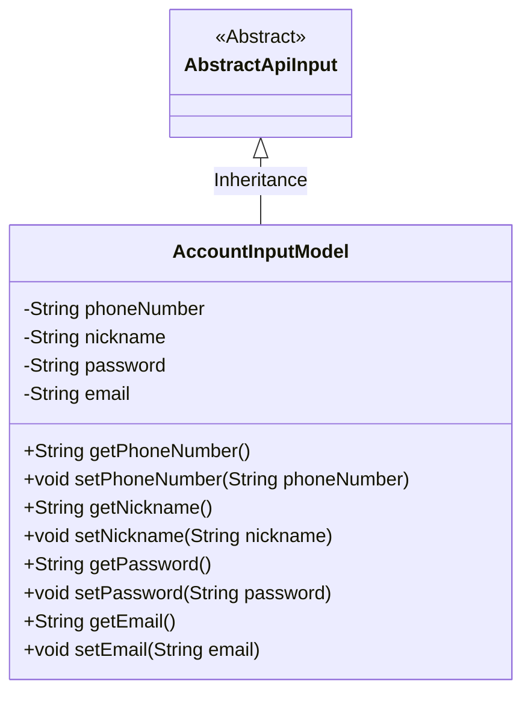
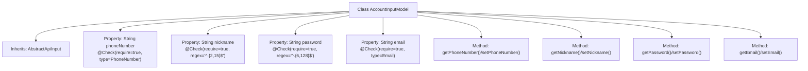

# Basic Information

|      |      |
|------|------|
| Name | AccountInputModel |
| Language | .java |
| Code Path | WeFe/fusion/fusion-service/src/main/java/com/welab/wefe/data/fusion/service/dto/vo/AccountInputModel.java |
| Package Name | com.welab.wefe.data.fusion.service.dto.vo |
| Dependencies | ['com.welab.wefe.common.fieldvalidate.StandardFieldType', 'com.welab.wefe.common.fieldvalidate.annotation.Check', 'com.welab.wefe.common.web.dto.AbstractApiInput'] |
| Brief Description | The `AccountInputModel` class inherits from `AbstractApiInput` and includes required fields: mobile number, a 2-15 character nickname, a 6-128 character password, and email. Each field has validation rules and getter/setter methods. |

# Description

This is a Java class named AccountInputModel, which extends AbstractApiInput and is used to encapsulate account input data. The class contains four private fields: phoneNumber (phone number, mandatory and must conform to the standard phone number format), nickname (nickname, mandatory with a length between 2 and 15 characters), password (password, mandatory with a length between 6 and 128 characters), and email (email, mandatory and must conform to the standard email format). Each field has corresponding getter and setter methods for accessing and modifying its value.

# Class Summary

| Name   | Type  | Description |
|-------|------|-------------|
| AccountInputModel | class | The `AccountInputModel` class inherits from `AbstractApiInput`, containing fields for phone number, nickname, password, and email. Each field includes non-null validation and format constraints, along with getter/setter methods provided. |

## Class AccountInputModel

|      |      |
|------|------|
| Access Modifier | public |
| Type | class |
| Name | AccountInputModel |
| Description | The `AccountInputModel` class inherits from `AbstractApiInput`, containing fields for phone number, nickname, password, and email. Each field includes non-null validation and format constraints, along with getter/setter methods provided. |

### UML Class Diagram

This code demonstrates an account input model class `AccountInputModel`, which inherits from the abstract class `AbstractApiInput`. The class contains four private fields: `phoneNumber`, `nickname`, `password`, and `email`, each with corresponding getter and setter methods. Notably, these fields are validated using `@Check` annotations, including constraints such as phone number format, nickname length, password complexity, and email format. This class is primarily used to encapsulate user account-related input data and inherits basic API input processing capabilities from `AbstractApiInput`.

### Internal Method Call Graph

This code defines an AccountInputModel class that inherits from the AbstractApiInput base class. The class contains four core properties: phoneNumber (with phone number validation), nickname (2-15 character length validation), password (6-128 character length validation), and email (with email format validation), each enforced with format validation through the @Check annotation. Standard getter and setter methods are provided for each property, forming a complete data encapsulation structure. This model is typically used for receiving and preliminary validation of API request parameters.

### Field List

| Name  | Type  | Description |
|-------|-------|------|
| password | String | Password field validation: Required, length 6-128 characters. |
| phoneNumber | String | The code defines a private string variable phoneNumber, annotated with @Check to indicate it is required and must be of phone number type. |
| nickname | String | Java field validation: Nickname is required, length must be 2-15 characters. |
| email | String | The code defines a private String variable email, marked as a required field with the @Check annotation, and specifies its type as a standard email format. |

### Method List

| Name  | Type  | Description |
|-------|-------|------|
| setPhoneNumber | void | The method to set the phone number assigns the input parameter to the `phoneNumber` member variable of the class. |
| getNickname | String | Methods to obtain the nickname, returns a string-type nickname. |
| getPassword | String | This is a Java method that returns the value of a string-type variable named password. |
| getPhoneNumber | String | This is a Java method that returns the value of the string-type variable phoneNumber. |
| setNickname | void | Methods for setting a user nickname, assigning the input parameter to the member variable nickname. |
| setPassword | void | This is a Java method used to set the password field in a class. The method accepts a string parameter `password` and assigns it to the member variable `password` of the class. |
| setEmail | void | Methods to set the email attribute, with the parameter being an email string. |
| getEmail | String | String methods for obtaining email. |

