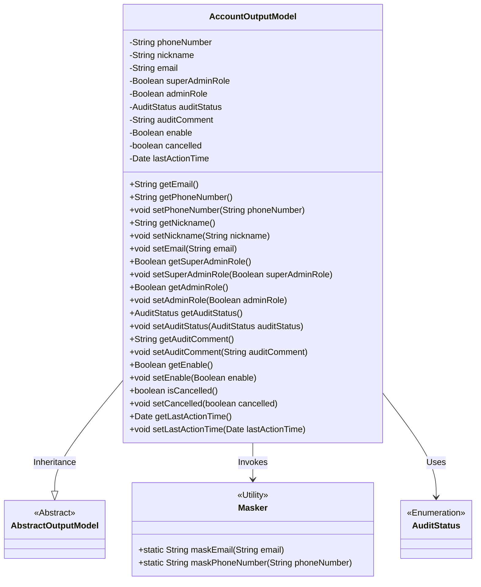

# Basic Information

|      |      |
|------|------|
| Name | AccountOutputModel |
| Language | .java |
| Code Path | WeFe/fusion/fusion-service/src/main/java/com/welab/wefe/data/fusion/service/dto/vo/AccountOutputModel.java |
| Package Name | com.welab.wefe.data.fusion.service.dto.vo |
| Dependencies | ['com.welab.wefe.common.fieldvalidate.annotation.Check', 'com.welab.wefe.common.util.Masker', 'com.welab.wefe.common.wefe.enums.AuditStatus', 'com.welab.wefe.data.fusion.service.dto.entity.AbstractOutputModel', 'java.util.Date'] |
| Brief Description | The AccountOutputModel class contains user account information such as phone number, nickname, email, administrator role, review status, and availability, and provides getter/setter methods. Some sensitive information is masked for security. |

# Description

The `AccountOutputModel` class inherits from `AbstractOutputModel` and includes account-related attributes: phone number, nickname, email, super administrator flag, administrator flag, review status, review comments, active status, cancellation status, and last activity time. The phone number and email are desensitized using `Masker`. It provides getter and setter methods for all attributes to facilitate data access and modification. The super administrator flag and administrator flag are used to distinguish different permission levels. The review status and comments are used to record account review information. The active status controls whether the account is valid, the cancellation status indicates whether the account has been canceled, and the last activity time records the user's most recent operation time.

# Class Summary

| Name   | Type  | Description |
|-------|------|-------------|
| AccountOutputModel | class | The AccountOutputModel class contains user account information such as phone number, nickname, email, administrator role, review status, and last activity time, and provides getter/setter methods. Some sensitive information is masked. |

## Class AccountOutputModel

|      |      |
|------|------|
| Access Modifier | public |
| Type | class |
| Name | AccountOutputModel |
| Description | The AccountOutputModel class contains user account information such as phone number, nickname, email, administrator role, review status, and last activity time, and provides getter/setter methods. Some sensitive information is masked. |

### UML Class Diagram

This diagram illustrates that AccountOutputModel inherits from AbstractOutputModel and contains multiple private attributes with corresponding getter/setter methods. The phoneNumber and email fields are desensitized using the Masker utility class, while auditStatus employs the enumeration type AuditStatus. The class diagram clearly reflects the structure and relationships of the data model, showcasing the core attributes and behavioral characteristics of the account output model.

### Internal Method Call Graph

```mermaid
graph TD
    A["Class AccountOutputModel"]
    B["Inherits from: AbstractOutputModel"]
    C["Property: @Check String phoneNumber"]
    D["Property: @Check String nickname"]
    E["Property: @Check String email"]
    F["Property: @Check Boolean superAdminRole"]
    G["Property: @Check Boolean adminRole"]
    H["Property: @Check AuditStatus auditStatus"]
    I["Property: @Check String auditComment"]
    J["Property: @Check Boolean enable"]
    K["Property: boolean cancelled"]
    L["Property: Date lastActionTime"]
    M["Method: getEmail() invokes Masker.maskEmail"]
    N["Method: getPhoneNumber() invokes Masker.maskPhoneNumber"]
    O["Method: 14 standard getter/setter"]

    A --> B
    A --> C
    A --> D
    A --> E
    A --> F
    A --> G
    A --> H
    A --> I
    A --> J
    A --> K
    A --> L
    A --> M
    A --> N
    A --> O
```

This flowchart illustrates the complete structure of the AccountOutputModel class, including inheritance relationships, 11 properties (8 annotated with @Check), and 16 methods. Key features include: 1) An extension model inheriting from AbstractOutputModel; 2) Sensitive information (email/phone) masking using the Masker utility class; 3) Business fields like admin roles and audit status; 4) Complete getter/setter method chains. The class design emphasizes data security (masking) and extensibility (inheritance + annotation-driven).

### Field List

| Name  | Type  | Description |
|-------|-------|------|
| auditComment | String | Define a private string `auditComment` to store audit comments, annotated with `@Check`. |
| email | String | The code defines a private string variable named email and adds an email validation annotation. |
| lastActionTime | Date | Private variable, records the time of the last operation. |
| auditStatus | AuditStatus | The private field auditStatus, labeled as audit status, is of type AuditStatus. |
| adminRole | Boolean | Check if it is an administrator, as administrators have additional permissions such as setting member visibility. |
| enable | Boolean | Define a private boolean variable enable, marked with the @Check annotation as the "Enabled" check item. |
| nickname | String | Java Field Annotation: Checking the string-type private variable for nickname. |
| phoneNumber | String | The field phoneNumber uses the @Check annotation to validate the phone number format. |
| cancelled | boolean | Private boolean variable indicating cancellation status. |
| superAdminRole | Boolean | Check if it is the super administrator, i.e., the initial creator of the system. |

### Method List

| Name  | Type  | Description |
|-------|-------|------|
| setLastActionTime | void | Method for setting the last operation time: Assign the passed date parameter to the object's lastActionTime property. |
| getSuperAdminRole | Boolean | This is a Java method that returns a boolean value of superAdminRole, indicating whether it is a super administrator role. |
| setAuditComment | void | The method to set the review comment assigns the input parameter auditComment to the auditComment member variable of the class. |
| setPhoneNumber | void | The method to set the phone number assigns the input parameter to the class member variable `phoneNumber`. |
| setNickname | void | The method to set a user nickname assigns the input parameter to the nickname property of the object. |
| getAuditComment | String | The method to obtain audit comments, returns the auditComment string. |
| setSuperAdminRole | void | Method to set the super administrator role, with a boolean parameter used to update the member variable superAdminRole. |
| setEnable | void | Methods for setting boolean activation status. |
| getAuditStatus | AuditStatus | The method returns the audit status auditStatus. |
| getEmail | String | This method returns a masked email address, hiding certain information to protect privacy. |
| isCancelled | boolean | This method returns a boolean value indicating whether it has been canceled. |
| setAuditStatus | void | The method to set the audit status assigns the incoming `auditStatus` to the `auditStatus` field of the current object. |
| getPhoneNumber | String | Get the phone number and return the desensitized result. |
| getEnable | Boolean | Public method to obtain the enable boolean value. |
| setAdminRole | void | This is a Java method used to set the adminRole property of an object, accepting a boolean parameter. |
| getNickname | String | Methods to obtain the nickname, returns a string-type nickname. |
| getAdminRole | Boolean | Methods to obtain administrator role status, returning a boolean value indicating whether the user is an administrator. |
| setEmail | void | Method to set the object's email property, with the parameter being a string type email. |
| setCancelled | void | Public method to set the cancellation status, with a boolean parameter `cancelled` for updating the internal state. |
| getLastActionTime | Date | The method returns the last operation time. |

