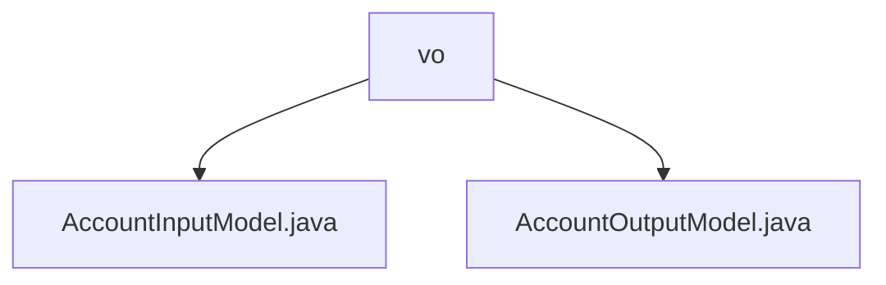

# Basic Information

|      |      |
|------|------|
| Name | vo |
| Language | .java |
| Code Path | WeFe/fusion/fusion-service/src/main/java/com/welab/wefe/data/fusion/service/dto/vo |
| Package Name | docs.fusion.fusion-service.src.main.java.com.welab.wefe.data.fusion.service.dto.vo |
| Brief Description | The `AccountInputModel` class inherits from `AbstractApiInput` and includes mandatory fields such as phone number, nickname, password, and email, with format and length constraints. The `AccountOutputModel` class inherits from `AbstractOutputModel` and contains account attributes like phone number, email (masked), permission identifiers, status information, and activity time, providing getter/setter methods. |

# Description

## Overview  
The core responsibility of this module is to encapsulate the input and output of account data, implementing data format validation and desensitization protection through Input/Output models. The interface specifications include mandatory field validation for AccountInputModel (such as phone number/email format) and sensitive information desensitization for AccountOutputModel (similar to data masking patterns). Key data structures include fields like phoneNumber/nickname in Input and permission identifiers/status flags in Output. External dependencies are limited to the basic AbstractApiInput/OutputModel parent classes. For example, InputModel enforces password length validation, while OutputModel uses Masker to process phone numbers.  

## Main Business Scenarios  
A typical workflow involves users submitting InputModel data during registration, with the system returning desensitized OutputModel information after validation. The interaction mode employs standard Getter/Setter for data access, with permission control hierarchically managed through super administrator identifiers. Functional completeness is reflected in covering the entire account lifecycle (registration-review-deactivation), such as OutputModel including review status and deactivation status. Integration examples include account information query interfaces returning desensitized data and registration interfaces validating Input formats.

### Package Internal Structure View

This flowchart illustrates the structural relationships within the dto/vo directory of the fusion-service module in the WeFe project. The parent node 'vo' contains two child nodes: AccountInputModel.java and AccountOutputModel.java. Both files are value object classes of data transfer objects, used for handling input and output models related to accounts. The entire structure is concise and clear, reflecting a typical layered design in Java projects.

# File List

| Name   | Type  | Description |
|-------|------|-------------|
| [AccountInputModel.java](AccountInputModel.md) | file | The `AccountInputModel` class inherits from `AbstractApiInput` and includes required fields: mobile number, a 2-15 character nickname, a 6-128 character password, and email. Each field has validation rules and getter/setter methods. |
| [AccountOutputModel.java](AccountOutputModel.md) | file | The AccountOutputModel class contains user account information such as phone number, nickname, email, administrator role, review status, and availability, and provides getter/setter methods. Some sensitive information is masked for security. |

