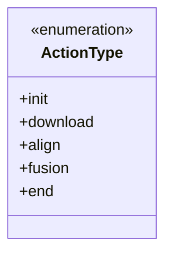
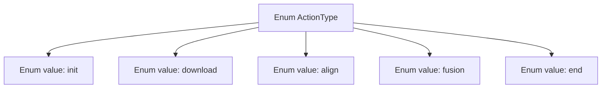

# Basic Information

|      |      |
|------|------|
| Name | ActionType |
| Language | .java |
| Code Path | WeFe/fusion/fusion-service/src/main/java/com/welab/wefe/data/fusion/service/enums/ActionType.java |
| Package Name | com.welab.wefe.data.fusion.service.enums |
| Dependencies | [] |
| Brief Description | The ActionType enumeration defines five action types: initialization, download, alignment, fusion, and completion. |

# Description

The content defines an enumeration type named ActionType, which includes five enumeration values: init represents an initialization operation, download represents a download operation, align represents an alignment operation, fusion represents a fusion operation, and end represents a termination operation. These enumeration values may be used to indicate different stages or operation types in a program execution flow.

# Class Summary

| Name   | Type  | Description |
|-------|------|-------------|
| ActionType | enum | This is an enumeration type that defines five action types: initialization, download, alignment, fusion, and completion. |

## Class ActionType

|      |      |
|------|------|
| Access Modifier | public |
| Type | enum |
| Name | ActionType |
| Description | This is an enumeration type that defines five action types: initialization, download, alignment, fusion, and completion. |

### UML Class Diagram

This code defines an enumeration type named ActionType, which contains five enumeration constants: init, download, align, fusion, and end. Enumeration types are used to represent a fixed set of constant values, typically employed in scenarios such as state machines or option configurations. This enumeration might describe different stages of a certain process or operation, such as the initialization, download, alignment, fusion, and completion steps in a file processing workflow. Each enumeration constant is an instance of the ActionType type and can be directly referenced via methods like ActionType.init.

### Internal Method Call Graph

This flowchart illustrates the structure of the ActionType enum, containing five sequentially defined enum values: init, download, align, fusion, and end. Each enum value is represented as an independent node connected to the parent enum type ActionType, indicating they are possible values of this enumeration. Such structure is commonly used to represent finite state sets or operation types, suitable for state machine or workflow scenarios.

### Field List

| Name  | Type  | Description |
|-------|-------|------|

### Method List

| Name  | Type  | Description |
|-------|-------|------|

