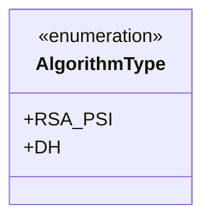
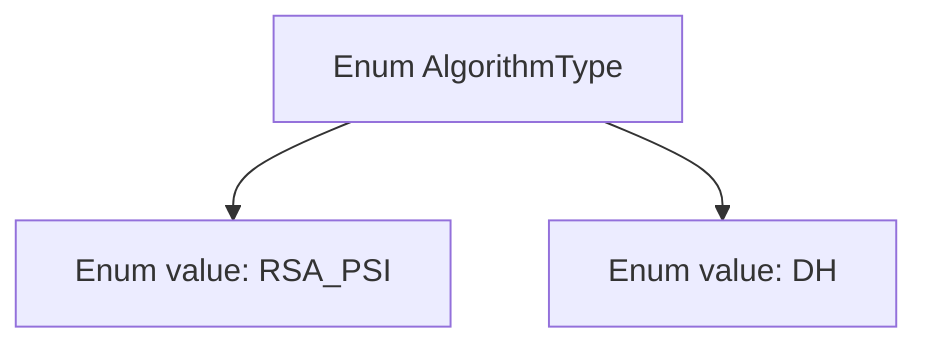

# Basic Information

|      |      |
|------|------|
| Name | AlgorithmType |
| Language | .java |
| Code Path | WeFe/fusion/fusion-service/src/main/java/com/welab/wefe/data/fusion/service/enums/AlgorithmType.java |
| Package Name | com.welab.wefe.data.fusion.service.enums |
| Dependencies | [] |
| Brief Description | The algorithm type enumeration includes two options: RSA_PSI and DH. |

# Description

The content defines a public enumeration type named AlgorithmType, which includes two enumeration constants: RSA_PSI and DH. RSA_PSI likely represents a private set intersection technique based on the RSA algorithm, while DH may refer to the Diffie-Hellman key exchange protocol. This enumeration type can be used to identify or select specific encryption algorithm types within a system.

# Class Summary

| Name   | Type  | Description |
|-------|------|-------------|
| AlgorithmType | enum | The algorithm type enumeration includes two types: RSA_PSI and DH. |

## Class AlgorithmType

|      |      |
|------|------|
| Access Modifier | public |
| Type | enum |
| Name | AlgorithmType |
| Description | The algorithm type enumeration includes two types: RSA_PSI and DH. |

### UML Class Diagram

This code defines an enumeration type named AlgorithmType, containing two enumeration constants RSA_PSI and DH, used to represent different algorithm types. In the class diagram, the enumeration type is marked with <<enumeration>>, and its members are listed as public static constants. This design is suitable for scenarios requiring explicit restriction of algorithm choices, such as cryptographic protocol implementations, where enumerations can prevent invalid parameters and enhance code readability.

### Internal Method Call Graph

This code defines an enumeration type named AlgorithmType containing two enum values: RSA_PSI and DH. The flowchart illustrates the hierarchical relationship between the enumeration type and its contained values, with AlgorithmType as the parent node and RSA_PSI/DH as its direct child nodes. Such structures are commonly used to represent a fixed set of constants, such as different algorithm type selections.

### Field List

| Name  | Type  | Description |
|-------|-------|------|

### Method List

| Name  | Type  | Description |
|-------|-------|------|

