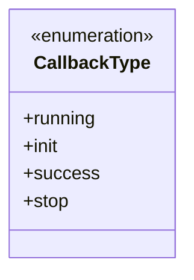
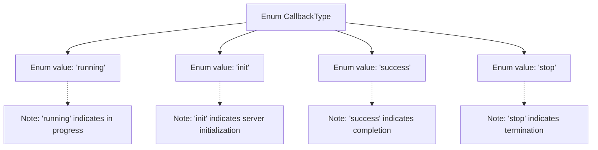

# Basic Information

|      |      |
|------|------|
| Name | CallbackType |
| Language | .java |
| Code Path | WeFe/fusion/fusion-service/src/main/java/com/welab/wefe/data/fusion/service/enums/CallbackType.java |
| Package Name | com.welab.wefe.data.fusion.service.enums |
| Dependencies | [] |
| Brief Description | The CallbackType enum defines four states: Running, Initializing Server, Success, Stopped. |

# Description

The content defines an enumeration type named CallbackType, which includes four enumeration values: running indicates in progress, init indicates server initialization, success indicates success, and stop indicates stopped. Each enumeration value has corresponding comments explaining its meaning.

# Class Summary

| Name   | Type  | Description |
|-------|------|-------------|
| CallbackType | enum | The enumeration CallbackType defines callback types: Running, Initializing Server, Success, Stopped. |

## Class CallbackType

|      |      |
|------|------|
| Access Modifier | public |
| Type | enum |
| Name | CallbackType |
| Description | The enumeration CallbackType defines callback types: Running, Initializing Server, Success, Stopped. |

### UML Class Diagram

This code defines an enumeration type named CallbackType, which includes four enum constants: `running` represents the running state, `init` represents the server initialization state, `success` represents the success state, and `stop` represents the stopped state. The enumeration type is indicated by the `<<enumeration>>` tag in the classDiagram, and all enum constants are public members. This design is commonly used to represent a finite and fixed set of states, suitable for use in state machines or callback mechanisms, effectively avoiding magic strings and improving code readability.

### Internal Method Call Graph

This flowchart illustrates the structure of the CallbackType enum, which includes four enum values: running (in progress), init (server initialization), success (completion), and stop (termination). Each enum value has corresponding notes explaining its purpose, with arrows showing the hierarchical relationship between the enum class and its values, as well as the association between notes and enum values.

### Field List

| Name  | Type  | Description |
|-------|-------|------|

### Method List

| Name  | Type  | Description |
|-------|-------|------|

