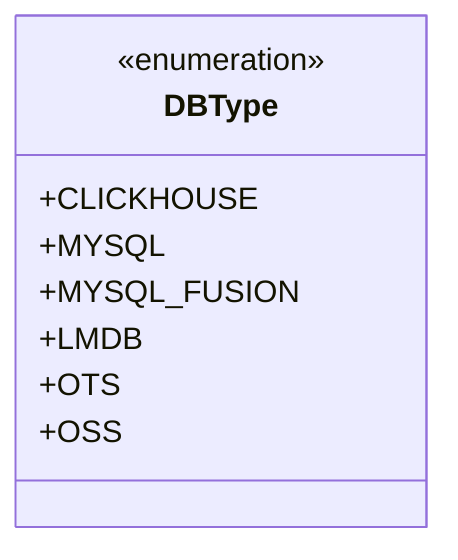
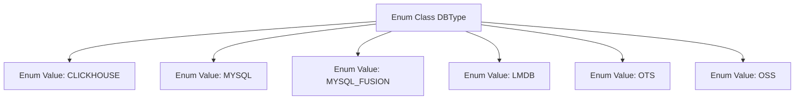

# Basic Information

|      |      |
|------|------|
| Name | DBType |
| Language | .java |
| Code Path | WeFe/fusion/fusion-service/src/main/java/com/welab/wefe/data/fusion/service/enums/DBType.java |
| Package Name | com.welab.wefe.data.fusion.service.enums |
| Dependencies | [] |
| Brief Description | Define the database type enumeration, including six types: CLICKHOUSE, MYSQL, MYSQL_FUSION, LMDB, OTS, and OSS. |

# Description

The content defines a public enumeration type named DBType, which includes six enumeration constants: CLICKHOUSE, MYSQL, MYSQL_FUSION, LMDB, OTS, and OSS. These constants represent different types of database systems, covering various data storage technologies such as relational databases, key-value stores, and object storage.

# Class Summary

| Name   | Type  | Description |
|-------|------|-------------|
| DBType | enum | The DBType enumeration defines six types of databases: CLICKHOUSE, MYSQL, MYSQL_FUSION, LMDB, OTS, and OSS. |

## Class DBType

|      |      |
|------|------|
| Access Modifier | public |
| Type | enum |
| Name | DBType |
| Description | The DBType enumeration defines six types of databases: CLICKHOUSE, MYSQL, MYSQL_FUSION, LMDB, OTS, and OSS. |

### UML Class Diagram

This class diagram illustrates an enumeration type named DBType, which defines six constant values representing different database types: CLICKHOUSE, MYSQL, MYSQL_FUSION, LMDB, OTS, and OSS. In Java, an enumeration is a special class used to represent a fixed set of constants, here employed to identify various database systems. Each enum value is an instance of this enumeration type and can be directly referenced via notations like DBType.CLICKHOUSE. Such design is commonly used in system configuration or database connection management scenarios to ensure type safety and avoid magic strings.

### Internal Method Call Graph

This flowchart illustrates the structure of the DBType enum class, which contains six predefined database type enum values: CLICKHOUSE, MYSQL, MYSQL_FUSION, LMDB, OTS, and OSS. Each enum value is represented as an independent node directly linked to the enum class, indicating they are static constant members of the DBType class. This design is commonly used to define a collection of supported database types in a system, facilitating type-safe configuration management and switch control.

### Field List

| Name  | Type  | Description |
|-------|-------|------|

### Method List

| Name  | Type  | Description |
|-------|-------|------|

