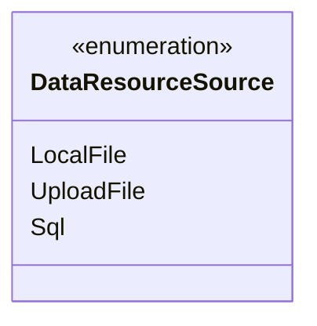
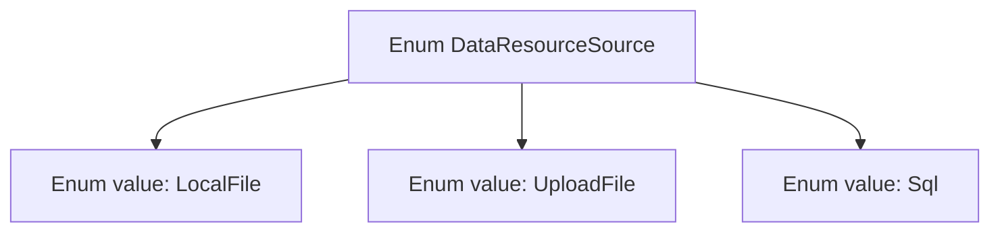

# Basic Information

|      |      |
|------|------|
| Name | DataResourceSource |
| Language | .java |
| Code Path | WeFe/fusion/fusion-service/src/main/java/com/welab/wefe/data/fusion/service/enums/DataResourceSource.java |
| Package Name | com.welab.wefe.data.fusion.service.enums |
| Dependencies | [] |
| Brief Description | The DataResourceSource enumeration defines three data sources: local files, uploaded files, and SQL databases. |

# Description

The content defines a public enumeration type named DataResourceSource, which includes three enumeration values: LocalFile represents a local file source, UploadFile represents an uploaded file source, and Sql represents a database source. The enumeration is used to identify different source types of data resources.

# Class Summary

| Name   | Type  | Description |
|-------|------|-------------|
| DataResourceSource | enum | The enumeration DataResourceSource defines three types of data sources: local files, uploaded files, and SQL databases. |

## Class DataResourceSource

|      |      |
|------|------|
| Access Modifier | public |
| Type | enum |
| Name | DataResourceSource |
| Description | The enumeration DataResourceSource defines three types of data sources: local files, uploaded files, and SQL databases. |

### UML Class Diagram

This code defines an enumeration type named DataResourceSource, containing three enumeration constants: LocalFile, UploadFile, and Sql. Enumeration types are used to represent a fixed set of constant values, which in this case likely identify different types of data sources, such as local files, uploaded files, or SQL databases. In class diagrams, enumeration types are marked with <<enumeration>>, and their constant values are listed directly within the class box without specifying access modifiers or methods, as enumeration constants are inherently public static instances of the type.

### Internal Method Call Graph

This flowchart illustrates the structure of the DataResourceSource enum, which contains three enum values: LocalFile represents a local file data source, UploadFile represents an uploaded file data source, and Sql represents a database data source. The enum type provides type-safe resource origin identification for programs through concise constant definitions, making it suitable for scenarios requiring clear distinction between different data sources. Each enum value is a unique instance of this type and can be directly accessed via the enum class name.

### Field List

| Name  | Type  | Description |
|-------|-------|------|

### Method List

| Name  | Type  | Description |
|-------|-------|------|

