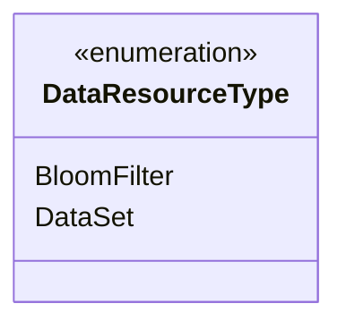
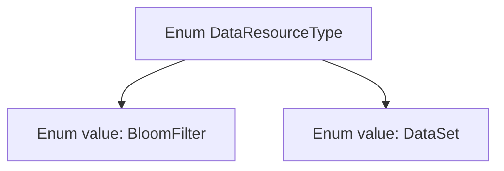

# Basic Information

|      |      |
|------|------|
| Name | DataResourceType |
| Language | .java |
| Code Path | WeFe/fusion/fusion-service/src/main/java/com/welab/wefe/data/fusion/service/enums/DataResourceType.java |
| Package Name | com.welab.wefe.data.fusion.service.enums |
| Dependencies | [] |
| Brief Description | Data resource type enumeration: BloomFilter and DataSet. |

# Description

The content defines a public enumeration type named DataResourceType, which includes two enumeration values: BloomFilter and DataSet. BloomFilter represents the Bloom filter resource type, while DataSet represents the dataset resource type. The enumeration is used to denote different categories of data resources, with a concise and clear structure.

# Class Summary

| Name   | Type  | Description |
|-------|------|-------------|
| DataResourceType | enum | The DataResourceType enum defines two data types: BloomFilter and DataSet. |

## Class DataResourceType

|      |      |
|------|------|
| Access Modifier | public |
| Type | enum |
| Name | DataResourceType |
| Description | The DataResourceType enum defines two data types: BloomFilter and DataSet. |

### UML Class Diagram

This code defines an enumeration type named DataResourceType, containing two enum constants: BloomFilter and DataSet. Enumeration types are used to represent a fixed set of constant values, which in this context likely serve to identify different types of data resources. As an enumeration, it is marked with <<enumeration>> in the class diagram and directly lists all its enum values. The structure of this enumeration is simple, with no additional methods or attributes defined, primarily serving as a type-safe identifier for constants.

### Internal Method Call Graph

This code defines an enum type named DataResourceType containing two enum values: BloomFilter and DataSet. Enum types are used to represent a fixed set of constants, which in this context likely serves to identify different types of data resources. BloomFilter may represent the probabilistic data structure of a Bloom filter, while DataSet probably denotes conventional datasets. This enum provides the system with a type-safe way to identify resource types, avoiding potential errors that could arise from using string or integer constants.

### Field List

| Name  | Type  | Description |
|-------|-------|------|

### Method List

| Name  | Type  | Description |
|-------|-------|------|

