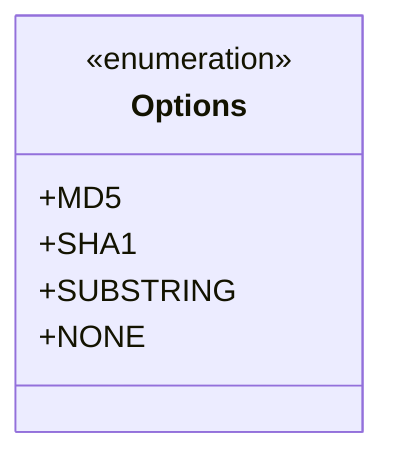
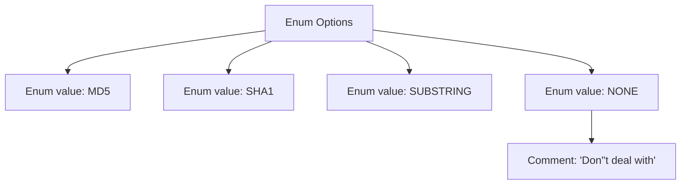

# Basic Information

|      |      |
|------|------|
| Name | Options |
| Language | .java |
| Code Path | WeFe/fusion/fusion-service/src/main/java/com/welab/wefe/data/fusion/service/enums/Options.java |
| Package Name | com.welab.wefe.data.fusion.service.enums |
| Dependencies | [] |
| Brief Description | The enum Options defines four options: MD5, SHA1, SUBSTRING, and NONE (no processing). |

# Description

This is an enumeration type named Options, which defines four option constants: MD5, SHA1, SUBSTRING, and NONE. Among them, MD5 and SHA1 represent two different hash algorithms, SUBSTRING denotes a substring operation, and NONE indicates no processing. The NONE option also includes a comment explaining its meaning as "no processing." This enumeration may be used to specify choices for data processing methods.

# Class Summary

| Name   | Type  | Description |
|-------|------|-------------|
| Options | enum | The enum Options defines four options: MD5, SHA1, SUBSTRING, and NONE, where NONE indicates no processing. |

## Class Options

|      |      |
|------|------|
| Access Modifier | public |
| Type | enum |
| Name | Options |
| Description | The enum Options defines four options: MD5, SHA1, SUBSTRING, and NONE, where NONE indicates no processing. |

### UML Class Diagram

This enumeration class defines four option constants: MD5, SHA1, SUBSTRING, and NONE, where NONE includes a comment indicating no processing. Enumeration types are marked with <<enumeration>> in the class diagram, and all enum values are public static constants. This simple enumeration structure can be used in scenarios such as algorithm selection or feature switches, providing highly readable configuration options through clear naming and comments.

### Internal Method Call Graph

This flowchart illustrates the structure of the Options enum, which includes four enum values (MD5, SHA1, SUBSTRING, and NONE), with NONE having a special comment stating "Don't deal with". The diagram clearly presents the basic components of the enum definition and the dependency of the comment, where each node is connected via arrows to show the hierarchical structure, making it easy to understand the overall design intent of this enum type.

### Field List

| Name  | Type  | Description |
|-------|-------|------|

### Method List

| Name  | Type  | Description |
|-------|-------|------|

