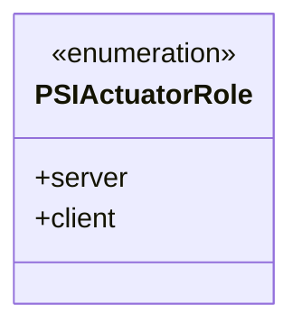
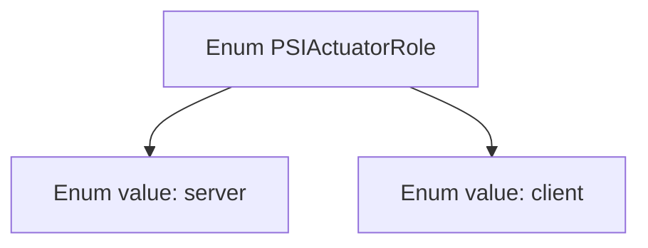

# Basic Information

|      |      |
|------|------|
| Name | PSIActuatorRole |
| Language | .java |
| Code Path | WeFe/fusion/fusion-service/src/main/java/com/welab/wefe/data/fusion/service/enums/PSIActuatorRole.java |
| Package Name | com.welab.wefe.data.fusion.service.enums |
| Dependencies | [] |
| Brief Description | The PSIActuatorRole enumeration defines two roles: server and client. |

# Description

The content defines a public enumeration type named PSIActuatorRole, which includes two enumeration values: server and client. The enumeration is used to represent the two roles of a PSI actuator, namely the server side and the client side. This definition is concise and clear, containing no additional attributes or methods, and is solely used to distinguish between role types.

# Class Summary

| Name   | Type  | Description |
|-------|------|-------------|
| PSIActuatorRole | enum | The PSIActuatorRole enumeration defines two roles: server and client. |

## Class PSIActuatorRole

|      |      |
|------|------|
| Access Modifier | public |
| Type | enum |
| Name | PSIActuatorRole |
| Description | The PSIActuatorRole enumeration defines two roles: server and client. |

### UML Class Diagram

This code defines an enumeration type named PSIActuatorRole, containing two enum constants: server and client. Enumeration types are used to represent a fixed set of constant values, here likely indicating whether an actuator's role in the PSI (Private Set Intersection) protocol is server or client. The class diagram illustrates the structure of this enumeration, marking its enumeration characteristic and listing all possible values.

### Internal Method Call Graph

This code defines an enumeration type named PSIActuatorRole, containing two enum values: server and client. The flowchart clearly illustrates the hierarchical relationship between the enumeration type and its values, with PSIActuatorRole as the parent node and server and client as its direct child nodes. This structure is commonly used to represent fixed sets of roles or states, such as distinguishing between server and client roles in network communication.

### Field List

| Name  | Type  | Description |
|-------|-------|------|

### Method List

| Name  | Type  | Description |
|-------|-------|------|

