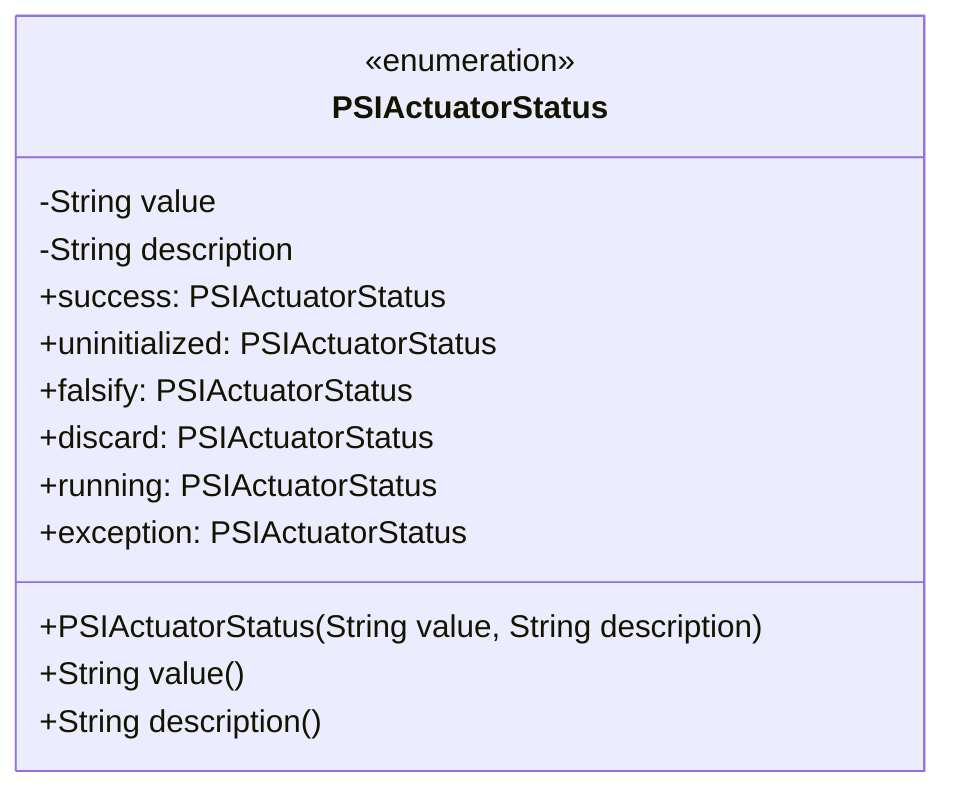
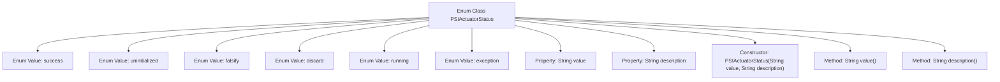

# Basic Information

|      |      |
|------|------|
| Name | PSIActuatorStatus |
| Language | .java |
| Code Path | WeFe/fusion/fusion-service/src/main/java/com/welab/wefe/data/fusion/service/enums/PSIActuatorStatus.java |
| Package Name | com.welab.wefe.data.fusion.service.enums |
| Dependencies | [] |
| Brief Description | The enumeration PSIActuatorStatus defines actuator states: Success, Uninitialized, Validation Failed, Task Discarded, Running, Exception. Each state includes a value and description. |

# Description

This is an enumeration type named PSIActuatorStatus, which defines six states and their descriptions. The states include: success indicating success, uninitialized indicating data is uninitialized or initialization failed, falsify indicating data validation failed, discard indicating the task was discarded, running indicating in progress, and exception indicating unexpected situations. Each enumeration value has corresponding value and description attributes, initialized via a constructor. Methods value and description are provided to retrieve the values of these two attributes, respectively.

# Class Summary

| Name   | Type  | Description |
|-------|------|-------------|
| PSIActuatorStatus | enum | The enumeration PSIActuatorStatus defines the actuator status, which includes six states: success, uninitialized, validation failed, discarded, running, and exception. Each state has a value and a description. |

## Class PSIActuatorStatus

|      |      |
|------|------|
| Access Modifier | public |
| Type | enum |
| Name | PSIActuatorStatus |
| Description | The enumeration PSIActuatorStatus defines the actuator status, which includes six states: success, uninitialized, validation failed, discarded, running, and exception. Each state has a value and a description. |

### UML Class Diagram

This code defines an enumeration class `PSIActuatorStatus` to represent actuator states, including 6 predefined states (success, uninitialized, etc.). Each enumeration instance contains two private attributes, `value` and `description`, initialized via the constructor and exposed through corresponding public access methods. The class diagram clearly illustrates the enumeration structure, private fields, constructor, and instance list, conforming to UML representation standards for enumeration types.

### Internal Method Call Graph

This flowchart illustrates the complete structure of the PSIActuatorStatus enum class, which includes 6 predefined state enum values (success/uninitialized/falsify/discard/running/exception), two string properties (value and description), a parameterized constructor, and two methods for retrieving property values. The enum class provides machine-readable values and human-readable descriptions for each state through the value and description fields, making it suitable for business scenarios that require clear state identification and state explanations.

### Field List

| Name  | Type  | Description |
|-------|-------|------|

### Method List

| Name  | Type  | Description |
|-------|-------|------|

