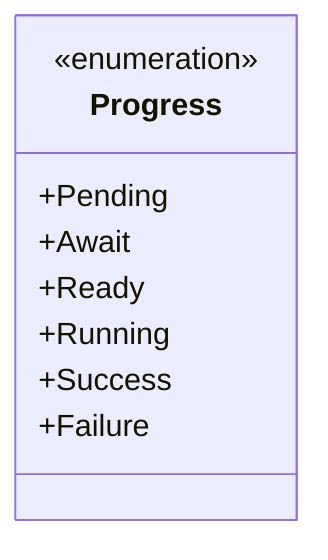
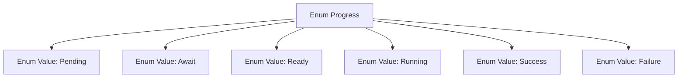

# Basic Information

|      |      |
|------|------|
| Name | Progress |
| Language | .java |
| Code Path | WeFe/fusion/fusion-service/src/main/java/com/welab/wefe/data/fusion/service/enums/Progress.java |
| Package Name | com.welab.wefe.data.fusion.service.enums |
| Dependencies | [] |
| Brief Description | The Progress enum defines task states: Pending, Await, Ready, Running, Success, Failure. |

# Description

This is an enumeration type named Progress, which defines six distinct status values representing different stages of a task or process. Pending indicates a to-be-processed state, Await denotes a waiting state, Ready signifies a prepared state, Running represents an in-progress state, Success indicates a successfully completed state, and Failure denotes a failed state. These enumeration values can be used to track and represent the current progress or outcome status of a process.

# Class Summary

| Name   | Type  | Description |
|-------|------|-------------|
| Progress | enum | Progress Status Enum: Pending, Waiting, Ready, Running, Success, Failed. |

## Class Progress

|      |      |
|------|------|
| Access Modifier | public |
| Type | enum |
| Name | Progress |
| Description | Progress Status Enum: Pending, Waiting, Ready, Running, Success, Failed. |

### UML Class Diagram

This code defines an enumeration type named `Progress` containing six enum constants: `Pending`, `Await`, `Ready`, `Running`, `Success`, and `Failure`. Enumerations are typically used to represent a fixed set of states or options, likely indicating different stages of a task or process here. Each enum constant is an instance of the `Progress` type and can be directly accessed via `Progress.ConstantName`. In class diagrams, enumeration types are marked with `<<enumeration>>` and list all enum values as public attributes.

### Internal Method Call Graph

This flowchart illustrates the structure of the Progress enum, which defines six state values: Pending, Await, Ready, Running, Success, and Failure. Each enum value is represented by an independent node and forms a hierarchical relationship with the parent node Progress, clearly depicting the complete set of states for this enum type. It is suitable for scenarios requiring multi-state management (e.g., task progress tracking).

### Field List

| Name  | Type  | Description |
|-------|-------|------|

### Method List

| Name  | Type  | Description |
|-------|-------|------|

