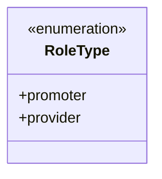
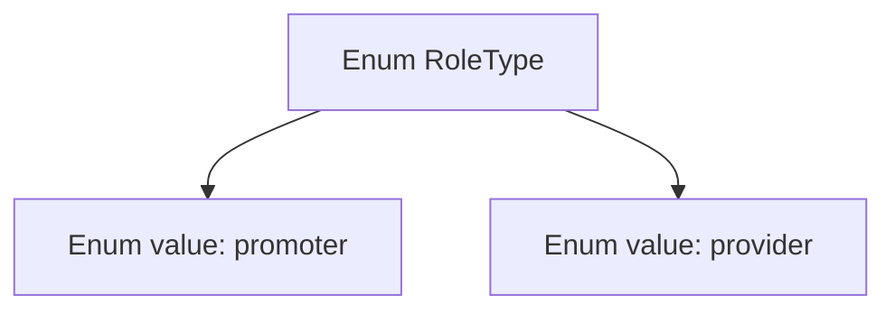

# Basic Information

|      |      |
|------|------|
| Name | RoleType |
| Language | .java |
| Code Path | WeFe/fusion/fusion-service/src/main/java/com/welab/wefe/data/fusion/service/enums/RoleType.java |
| Package Name | com.welab.wefe.data.fusion.service.enums |
| Dependencies | [] |
| Brief Description | Defined an enumeration class RoleType, containing two role types: promoter and provider. |

# Description

The content defines a public enumeration type named RoleType, containing two enumeration constants: promoter and provider. Enumerations are used to represent a fixed set of constant values, which in this case may be used to identify role types. Promoter and provider represent two distinct roles, with their specific meanings to be determined by the context. The entire definition is concise and clear, without including any additional modifiers or methods.

# Class Summary

| Name   | Type  | Description |
|-------|------|-------------|
| RoleType | enum | The enumeration RoleType defines two role types: promoter and provider. |

## Class RoleType

|      |      |
|------|------|
| Access Modifier | public |
| Type | enum |
| Name | RoleType |
| Description | The enumeration RoleType defines two role types: promoter and provider. |

### UML Class Diagram

This class diagram depicts a simple enumeration type RoleType, which contains two enum constants: promoter and provider. As an enumeration, it is marked with <<enumeration>>, indicating this is a fixed set of values. The enum does not define any methods or additional attributes, serving solely to represent two role types. Such design is commonly used in scenarios requiring type-safe constants, such as system permission management or status identification.

### Internal Method Call Graph

This mermaid flowchart describes the structure of the RoleType enum, which contains two enum values: promoter and provider. In Java, an enum is a special class used to define a fixed set of constants. The diagram clearly illustrates the hierarchical relationship between RoleType as the parent node and its two enum values. This representation aids in understanding the composition of enums, particularly when it is necessary to explicitly define a limited range of values or states. Enum types provide enhanced type safety and code readability in such scenarios.

### Field List

| Name  | Type  | Description |
|-------|-------|------|

### Method List

| Name  | Type  | Description |
|-------|-------|------|

