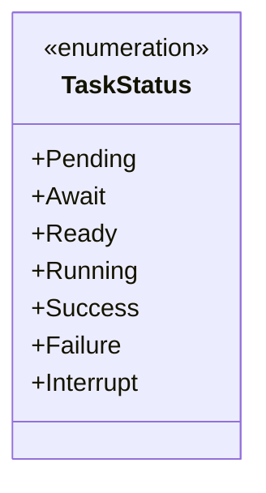
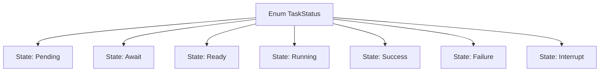

# Basic Information

|      |      |
|------|------|
| Name | TaskStatus |
| Language | .java |
| Code Path | WeFe/fusion/fusion-service/src/main/java/com/welab/wefe/data/fusion/service/enums/TaskStatus.java |
| Package Name | com.welab.wefe.data.fusion.service.enums |
| Dependencies | [] |
| Brief Description | Task status enumeration: Pending, Waiting, Ready, Running, Success, Failed, Interrupted. |

# Description

This enumeration type defines seven possible values for task status, covering the entire lifecycle of task execution. The initial states include Pending and Await (waiting), the preparation phase is Ready, and the execution phase is Running (in progress). The final states are divided into three types: Success, Failure, and Interrupt. The comments indicate that each status corresponds to different stages of the task alignment process, but there are some discrepancies between the actual enumeration value names and the descriptions in the comments.

# Class Summary

| Name   | Type  | Description |
|-------|------|-------------|
| TaskStatus | enum | Task status enumeration definition, including seven states: pending, waiting, ready, running, success, failure, and interrupted. |

## Class TaskStatus

|      |      |
|------|------|
| Access Modifier | public |
| Type | enum |
| Name | TaskStatus |
| Description | Task status enumeration definition, including seven states: pending, waiting, ready, running, success, failure, and interrupted. |

### UML Class Diagram

This enumeration class defines 7 states of task execution: Pending, Await, Ready, Running, Success, Failure, and Interrupt. Each enum value represents a distinct phase in the task lifecycle, from the initial waiting state to the final completion state (Success/Failure/Interrupt), comprehensively covering all possible state scenarios during task execution. The enumeration type ensures state consistency and type safety through a fixed set of values.

### Internal Method Call Graph

This flowchart illustrates the complete state definition structure of the TaskStatus enum. The enum contains 7 state constants, representing different phases in a task's lifecycle: three intermediate states - Pending, Await, Ready, and Running, along with three terminal states - Success, Failure, and Interrupt. Each state is connected to the enum body through independent nodes, clearly presenting the complete definition of the state machine.

### Field List

| Name  | Type  | Description |
|-------|-------|------|

### Method List

| Name  | Type  | Description |
|-------|-------|------|

