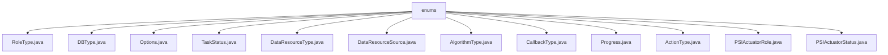

# Basic Information

|      |      |
|------|------|
| Name | enums |
| Language | .java |
| Code Path | WeFe/fusion/fusion-service/src/main/java/com/welab/wefe/data/fusion/service/enums |
| Package Name | docs.fusion.fusion-service.src.main.java.com.welab.wefe.data.fusion.service.enums |
| Brief Description | Multiple enumeration types are defined: RoleType (promoter/provider), DBType (6 database types), Options (4 processing methods), TaskStatus (7 task statuses), DataResourceType (2 resource types), DataResourceSource (3 sources), AlgorithmType (2 algorithms), CallbackType (4 callback statuses), Progress (6 progress stages), ActionType (5 operations), PSIActuatorRole (2 roles), PSIActuatorStatus (6 statuses). |

# Description

## Overview  
This module defines system core metadata through enumerated types, with its primary responsibility being to standardize fundamental enumeration values such as states, roles, algorithms, and resource types in data fusion services. The interface specifications uniformly adopt Java enum definitions, including value/description attributes and access methods. Key data structures include TaskStatus (7 task states), DBType (6 database types), and PSIActuatorStatus (state objects with descriptions). External dependencies involve only standard Java enum support. For example, AlgorithmType defines RSA_PSI and DH encryption algorithms, resembling a strategy pattern selector.

## Core Business Scenarios  
The module supports end-to-end data fusion management, including task state machines (Pending→Success), PSI role assignment (server/client), and data processing options (e.g., MD5 hashing). The typical interaction pattern is enumeration-driven process transitions, such as the linear operation chain from init to end in ActionType. It comprehensively covers scenarios like data sources (LocalFile/Sql), resource types (BloomFilter), and callback events (running/stop). All API types are enumeration values, with integration cases including database selection (CLICKHOUSE/OSS) and algorithm switching (RSA_PSI/DH).

### Package Internal Structure View

This flowchart illustrates the hierarchical structure of enumeration classes in the WeFe data fusion service. The root node is the "enums" directory, which contains 12 specific enumeration type files covering various business enumeration definitions such as role types, database types, task statuses, and algorithm types. All child nodes are directly subordinate to the "enums" directory, presenting a flat structure.

# File List

| Name   | Type  | Description |
|-------|------|-------------|
| [RoleType.java](RoleType.md) | file | Defined an enumeration class RoleType, containing two role types: promoter and provider. |
| [DBType.java](DBType.md) | file | Define the database type enumeration, including six types: CLICKHOUSE, MYSQL, MYSQL_FUSION, LMDB, OTS, and OSS. |
| [Options.java](Options.md) | file | The enumeration Options defines four options: MD5, SHA1, SUBSTRING, and NONE (no processing). |
| [TaskStatus.java](TaskStatus.md) | file | Task status enumeration: Pending, Waiting, Ready, Running, Success, Failed, Interrupted. |
| [DataResourceType.java](DataResourceType.md) | file | Data resource type enumeration: BloomFilter and DataSet. |
| [DataResourceSource.java](DataResourceSource.md) | file | The DataResourceSource enumeration defines three data sources: local files, uploaded files, and SQL databases. |
| [AlgorithmType.java](AlgorithmType.md) | file | The algorithm type enumeration includes two options: RSA_PSI and DH. |
| [CallbackType.java](CallbackType.md) | file | The CallbackType enum defines four states: Running, Initializing Server, Success, and Stopped. |
| [Progress.java](Progress.md) | file | The Progress enumeration defines task states: Pending, Await, Ready, Running, Success, Failure. |
| [ActionType.java](ActionType.md) | file | The ActionType enumeration defines five action types: initialization, download, alignment, fusion, and termination. |
| [PSIActuatorRole.java](PSIActuatorRole.md) | file | The PSIActuatorRole enumeration defines two roles: server and client. |
| [PSIActuatorStatus.java](PSIActuatorStatus.md) | file | The enumeration PSIActuatorStatus defines actuator statuses: Success, Uninitialized, Validation Failed, Task Discarded, Running, Exception. Each status includes a value and description. |

