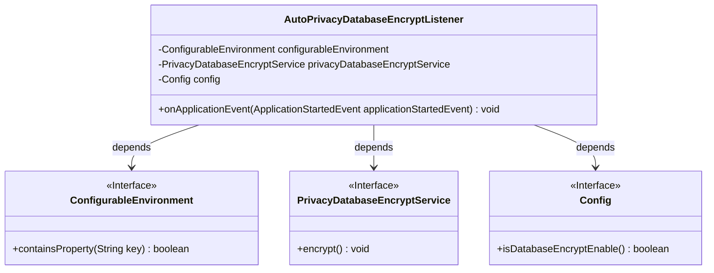
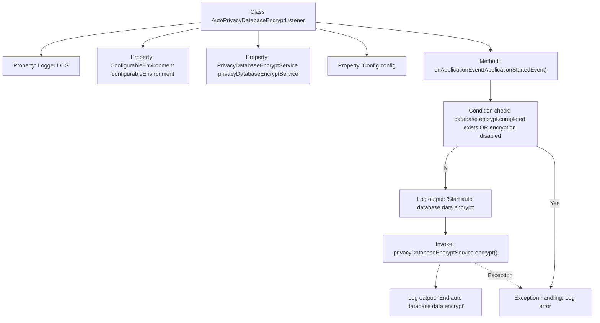

# Basic Information

|      |      |
|------|------|
| Name | AutoPrivacyDatabaseEncryptListener |
| Language | .java |
| Code Path | WeFe/fusion/fusion-service/src/main/java/com/welab/wefe/data/fusion/service/listener/AutoPrivacyDatabaseEncryptListener.java |
| Package Name | com.welab.wefe.data.fusion.service.listener |
| Dependencies | ['com.welab.wefe.data.fusion.service.config.Config', 'com.welab.wefe.data.fusion.service.service.PrivacyDatabaseEncryptService', 'org.slf4j.Logger', 'org.slf4j.LoggerFactory', 'org.springframework.beans.factory.annotation.Autowired', 'org.springframework.boot.context.event.ApplicationStartedEvent', 'org.springframework.context.ApplicationListener', 'org.springframework.core.env.ConfigurableEnvironment', 'org.springframework.stereotype.Component'] |
| Brief Description | Automatic database encryption listener, which checks configurations and performs encryption services upon application startup, while logging operation records and exceptions. |

# Description

This is a Spring component class named AutoPrivacyDatabaseEncryptListener, which implements the ApplicationListener interface to listen for ApplicationStartedEvent events. The class injects three dependencies: ConfigurableEnvironment, PrivacyDatabaseEncryptService, and Config. The main logic involves checking configurations during application startup. If encryption is not yet completed and the encryption feature is enabled, it invokes the privacy database encryption service to perform encryption operations, while logging start, completion, and exception events. The entire process includes conditional checks, encryption execution, and exception handling mechanisms.

# Class Summary

| Name   | Type  | Description |
|-------|------|-------------|
| AutoPrivacyDatabaseEncryptListener | class | The AutoPrivacyDatabaseEncryptListener monitors application startup events, checks configurations, then invokes encryption services to process database data while logging operations and exceptions. |

## Class AutoPrivacyDatabaseEncryptListener

|      |      |
|------|------|
| Access Modifier | @Component;public |
| Type | class |
| Name | AutoPrivacyDatabaseEncryptListener |
| Description | The AutoPrivacyDatabaseEncryptListener monitors application startup events, checks configurations, then invokes encryption services to process database data while logging operations and exceptions. |

### UML Class Diagram

Class diagram description: This diagram illustrates the dependency relationships between the AutoPrivacyDatabaseEncryptListener class and three interfaces. The listener checks encryption status through Spring environment variable ConfigurableEnvironment, relies on PrivacyDatabaseEncryptService to perform encryption operations, and obtains encryption configurations via the Config interface. Core logic is implemented in the onApplicationEvent method for conditional judgment and exception handling, completing the automated database encryption process.

### Internal Method Call Graph

This code represents a Spring event listener designed to automatically perform database encryption during application startup. The flowchart illustrates the complete process from class structure to event handling: it first checks encryption conditions, executes the encryption service if met while logging the process, and captures errors during exceptions. The core logic resides within the onApplicationEvent method, with execution controlled through environment variables and configurations.

### Field List

| Name  | Type  | Description |
|-------|-------|------|
| privacyDatabaseEncryptService | PrivacyDatabaseEncryptService | Use @Autowired to automatically inject an instance of the privacy database encryption service. |
| LOG = LoggerFactory.getLogger(AutoPrivacyDatabaseEncryptListener.class) | Logger | The class AutoPrivacyDatabaseEncryptListener defines a static immutable logger instance named LOG. |
| config | Config | Automatically injects Config configuration object instances. |
| configurableEnvironment | ConfigurableEnvironment | The code snippet declares a private member variable `configurableEnvironment` and implements automatic dependency injection using the `@Autowired` annotation. |

### Method List

| Name  | Type  | Description |
|-------|-------|------|
| onApplicationEvent | void | During application startup, check the database encryption configuration. If encryption is enabled but not completed, perform data encryption operations, log the start and end events, and record error messages in case of exceptions. |

