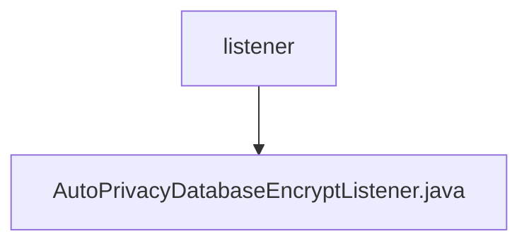

# Basic Information

|      |      |
|------|------|
| Name | listener |
| Language | .java |
| Code Path | WeFe/fusion/fusion-service/src/main/java/com/welab/wefe/data/fusion/service/listener |
| Package Name | docs.fusion.fusion-service.src.main.java.com.welab.wefe.data.fusion.service.listener |
| Brief Description | Automatic database encryption listener, which checks configurations and performs encryption services upon application startup, while logging operation records and exceptions. |

# Description

This is a Spring component class named AutoPrivacyDatabaseEncryptListener, which implements the ApplicationListener interface to listen for ApplicationStartedEvent events. The class injects three dependencies: ConfigurableEnvironment, PrivacyDatabaseEncryptService, and Config. The main logic involves checking configurations during application startup. If encryption is not yet completed and the encryption feature is enabled, it invokes the privacy database encryption service to perform encryption operations, logging start, completion, and exception events. The entire process includes conditional checks, encryption execution, and exception handling mechanisms.

### Package Internal Structure View

This flowchart illustrates the directory structure of listeners under the fusion-service module in the WeFe project. The root node is the listener folder, which contains a specific listener implementation file named AutoPrivacyDatabaseEncryptListener.java. This structure adheres to the typical Java service listener design pattern, where listener classes are centrally stored in a dedicated listener package for unified management and maintenance of event listening logic.

# File List

| Name   | Type  | Description |
|-------|------|-------------|
| [AutoPrivacyDatabaseEncryptListener.java](AutoPrivacyDatabaseEncryptListener.md) | file | Automatic database encryption listener, which checks configurations and performs encryption services upon application startup, logging operation records and exceptions. |

