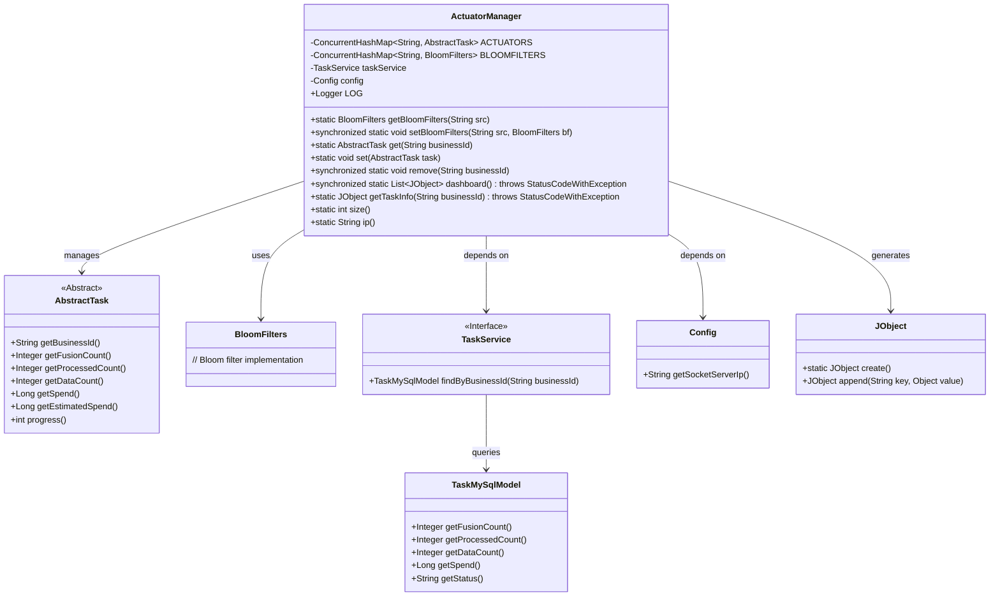
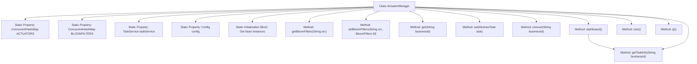
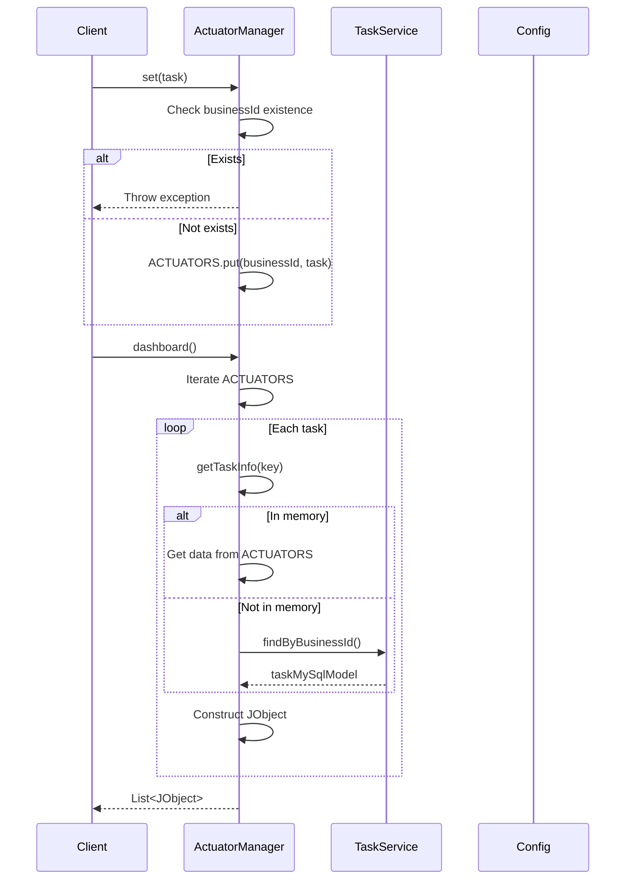

# Basic Information

|      |      |
|------|------|
| Name | ActuatorManager |
| Language | .java |
| Code Path | WeFe/fusion/fusion-service/src/main/java/com/welab/wefe/data/fusion/service/manager/ActuatorManager.java |
| Package Name | com.welab.wefe.data.fusion.service.manager |
| Dependencies | ['java.net.InetAddress', 'java.net.UnknownHostException', 'java.util.ArrayList', 'java.util.List', 'java.util.concurrent.ConcurrentHashMap', 'org.apache.commons.lang3.StringUtils', 'org.slf4j.Logger', 'org.slf4j.LoggerFactory', 'com.welab.wefe.common.exception.StatusCodeWithException', 'com.welab.wefe.common.util.JObject', 'com.welab.wefe.common.web.Launcher', 'com.welab.wefe.data.fusion.service.config.Config', 'com.welab.wefe.data.fusion.service.database.entity.TaskMySqlModel', 'com.welab.wefe.data.fusion.service.enums.TaskStatus', 'com.welab.wefe.data.fusion.service.service.TaskService', 'com.welab.wefe.data.fusion.service.task.AbstractTask', 'com.welab.wefe.data.fusion.service.utils.bf.BloomFilters'] |
| Brief Description | The ActuatorManager class manages tasks and Bloom filters, providing CRUD functionality, supporting task status queries and dashboard display, and includes concurrency control and IP retrieval methods. |

# Description

The ActuatorManager is a utility class for managing task executors, which includes two static ConcurrentHashMaps to store mappings between task IDs and task objects, as well as task IDs and Bloom filters. During class initialization, it obtains instances of TaskService and Config through the Launcher. It provides methods for retrieving and setting Bloom filters, supports adding, removing, and querying tasks, and ensures the uniqueness of task IDs. The dashboard method returns a list of information for all tasks, while the getTaskInfo method retrieves detailed information for a single task, including business ID, processing count, data volume, time consumption, progress, and status. The size method returns the current number of tasks, and the ip method fetches the server's IP address, prioritizing the IP from the configuration if available; otherwise, it retrieves the local IP. All operations are thread-safe.

# Class Summary

| Name   | Type  | Description |
|-------|------|-------------|
| ActuatorManager | class | The ActuatorManager class manages tasks and Bloom filters, providing CRUD functionality, supporting task information display and IP retrieval. It uses ConcurrentHashMap to store tasks and filters, ensuring thread safety. It includes methods for static initialization, task status query, and dashboard data generation. |

## Class ActuatorManager

|      |      |
|------|------|
| Access Modifier | public |
| Type | class |
| Name | ActuatorManager |
| Description | The ActuatorManager class manages tasks and Bloom filters, providing CRUD functionality, supporting task information display and IP retrieval. It uses ConcurrentHashMap to store tasks and filters, ensuring thread safety. It includes methods for static initialization, task status query, and dashboard data generation. |

### UML Class Diagram

Class diagram description: ActuatorManager is a core management class that maintains AbstractTask and BloomFilters instances through two ConcurrentHashMaps. It relies on TaskService and Config to obtain task information and configurations, and uses JObject to construct response data. AbstractTask is an abstract base class defining core task attributes and methods. This design implements thread-safe task management and status monitoring functionality.

### Internal Method Call Graph

This flowchart illustrates the core structure and data flow of the ActuatorManager class. The class manages tasks and Bloom Filters through two ConcurrentHashMaps, providing task CRUD operations and dashboard data aggregation functionality. The sequence diagram highlights two key processes: task setting and dashboard data retrieval, involving in-memory data checks, database fallback queries, and exception handling logic. The static initialization block obtains dependent service instances through the Spring context, demonstrating integration with the Inversion of Control container.

### Field List

| Name  | Type  | Description |
|-------|-------|------|
| config | Config | Private static immutable configuration object. |
| taskService | TaskService | Private static constant task service instance. |
| ACTUATORS = new ConcurrentHashMap<>() | ConcurrentHashMap<String, AbstractTask> | Define a private static immutable concurrent hash map with string keys and abstract task object values, used to store executors. |
| LOG = LoggerFactory.getLogger(ActuatorManager.class) | Logger | Define the static log constant LOG for the ActuatorManager class, created using LoggerFactory. |
| BLOOMFILTERS = new ConcurrentHashMap<>() | ConcurrentHashMap<String, BloomFilters> | Define a thread-safe global static Map with String as the key and BloomFilters objects as the value. |

### Method List

| Name  | Type  | Description |
|-------|-------|------|
| dashboard | List<JObject> | The synchronous static method `dashboard` returns a list of JObject, iterates through the ACTUATORS key set to retrieve task information, and adds it to the list if non-empty. May throw a `StatusCodeWithException` exception. |
| remove | void | Synchronize static method, remove the executor corresponding to the specified businessId. |
| getTaskInfo | JObject | Method to obtain task information: Query task data based on businessId, returning a JSON object containing business ID, merged count, processed count, total count, time consumed, progress, and status. If the task does not exist, fetch it from the database; if it is running, retrieve it from the executor. |
| set | void | The static method `set` takes an `AbstractTask` parameter, checks if the `businessId` already exists, throws an exception if it does, otherwise stores it in the `ACTUATORS` map. |
| getBloomFilters | BloomFilters | The static method `getBloomFilters` returns the corresponding `BloomFilters` object based on the input string `src`, retrieved from `BLOOMFILTERS`. |
| size | int | This method returns the number of elements in the static collection ACTUATORS. |
| ip | String | Methods to obtain the IP address: First read from the configuration, if failed then retrieve the local IP, and log an error message in case of exceptions. |
| setBloomFilters | void | Synchronized static method `setBloomFilters`: After clearing `BLOOMFILTERS`, store `src` and `bf` into it. |
| get | AbstractTask | The static method get retrieves the corresponding AbstractTask instance from ACTUATORS using the businessId. |

