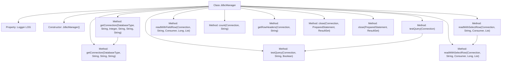

# Basic Information

|      |      |
|------|------|
| Name | JdbcManager |
| Language | .java |
| Code Path | WeFe/fusion/fusion-service/src/main/java/com/welab/wefe/data/fusion/service/manager/JdbcManager.java |
| Package Name | com.welab.wefe.data.fusion.service.manager |
| Dependencies | ['com.welab.wefe.common.CommonThreadPool', 'com.welab.wefe.common.StatusCode', 'com.welab.wefe.common.exception.StatusCodeWithException', 'com.welab.wefe.common.jdbc.base.DatabaseType', 'org.slf4j.Logger', 'org.slf4j.LoggerFactory', 'java.sql', 'java.util.ArrayList', 'java.util.LinkedHashMap', 'java.util.List', 'java.util.Map', 'java.util.function.Consumer'] |
| Brief Description | Deprecated JdbcManager class, providing functionalities such as database connection, query testing, data traversal reading, and column name retrieval. Supports Hive, MySQL, and Impala, including exception handling and resource closure. |

# Description

JdbcManager is a deprecated JDBC connection management utility class that provides various database connection and query functionalities. It supports connections to Hive, MySQL, and Impala databases, obtaining Connection objects through different methods. The class includes features such as test queries, iterative data retrieval, fetching query result column names, and record counting. It employs streaming reads to optimize large data volume processing and offers resource-closing methods to ensure secure connection release. All operations are logged with exceptions handled, throwing the custom StatusCodeWithException.

# Class Summary

| Name   | Type  | Description |
|-------|------|-------------|
| JdbcManager | class | The deprecated JdbcManager class provides JDBC connection management, supporting connections to Hive, MySQL, and Impala databases. It includes functionalities for obtaining connections, performing test queries, iterating through data reads, counting records, and retrieving column names, with final resource closure. |


## Class JdbcManager

|      |      |
|------|------|
| Access Modifier | @Deprecated;public |
| Type | class |
| Name | JdbcManager |
| Description | The deprecated JdbcManager class provides JDBC connection management, supporting connections to Hive, MySQL, and Impala databases. It includes functionalities for obtaining connections, performing test queries, iterating through data reads, counting records, and retrieving column names, with final resource closure. |


### UML Class Diagram

```mermaid
classDiagram
    class JdbcManager {
        <<Deprecated>>
        -Logger LOG
        +JdbcManager()
        +getConnection(DatabaseType, String, Integer, String, String, String) Connection
        +getConnection(DatabaseType, String, String, String) Connection
        +testQuery(Connection) boolean
        +testQuery(Connection, String, boolean) boolean
        +readWithSelectRow(Connection, String, Consumer~Map~String,Object~~, List~String~)
        +readWithSelectRow(Connection, String, Consumer~Map~String,Object~~, long, List~String~)
        +readWithFieldRow(Connection, String, Consumer~Map~String,Object~~, long, List~String~)
        +count(Connection, String) long
        +getRowHeaders(Connection, String) List~String~
        +close(Connection, PreparedStatement, ResultSet)
        +close(PreparedStatement, ResultSet)
    }

    class DatabaseType {
        <<enumeration>>
        Hive
        MySql
        Impala
    }

    class StatusCodeWithException {
        <<Exception>>
    }

    class StatusCode {
        <<enumeration>>
        UNEXPECTED_ENUM_CASE
        DATABASE_LOST
        ILLEGAL_REQUEST
        SQL_SYNTAX_ERROR
    }

    JdbcManager --> DatabaseType : uses
    JdbcManager --> StatusCodeWithException : throws
    StatusCodeWithException --> StatusCode : associates
    JdbcManager --> Consumer~Map~String,Object~~ : callback
    JdbcManager --> Connection : returns/operates
    JdbcManager --> PreparedStatement : operates
    JdbcManager --> ResultSet : operates
```

This code demonstrates a deprecated JDBC connection management class JdbcManager, which provides various database connection and query operations. The class diagram illustrates JdbcManager's relationships with the DatabaseType enumeration, StatusCodeWithException exception class, and core JDBC classes (Connection/PreparedStatement/ResultSet). Key functionalities include: establishing connections for different database types, executing test queries, streaming data reading, retrieving query result column names, and counting records. All database operations incorporate logging mechanisms, resource cleanup, and handle exceptions through custom status codes.


### Internal Method Call Graph



This code demonstrates a JDBC connection management utility class primarily designed to handle various database operations such as connection establishment, query testing, data retrieval, and resource cleanup. The flowchart clearly illustrates the class structure and invocation relationships between methods, including two overloaded getConnection methods for establishing database connections, testQuery methods for query testing, readWithSelectRow and readWithFieldRow methods for data reading, as well as close methods for resource release. The class supports multiple database types including Hive, MySQL, and Impala, and logs operation durations, reflecting robust exception handling and resource management mechanisms.

### Field List

| Name  | Type  | Description |
|-------|-------|------|
| LOG = LoggerFactory.getLogger(JdbcManager.class) | Logger | Declare a protected static constant log object LOG for logging in the JdbcManager class. |

### Method List

| Name  | Type  | Description |
|-------|-------|------|
| readWithSelectRow | void | The static method `readWithSelectRow` reads data via JDBC in a streaming manner, supporting row filtering and maximum row limit. After processing the result set, it passes each row of data through a `Consumer` callback, finally closes resources, and logs the time consumed. |
| getConnection | Connection | The static method `getConnection` loads the driver and establishes a connection based on the database type, supporting Hive, MySQL, and Impala, and throws an exception upon failure. |
| count | long | The static method `count` executes an SQL query via JDBC and returns the record count, logs the execution time, handles exceptions, and ensures resource release. |
| readWithFieldRow | void | This method reads specified field data from the database, processes each row of data, and returns the results via a callback. It supports limiting the number of rows read, automatically adds a default limit, and records the time consumed. |
| readWithSelectRow | void | The static method `readWithSelectRow` reads data via SQL query and invokes a Consumer to process each row of results, with the option to specify the number of rows to query. |
| getConnection | Connection | The static method `getConnection` generates a connection URL based on the database type, supporting Hive, MySQL, and Impala. It establishes a connection using a username and password, throwing an exception if the operation fails. |
| testQuery | boolean | The method testQuery tests an SQL query, checks that the result set is non-empty, optionally verifies that the number of columns is greater than 1, records the time taken, and returns success or failure. |
| testQuery | boolean | This is a static method used to test database connectivity by executing a simple query "select 1" without throwing exceptions. |
| getRowHeaders | List<String> | This method retrieves the column name list of SQL query results via JDBC, automatically adds a limit 1 restriction, and sets both fetchSize and maxRows to 1 to improve performance, ultimately returning the column name collection. |
| close | void | The static method `close` is used to safely close database connections, prepared statements, and result sets, while capturing and logging SQL exceptions. |
| close | void | The static method `close` is used to safely close `PreparedStatement` and `ResultSet`, catching and logging any `SQLException`. |


