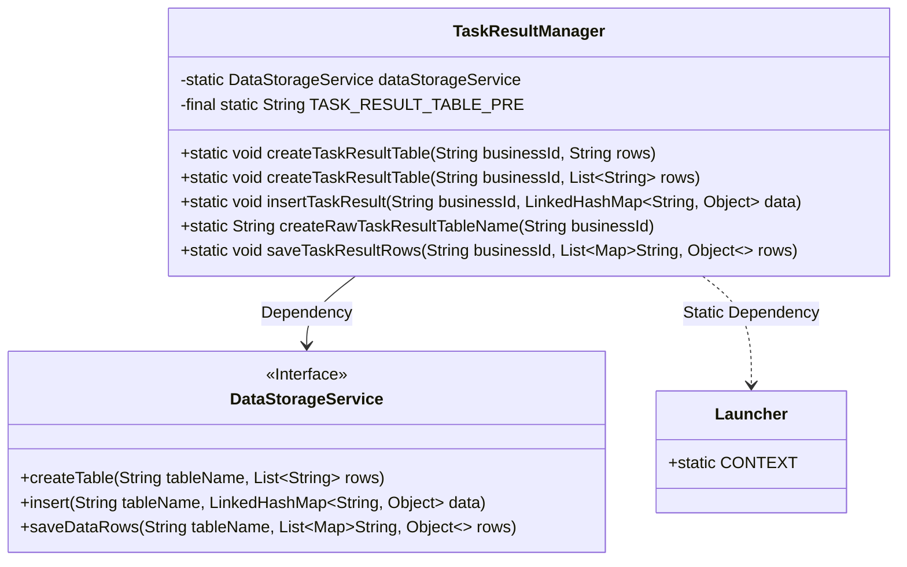
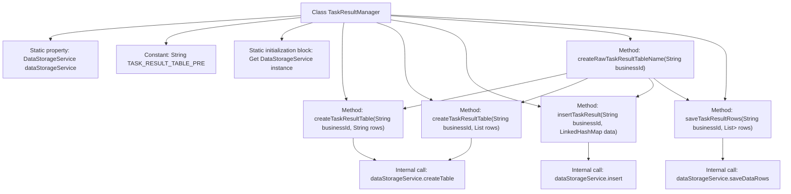

# Basic Information

|      |      |
|------|------|
| Name | TaskResultManager |
| Language | .java |
| Code Path | WeFe/fusion/fusion-service/src/main/java/com/welab/wefe/data/fusion/service/manager/TaskResultManager.java |
| Package Name | com.welab.wefe.data.fusion.service.manager |
| Dependencies | ['com.welab.wefe.common.web.Launcher', 'com.welab.wefe.data.fusion.service.service.DataStorageService', 'java.util.Arrays', 'java.util.LinkedHashMap', 'java.util.List', 'java.util.Map'] |
| Brief Description | The TaskResultManager class is used to manage task result tables, providing functionalities for table creation, data insertion, and batch saving. The table name format follows the pattern `task_result_` followed by the business ID. |

# Description

The TaskResultManager is a utility class designed for managing task result data, comprising a static member dataStorageService and a table name prefix constant. During class initialization, it retrieves the data storage service instance from the Launcher. It provides methods for creating task result tables, supporting table structure definition via strings or lists. The class includes functionality for inserting single records and batch-saving data, both of which generate table names based on business IDs. Table names follow a fixed format combining a prefix with the business ID. All operations—including table creation, insertion, and batch saving—are delegated to the dataStorageService.

# Class Summary

| Name   | Type  | Description |
|-------|------|-------------|
| TaskResultManager | class | The TaskResultManager class manages the task result table, providing functionalities such as table creation, data insertion, and batch saving. The table name follows the format of task_result_ followed by the business ID. |

## Class TaskResultManager

|      |      |
|------|------|
| Access Modifier | public |
| Type | class |
| Name | TaskResultManager |
| Description | The TaskResultManager class manages the task result table, providing functionalities such as table creation, data insertion, and batch saving. The table name follows the format of task_result_ followed by the business ID. |

### UML Class Diagram

This code demonstrates a Task Result Manager (TaskResultManager) that encapsulates operations for a data storage service (DataStorageService) through static methods. Its primary functionalities include creating task result tables, inserting single data entries, and batch-saving data rows. The class relies on the Spring context (Launcher.CONTEXT) to obtain an instance of the data storage service, with all methods operating around dynamically generated table names based on businessId. The DataStorageService, as an interface, defines core data operation contracts, embodying the Dependency Inversion Principle.

### Internal Method Call Graph

This flowchart illustrates the structure of the TaskResultManager class and its key method invocation relationships. The class primarily manages task result tables, including functionalities like table creation, data insertion, and batch data saving. The core operations are performed through a static DataStorageService instance, with all table names generated via the createRawTaskResultTableName method. The diagram clearly presents the class property initialization process, method call chains, and the complete workflow where operations are ultimately delegated to dataStorageService for execution.

### Field List

| Name  | Type  | Description |
|-------|-------|------|
| TASK_RESULT_TABLE_PRE = "task_result_" | String | Define a static constant TASK_RESULT_TABLE_PRE with the value "task_result_" as the table name prefix. |
| dataStorageService | DataStorageService | Private static data storage service instance variables. |

### Method List

| Name  | Type  | Description |
|-------|-------|------|
| createRawTaskResultTableName | String | This method generates the original task result table name based on the business ID, with the format being a prefix followed by the business ID. |
| createTaskResultTable | void | The method `createTaskResultTable` generates a table name based on the business ID and invokes the storage service to create a table containing the specified rows. |
| createTaskResultTable | void | The method `createTaskResultTable` generates a table name based on `businessId` and invokes `dataStorageService` to create a table with the specified rows. |
| insertTaskResult | void | The static method `insertTaskResult` receives a business ID and a data map, generates a table name, and then calls the storage service to insert the data. |
| saveTaskResultRows | void | Save task result data rows to the table corresponding to the specified business ID. |

