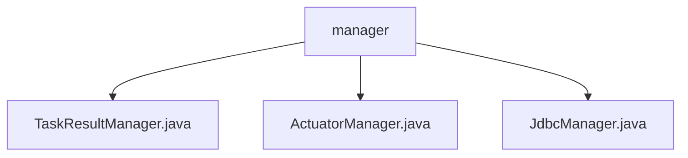

# Basic Information

|      |      |
|------|------|
| Name | manager |
| Language | .java |
| Code Path | WeFe/fusion/fusion-service/src/main/java/com/welab/wefe/data/fusion/service/manager |
| Package Name | docs.fusion.fusion-service.src.main.java.com.welab.wefe.data.fusion.service.manager |
| Brief Description | The TaskResultManager manages task result data, supporting table creation, insertion, and batch saving. The ActuatorManager manages task actuators, providing thread-safe task and Bloom filter operations. The JdbcManager is a deprecated JDBC utility class that supports multiple database connections and queries. |

# Description

## Overview  
The core responsibilities of this module are to provide task result management, actuator management, and database connection capabilities, supporting data storage, task tracking, and multi-database operations. The interface specifications include: TaskResultManager dynamically generates table names based on business IDs and delegates storage services to manipulate data; ActuatorManager uses thread-safe containers to manage task states; JdbcManager provides multiple database connection capabilities. Key data structures include ConcurrentHashMap for storing task mappings, Bloom filters, and table name prefix constants. External dependencies involve Launcher services, TaskService, Config, and Hive/MySQL/Impala drivers. For example, TaskResultManager dynamically creates tables using the "prefix + business ID" pattern.

## Primary Business Scenarios  
The module supports full lifecycle task management, resembling a factory assembly line model: TaskResultManager handles result storage, ActuatorManager monitors execution states, and JdbcManager (deprecated) provides data querying. Typical workflows include creating task result tables, batch-saving data, and tracking task progress via Bloom filters. The interaction model is thread-safe by design, such as ActuatorManager using ConcurrentHashMap to ensure atomicity in task operations. Functionality covers data storage (e.g., Hive table operations), task monitoring (e.g., progress queries), and cross-database queries (e.g., stream reading). For example, the dashboard method in ActuatorManager can aggregate the statuses of all tasks.

### Package Internal Structure View

This flowchart illustrates three Java files under the manager directory: TaskResultManager.java, ActuatorManager.java, and JdbcManager.java. All three files are directly subordinate to the manager directory with no deeper nesting relationships, belonging to the same level of management class files.

# File List

| Name   | Type  | Description |
|-------|------|-------------|
| [TaskResultManager.java](TaskResultManager.md) | file | The TaskResultManager class is used to manage task result tables, providing functionalities such as table creation, data insertion, and batch saving. The table name format is task_result_ followed by the business ID. |
| [ActuatorManager.java](ActuatorManager.md) | file | The ActuatorManager class manages tasks and Bloom filters, providing CRUD functionality, supporting task status queries and dashboard display, and includes concurrency control and IP retrieval methods. |
| [JdbcManager.java](JdbcManager.md) | file | Deprecated JdbcManager class, providing functionalities such as database connection, query testing, data traversal reading, and column name retrieval. Supports Hive, MySQL, and Impala, including exception handling and resource closure. |

