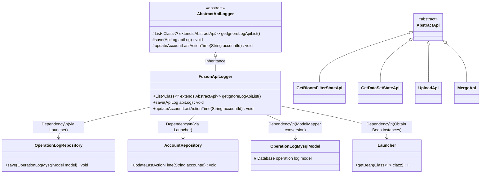
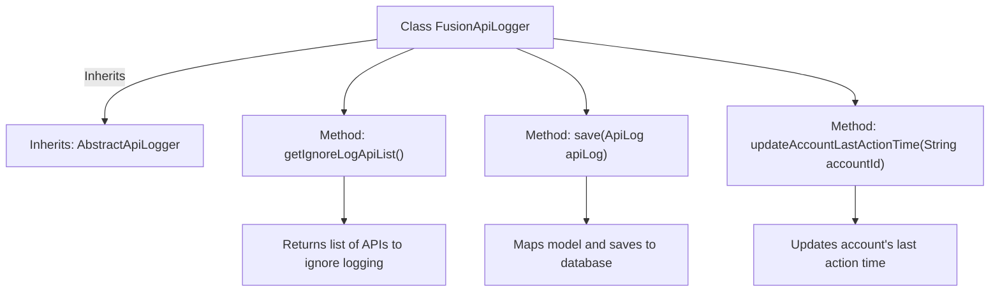

# Basic Information

|      |      |
|------|------|
| Name | FusionApiLogger |
| Language | .java |
| Code Path | WeFe/fusion/fusion-service/src/main/java/com/welab/wefe/data/fusion/service/operation/FusionApiLogger.java |
| Package Name | com.welab.wefe.data.fusion.service.operation |
| Dependencies | ['com.welab.wefe.common.web.Launcher', 'com.welab.wefe.common.web.api.base.AbstractApi', 'com.welab.wefe.common.web.delegate.api_log.AbstractApiLogger', 'com.welab.wefe.common.web.delegate.api_log.ApiLog', 'com.welab.wefe.common.web.util.ModelMapper', 'com.welab.wefe.data.fusion.service.api.bloomfilter.GetBloomFilterStateApi', 'com.welab.wefe.data.fusion.service.api.dataset.GetDataSetStateApi', 'com.welab.wefe.data.fusion.service.api.file.MergeApi', 'com.welab.wefe.data.fusion.service.api.file.UploadApi', 'com.welab.wefe.data.fusion.service.database.entity.OperationLogMysqlModel', 'com.welab.wefe.data.fusion.service.database.repository.AccountRepository', 'com.welab.wefe.data.fusion.service.database.repository.OperationLogRepository', 'org.springframework.stereotype.Component', 'java.util.Arrays', 'java.util.List'] |
| Brief Description | FusionApiLogger inherits from AbstractApiLogger, ignores logs for specific APIs, saves logs to the database, and updates the account's last operation time. |

# Description

FusionApiLogger is a component class that inherits from AbstractApiLogger, primarily used for recording API logs. It defines a list of APIs to be excluded from logging via the getIgnoreLogApiList method, including GetBloomFilterStateApi, GetDataSetStateApi, UploadApi, and MergeApi. The save method is responsible for mapping API logs to OperationLogMysqlModel and storing them in the database. The updateAccountLastActionTime method updates the last action time of a specified account. This class obtains the required Repository instances through Launcher to perform data operations.

# Class Summary

| Name   | Type  | Description |
|-------|------|-------------|
| FusionApiLogger | class | FusionApiLogger extends AbstractApiLogger, ignores logs for specific APIs, saves logs to the database, and updates the account's last operation time. |

## Class FusionApiLogger

|      |      |
|------|------|
| Access Modifier | @Component;public |
| Type | class |
| Name | FusionApiLogger |
| Description | FusionApiLogger extends AbstractApiLogger, ignores logs for specific APIs, saves logs to the database, and updates the account's last operation time. |

### UML Class Diagram

Class diagram description: This diagram illustrates that FusionApiLogger inherits from the abstract class AbstractApiLogger, implementing three core functionalities: log filtering, saving, and account update time tracking. It dynamically obtains instances of OperationLogRepository and AccountRepository through Launcher, utilizing ModelMapper for model conversion. The diagram includes four API classes (inheriting from AbstractApi) excluded from logging, demonstrating the extensibility of the logging system and its dependency management mechanism.

### Internal Method Call Graph

This flowchart illustrates the structure and key methods of the FusionApiLogger class. The class inherits from AbstractApiLogger and contains three core methods: getIgnoreLogApiList() returns a list of API classes to exclude from logging, save() maps API logs to database models for storage, and updateAccountLastActionTime() updates the last action time for specified accounts. Each method clearly demonstrates its functionality and internal workflow, reflecting the core logic of logging and account management.

### Field List

| Name  | Type  | Description |
|-------|-------|------|

### Method List

| Name  | Type  | Description |
|-------|-------|------|
| save | void | This method overrides save, mapping ApiLog to OperationLogMysqlModel and storing it in the database. |
| getIgnoreLogApiList | List<Class<? extends AbstractApi>> | The method returns a list of API classes that ignore logs, including GetBloomFilterStateApi, GetDataSetStateApi, UploadApi, and MergeApi. |
| updateAccountLastActionTime | void | Rewrite the method to update the last operation time of a specified account via AccountRepository. |

