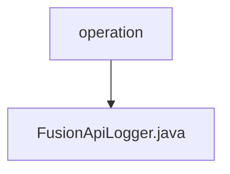

# Basic Information

|      |      |
|------|------|
| Name | operation |
| Language | .java |
| Code Path | WeFe/fusion/fusion-service/src/main/java/com/welab/wefe/data/fusion/service/operation |
| Package Name | docs.fusion.fusion-service.src.main.java.com.welab.wefe.data.fusion.service.operation |
| Brief Description | FusionApiLogger inherits from AbstractApiLogger, ignores logs for specific APIs, saves logs to the database, and updates the account's last operation time. |

# Description

FusionApiLogger is a component class that inherits from AbstractApiLogger, primarily used for recording API logs. It defines a list of APIs to be excluded from logging via the getIgnoreLogApiList method, including GetBloomFilterStateApi, GetDataSetStateApi, UploadApi, and MergeApi. The save method is responsible for mapping API logs to OperationLogMysqlModel and storing them in the database. The updateAccountLastActionTime method updates the last action time of a specified account. This class obtains the required Repository instances through Launcher to perform data operations.

### Package Internal Structure View

This flowchart illustrates the Java code structure of the fusion-service module in the WeFe project. The "operation" serves as the parent directory, containing a single child file, FusionApiLogger.java. This represents a typical single-file directory structure, indicating that the operation directory currently only includes one Java class file related to logging.

# File List

| Name   | Type  | Description |
|-------|------|-------------|
| [FusionApiLogger.java](FusionApiLogger.md) | file | FusionApiLogger inherits from AbstractApiLogger, ignores logs for specific APIs, saves logs to the database, and updates the account's last operation time. |

