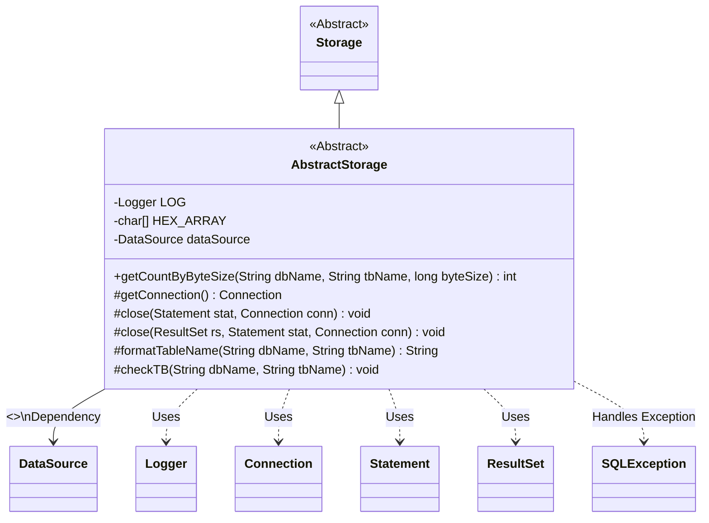
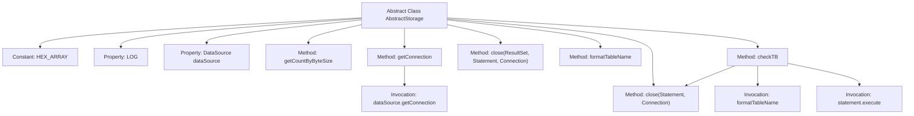

# Basic Information

|      |      |
|------|------|
| Name | AbstractStorage |
| Language | .java |
| Code Path | WeFe/fusion/fusion-service/src/main/java/com/welab/wefe/data/fusion/service/repo/AbstractStorage.java |
| Package Name | com.welab.wefe.data.fusion.service.repo |
| Dependencies | ['org.slf4j.Logger', 'org.slf4j.LoggerFactory', 'org.springframework.beans.factory.annotation.Autowired', 'org.springframework.beans.factory.annotation.Qualifier', 'javax.sql.DataSource', 'java.sql'] |
| Brief Description | The abstract class `AbstractStorage` inherits from `Storage`, incorporating logging and data source configuration. It provides functionalities for node computation, connection management, resource release, and table name formatting, while also supporting table creation checks. |

# Description

This is an abstract class named AbstractStorage, which inherits from the Storage class. It includes a logger, a hexadecimal character array, and an injected DataSource object. Its main functionalities consist of: calculating the number of nodes based on byte size (fixed return value of 1000), obtaining database connections, releasing resources (closing ResultSet, Statement, and Connection), formatting table names (adding backticks), and checking and creating tables (using the MergeTree engine with fields such as eventDate, k, v, and id, partitioned by date and sorted by id). All database operations incorporate exception handling and resource release logic.

# Class Summary

| Name   | Type  | Description |
|-------|------|-------------|
| AbstractStorage | class | The abstract class `AbstractStorage` inherits from `Storage`, incorporating logging, data source configuration, and providing functionalities for node computation, database connection management, resource release, and table name formatting, with support for table creation checks. |

## Class AbstractStorage

|      |      |
|------|------|
| Access Modifier | public abstract |
| Type | class |
| Name | AbstractStorage |
| Description | The abstract class `AbstractStorage` inherits from `Storage`, incorporating logging, data source configuration, and providing functionalities for node computation, database connection management, resource release, and table name formatting, with support for table creation checks. |

### UML Class Diagram

Class diagram description: AbstractStorage is an abstract subclass of Storage, primarily providing foundational functionalities for database connection management, resource release, and table operations. It includes an autowired protected DataSource dependency, a connection acquisition method getConnection(), two overloaded resource closing methods close(), a table name formatting method formatTableName(), and a table validation method checkTB(). It logs via Logger, handles SQLException, and interacts with core JDBC interfaces (Connection/Statement/ResultSet).

### Internal Method Call Graph

This code illustrates an abstract class AbstractStorage, inherited from the Storage class, primarily used for database storage operations. It encompasses functionalities such as database connection management, resource release, table name formatting, and table verification. Core methods include obtaining database connections (getConnection), two resource closing methods (close), and table verification (checkTB). The class injects DataSource via @Autowired, utilizes the constant HEX_ARRAY and logger LOG, embodying fundamental encapsulation of database operations and exception handling mechanisms.

### Field List

| Name  | Type  | Description |
|-------|-------|------|
| HEX_ARRAY = "0123456789ABCDEF".toCharArray() | char[] | Define a static character array HEX_ARRAY containing hexadecimal characters 0-9 and A-F. |
| LOG = LoggerFactory.getLogger(this.getClass()) | Logger | A protected final log object LOG is defined in the class, initialized with the current class for logging purposes. |
| dataSource | DataSource | Use @Qualifier to specify the "fusion" data source and automatically inject the DataSource object via @Autowired. |

### Method List

| Name  | Type  | Description |
|-------|-------|------|
| close | void | Close the database connection and statement objects, handling any potential SQL exceptions. |
| checkTB | void | The method `checkTB` is used to check and create a table, with the table structure including the fields `eventDate`, `k`, `v`, and `id`. It uses the MergeTree engine, partitions by `eventDate`, and sorts by `id`, finally closing the connection. |
| close | void | Method for closing database resources: Close ResultSet, Statement, and Connection in sequence, catch and print SQLException. |
| formatTableName | String | This method is used to format database table names, returning a string in the format `database_name`.`table_name`. |
| getConnection | Connection | Methods for obtaining a database connection attempt to acquire a connection from the data source, catch and print SQL exceptions, and finally return the connection object. |
| getCountByByteSize | int | The method getCountByByteSize returns a fixed value of 1000 based on the database name, table name, and byte size, and may throw an exception. |

