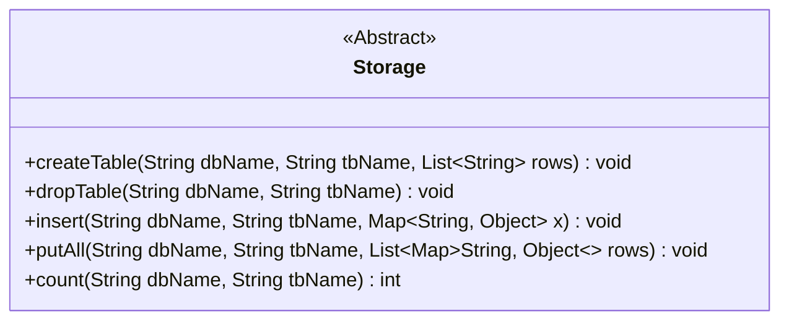
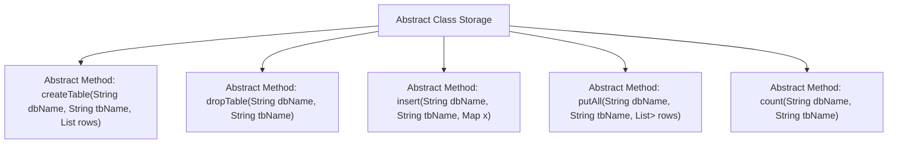

# Basic Information

|      |      |
|------|------|
| Name | Storage |
| Language | .java |
| Code Path | WeFe/fusion/fusion-service/src/main/java/com/welab/wefe/data/fusion/service/repo/Storage.java |
| Package Name | com.welab.wefe.data.fusion.service.repo |
| Dependencies | ['java.util.List', 'java.util.Map'] |
| Brief Description | The abstract class Storage defines the database operation interfaces, including creating tables, deleting tables, inserting data, batch inserting data, and data statistics functions. |

# Description

This is an abstract class named Storage, which defines abstract methods for local storage operations. It includes functionalities such as creating tables, deleting tables, inserting single data entries, batch inserting data, and counting data entries. All methods require parameters for the database name and table name, while some methods need additional parameters such as column definitions or data content. Operations may throw exceptions, with specific implementations to be completed by subclasses.

# Class Summary

| Name   | Type  | Description |
|-------|------|-------------|
| Storage | class | The abstract class Storage defines the interface for database operations, including methods such as creating tables, deleting tables, inserting data, and counting records. |

## Class Storage

|      |      |
|------|------|
| Access Modifier | public abstract |
| Type | class |
| Name | Storage |
| Description | The abstract class Storage defines the interface for database operations, including methods such as creating tables, deleting tables, inserting data, and counting records. |

### UML Class Diagram

This code defines an abstract class named Storage, which provides fundamental abstract methods for database table operations. The class contains five core methods: createTable for creating tables, dropTable for deleting tables, insert for inserting single records, putAll for batch data insertion, and count for retrieving record counts. All methods accept dbName and tbName parameters to specify the database and table, and may throw exceptions. This abstract class requires implementation by subclasses, with concrete implementations determining the underlying storage type (such as relational databases, NoSQL, or file systems). The <<Abstract>> marker in the class diagram denotes its abstract nature, while generic parameters clearly illustrate the structure of collection types.

### Internal Method Call Graph

This flowchart illustrates the structure of the abstract class Storage and its five core abstract methods. Serving as an abstract base class for data storage, the Storage class defines fundamental operation interfaces including table creation (createTable), table deletion (dropTable), data insertion (insert), batch insertion (putAll), and data counting (count). Each method accepts database name (dbName) and table name (tbName) as parameters, with some methods additionally involving row data (rows) or key-value pair data (Map). These abstract methods require implementation by concrete subclasses, providing a unified operational specification for different types of storage systems.

### Field List

| Name  | Type  | Description |
|-------|-------|------|

### Method List

| Name  | Type  | Description |
|-------|-------|------|
| putAll | void | Abstract method: Batch insert data into the specified database table, with parameters including database name, table name, and a list of data rows, may throw exceptions. |
| count | int | Abstract method `count`, which takes a database name and table name as input, returns an integer result, and may throw exceptions. |
| insert | void | Abstract method `insert`, used to insert data into a specified database table, with parameters including the database name, table name, and data mapping, which may throw exceptions. |
| dropTable | void | Abstract method `dropTable`, used to delete a specified table in a database, with parameters `dbName` and `tbName`, may throw exceptions. |
| createTable | void | Abstract method `createTable`: Creates a table `tbName` in the specified database `dbName`, with the table structure defined by `rows`. May throw exceptions. |

