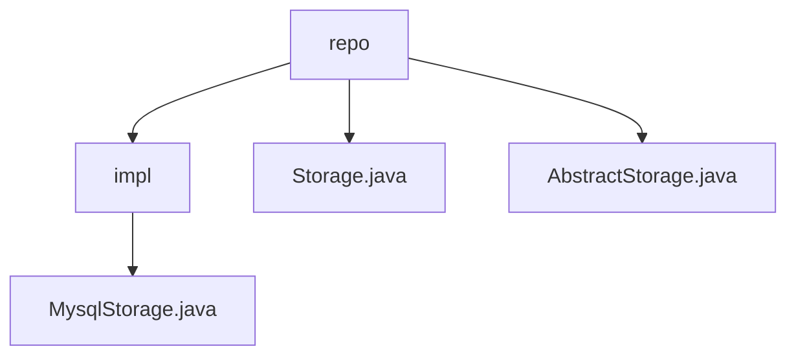

# Basic Information

|      |      |
|------|------|
| Name | repo |
| Language | .java |
| Code Path | WeFe/fusion/fusion-service/src/main/java/com/welab/wefe/data/fusion/service/repo |
| Package Name | docs.fusion.fusion-service.src.main.java.com.welab.wefe.data.fusion.service.repo |
| Brief Description | MysqlStorage inherits from AbstractStorage, implementing MySQL operations: table creation, table deletion, insertion, batch insertion, and counting, including exception handling and connection pool management. Storage defines abstract storage methods, while AbstractStorage extends functionality and implements resource management. |

# Description

## Overview  
This module implements a hierarchical storage system, with its core responsibility being to provide a unified abstraction for database operations, supporting CRUD functionalities for both MySQL and MergeTree engines. The interface specifications include creating/deleting tables, data insertion (single/batch), and count queries, all of which require passing database and table name parameters. Key data structures include the MergeTree engine table schema (with fields such as eventDate, k, v, and id) and the DataSource managed by the connection pool. External dependencies are limited to the MySQL driver and connection pool. For example, MysqlStorage implements injection prevention through precompiled SQL, while AbstractStorage incorporates table name formatting logic.

## Main Business Scenarios  
The module adopts the template method pattern, where abstract classes define the workflow and subclasses implement the details, similar to the layered driver design of JDBC. Typical scenarios include: creating partitioned tables during initialization (e.g., MergeTree engine partitioned by date), efficient batch data import (leveraging batch processing to improve throughput), and executing lightweight statistical queries. The interaction mode uniformly acquires connections through DataSource, with all operations strictly adhering to the "acquire-execute-release" resource lifecycle. For example, the putAll method of MysqlStorage wraps batch inserts in transactions to ensure data consistency.

### Package Internal Structure View

This flowchart illustrates the storage-related code structure in the data fusion service. The repo directory contains the abstract storage class (AbstractStorage.java), storage interface (Storage.java), and implementation subdirectory (impl). The impl directory includes the concrete MySQL storage implementation (MysqlStorage.java), demonstrating a clear layered architecture of interface-abstract class-concrete implementation.

# File List

| Name   | Type  | Description |
|-------|------|-------------|
| [Storage.java](Storage.md) | file | The abstract class Storage defines database operation interfaces, including creating tables, deleting tables, inserting data, batch insertion, and data statistics functions. |
| [AbstractStorage.java](AbstractStorage.md) | file | The abstract class `AbstractStorage` inherits from `Storage`, incorporating logging and data source configuration. It provides functionalities for node computation, connection management, resource release, and table name formatting, while supporting table creation checks. |
| [impl](impl/_module.md) | package | The MysqlStorage class inherits from AbstractStorage, implementing functionalities such as creating tables, deleting tables, inserting data, batch insertion, and data counting. It utilizes JDBC to operate MySQL databases and includes exception handling and resource closure. |

