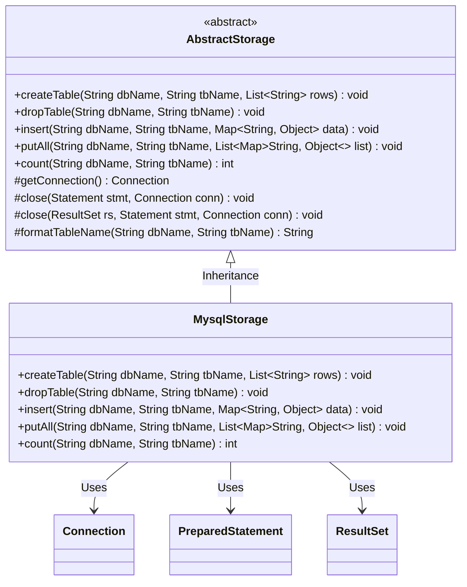
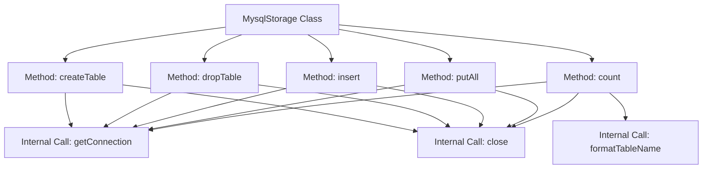

# Basic Information

|      |      |
|------|------|
| Name | MysqlStorage |
| Language | .java |
| Code Path | WeFe/fusion/fusion-service/src/main/java/com/welab/wefe/data/fusion/service/repo/impl/MysqlStorage.java |
| Package Name | com.welab.wefe.data.fusion.service.repo.impl |
| Dependencies | ['com.welab.wefe.data.fusion.service.repo.AbstractStorage', 'org.springframework.stereotype.Component', 'java.sql.Connection', 'java.sql.PreparedStatement', 'java.sql.ResultSet', 'java.util.ArrayList', 'java.util.List', 'java.util.Map'] |
| Brief Description | The MysqlStorage class inherits from AbstractStorage and implements functionalities for creating tables, deleting tables, inserting data, batch insertion, and data counting. It utilizes JDBC to operate MySQL databases and includes exception handling and resource closure. |

# Description

The code defines a component class named `MysqlStorage`, which inherits from `AbstractStorage` and implements basic MySQL database operations. Key functionalities include:  
- **createTable**: Generates a `CREATE TABLE` statement by concatenating field names.  
- **dropTable**: Executes a `DROP TABLE` statement.  
- **insert**: Constructs an `INSERT` statement using prepared parameters for single-data insertion.  
- **putAll**: Improves efficiency via batch processing for bulk data insertion.  
- **count**: Executes a `COUNT` query to tally table records.  

All operations include exception handling and resource cleanup logic, utilize connection pooling for database connections, and support transaction control.

# Class Summary

| Name   | Type  | Description |
|-------|------|-------------|
| MysqlStorage | class | The MysqlStorage class implements database table operations, including creating tables, dropping tables, inserting data, batch inserting, and counting functionality, using JDBC to connect to MySQL and handle exceptions. |

## Class MysqlStorage

|      |      |
|------|------|
| Access Modifier | @Component;public |
| Type | class |
| Name | MysqlStorage |
| Description | The MysqlStorage class implements database table operations, including creating tables, dropping tables, inserting data, batch inserting, and counting functionality, using JDBC to connect to MySQL and handle exceptions. |

### UML Class Diagram

This code demonstrates a MySQL database storage implementation class MysqlStorage, which inherits from the abstract class AbstractStorage. Key functionalities include creating tables, dropping tables, inserting single records, batch inserting data, and counting records. The class diagram clearly illustrates the inheritance relationship and dependencies on core JDBC classes (Connection/PreparedStatement/ResultSet). All database operations follow the standard workflow: obtain connection -> execute SQL -> close resources, with prepared statements used to prevent SQL injection. Batch operations employ transactions to ensure data consistency, reflecting sound database operation practices.

### Internal Method Call Graph

This code demonstrates a MySQL storage class that inherits from an abstract storage class and implements database operations such as creating tables, dropping tables, inserting data, batch insertion, and counting. Each method follows the workflow of obtaining a connection, executing SQL, handling exceptions, and closing resources, reflecting the complete lifecycle of database operations and resource management mechanisms. Core methods dynamically generate SQL statements through string concatenation and use prepared statements to prevent SQL injection.

### Field List

| Name  | Type  | Description |
|-------|-------|------|

### Method List

| Name  | Type  | Description |
|-------|-------|------|
| insert | void | Java method implementation for database insertion operation, which receives table name and data Map, constructs SQL statement and executes batch insertion, uses transaction to ensure data consistency, and finally closes the connection. |
| count | int | This method is used to count the number of records in a specified database table by executing an SQL query, and it closes the relevant resources upon completion. |
| dropTable | void | Java Method: Delete a specified table via JDBC, catch exceptions and log them, then finally close the connection. |
| putAll | void | The method `putAll` performs batch insertion of data into a specified database table, handles empty lists, constructs SQL statements, and improves efficiency using prepared statements and batch processing, finally committing the transaction and closing the connection. |
| createTable | void | The method `createTable` is used to create a table in the specified database. It accepts the table name and a list of fields, generates and executes the SQL, handles exceptions, and closes the connection. |

