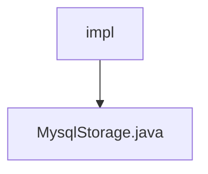

# Basic Information

|      |      |
|------|------|
| Name | impl |
| Language | .java |
| Code Path | WeFe/fusion/fusion-service/src/main/java/com/welab/wefe/data/fusion/service/repo/impl |
| Package Name | docs.fusion.fusion-service.src.main.java.com.welab.wefe.data.fusion.service.repo.impl |
| Brief Description | The MysqlStorage class inherits from AbstractStorage, implementing functionalities such as creating tables, deleting tables, inserting data, batch insertion, and data counting. It utilizes JDBC to operate MySQL databases and includes exception handling and resource closure. |

# Description

The code defines a component class named `MysqlStorage`, which inherits from `AbstractStorage` and implements basic MySQL database operations. Key functionalities include:  
- **createTable**: Generates a CREATE TABLE statement by concatenating field names.  
- **dropTable**: Executes a DROP TABLE statement.  
- **insert**: Constructs an INSERT statement with prepared parameters for single-data insertion.  
- **putAll**: Performs batch insertion for improved efficiency.  
- **count**: Executes a COUNT query to tally table records.  

All operations incorporate exception handling and resource cleanup logic. Database connections are managed via a connection pool, with support for transaction control.

### Package Internal Structure View

This flowchart illustrates the storage implementation structure of the fusion-service module in the WeFe project. The `impl` folder serves as the root node, containing a specific database storage implementation file `MysqlStorage.java`. This structure exemplifies a typical repository layer implementation pattern, where the `impl` directory houses concrete storage implementation classes, and `MysqlStorage.java` is the specific implementation class for the MySQL database.

# File List

| Name   | Type  | Description |
|-------|------|-------------|
| [MysqlStorage.java](MysqlStorage.md) | file | The MysqlStorage class inherits from AbstractStorage, implementing functionalities such as creating tables, dropping tables, inserting data, batch inserting, and data counting. It utilizes JDBC to operate MySQL databases, incorporating exception handling and resource closure. |

