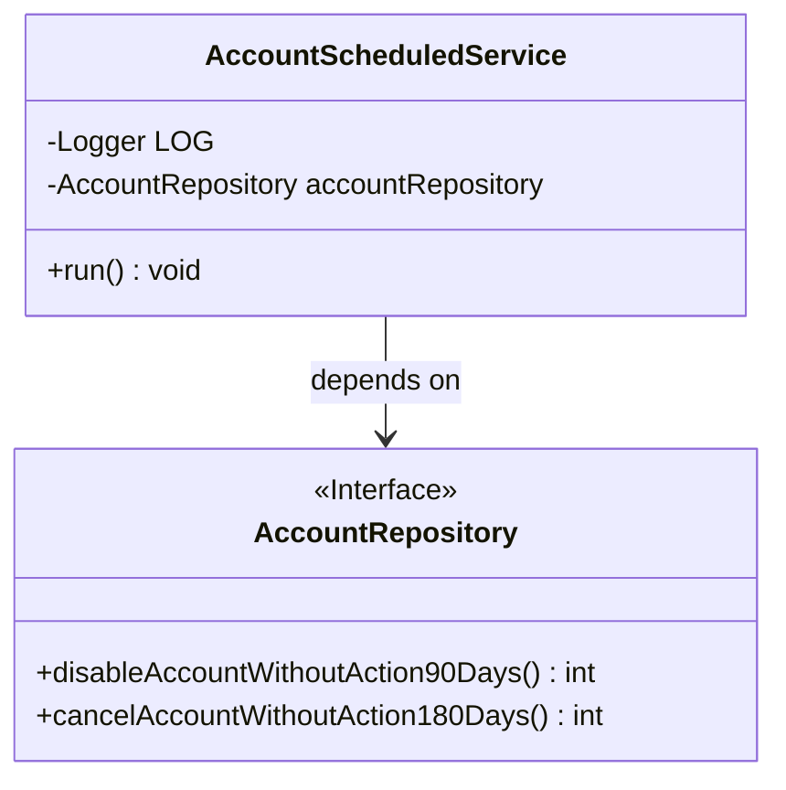
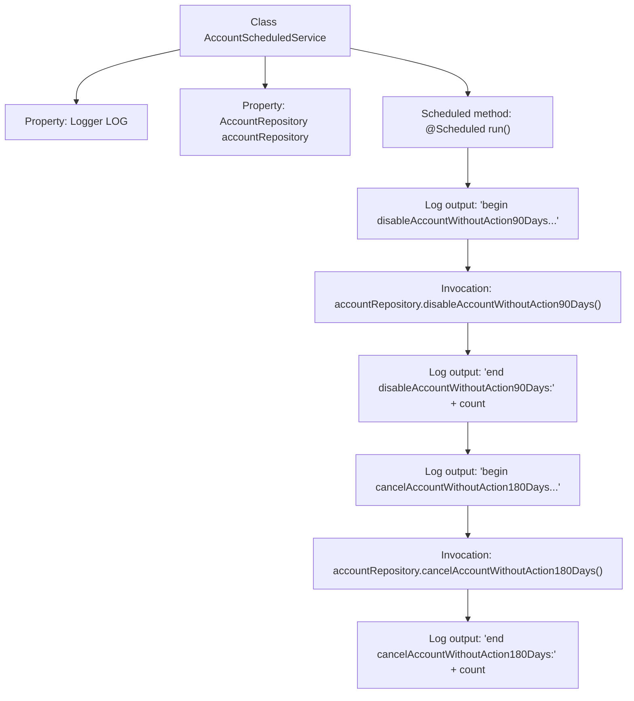

# Basic Information

|      |      |
|------|------|
| Name | AccountScheduledService |
| Language | .java |
| Code Path | WeFe/fusion/fusion-service/src/main/java/com/welab/wefe/data/fusion/service/scheduled/AccountScheduledService.java |
| Package Name | com.welab.wefe.data.fusion.service.scheduled |
| Dependencies | ['com.welab.wefe.data.fusion.service.database.repository.AccountRepository', 'org.slf4j.Logger', 'org.slf4j.LoggerFactory', 'org.springframework.beans.factory.annotation.Autowired', 'org.springframework.context.annotation.Lazy', 'org.springframework.scheduling.annotation.Scheduled', 'org.springframework.stereotype.Component'] |
| Brief Description | The AccountScheduledService scheduled task class runs every 10 minutes, automatically disabling accounts inactive for 90 days and deleting accounts inactive for 180 days, while logging the operations. |

# Description

This is a Spring component class named AccountScheduledService, designed to execute scheduled tasks. The class is marked for non-lazy initialization and contains an auto-wired AccountRepository instance. Two scheduled tasks are configured via the @Scheduled annotation: one executes 10 seconds after startup and subsequently every 10 minutes, while the other (commented-out configuration) is a test plan with a 5-second interval. Its primary function is to periodically check and process long-inactive accounts: first disabling accounts inactive for 90 days, then deactivating those inactive for 180 days. All operations log start/end statuses and count processed records.

# Class Summary

| Name   | Type  | Description |
|-------|------|-------------|
| AccountScheduledService | class | The scheduled task class AccountScheduledService, non-lazy loaded, executes every 10 minutes, automatically disabling accounts inactive for 90 days and deactivating accounts inactive for 180 days. |

## Class AccountScheduledService

|      |      |
|------|------|
| Access Modifier | @Component;@Lazy(false);public |
| Type | class |
| Name | AccountScheduledService |
| Description | The scheduled task class AccountScheduledService, non-lazy loaded, executes every 10 minutes, automatically disabling accounts inactive for 90 days and deactivating accounts inactive for 180 days. |

### UML Class Diagram

Class diagram description: This diagram illustrates the relationship between the AccountScheduledService class and the AccountRepository interface. AccountScheduledService is a Spring component containing a scheduled task method run(), which utilizes the AccountRepository interface through dependency injection to perform account deactivation and cancellation operations. As an interface, AccountRepository defines concrete database operation methods, embodying the Dependency Inversion Principle.

### Internal Method Call Graph

This code demonstrates a Spring scheduled task class AccountScheduledService, which implements regular account cleanup tasks through the @Scheduled annotation. The flowchart clearly depicts the execution sequence: first logging the start, invoking the 90-day inactive account disable method and recording results, then executing the 180-day inactive account cancellation method and logging results. The entire process outputs detailed execution logs via Logger for monitoring task execution status.

### Field List

| Name  | Type  | Description |
|-------|-------|------|
| LOG = LoggerFactory.getLogger(this.getClass()) | Logger | Define the logger instance of the current class for outputting log information. |
| accountRepository | AccountRepository | Using @Autowired to automatically inject an instance of AccountRepository. |

### Method List

| Name  | Type  | Description |
|-------|-------|------|
| run | void | Scheduled task: Starts every 10 seconds, executes every 600 seconds. Function: Disables inactive accounts for 90 days, deletes inactive accounts for 180 days, and logs the execution count. |

