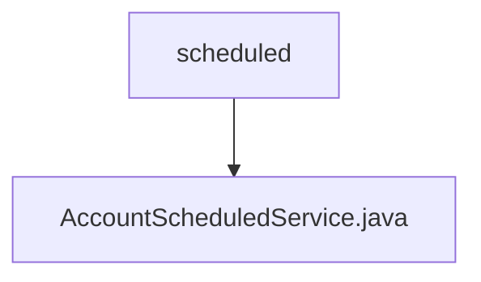

# Basic Information

|      |      |
|------|------|
| Name | scheduled |
| Language | .java |
| Code Path | WeFe/fusion/fusion-service/src/main/java/com/welab/wefe/data/fusion/service/scheduled |
| Package Name | docs.fusion.fusion-service.src.main.java.com.welab.wefe.data.fusion.service.scheduled |
| Brief Description | The AccountScheduledService scheduled task class runs every 10 minutes, automatically disabling accounts inactive for 90 days and deleting those inactive for 180 days, with logs recorded. |

# Description

This is a Spring component class named AccountScheduledService, designed for executing scheduled tasks. The class is marked for non-lazy initialization and contains an auto-wired AccountRepository instance. Two scheduled tasks are configured via the @Scheduled annotation: one executes 10 seconds after startup and subsequently every 10 minutes, while the other (commented out) is a test configuration with a 5-second interval. Its primary function is to periodically check and process inactive accounts: first disabling those inactive for 90 days, then deleting those inactive for 180 days. All operations log their start/end statuses and count the number of processed accounts.

### Package Internal Structure View

This flowchart illustrates the hierarchical relationship between the scheduled directory and the AccountScheduledService.java file in the WeFe project. The parent node "scheduled" contains a child node "AccountScheduledService.java", indicating a simple structure where this scheduled task service class file resides under the scheduled directory.

# File List

| Name   | Type  | Description |
|-------|------|-------------|
| [AccountScheduledService.java](AccountScheduledService.md) | file | The AccountScheduledService scheduled task class runs every 10 minutes, automatically disabling accounts inactive for 90 days and deactivating accounts inactive for 180 days, while logging the actions. |

