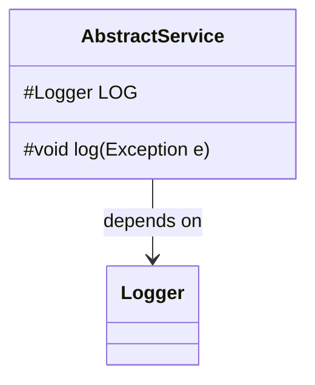
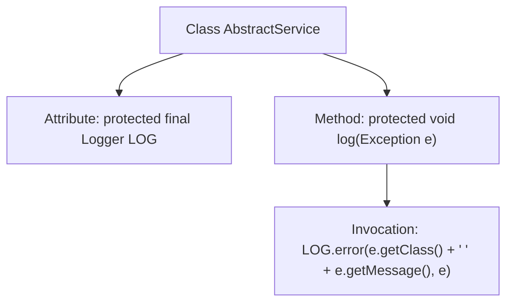

# Basic Information

|      |      |
|------|------|
| Name | AbstractService |
| Language | .java |
| Code Path | WeFe/fusion/fusion-service/src/main/java/com/welab/wefe/data/fusion/service/service/AbstractService.java |
| Package Name | com.welab.wefe.data.fusion.service.service |
| Dependencies | ['org.slf4j.Logger', 'org.slf4j.LoggerFactory'] |
| Brief Description | Abstract service classes provide logging functionality, including a logger object and exception logging methods. |

# Description

This is an abstract class named AbstractService, which consists of two core components: a protected and immutable Logger instance initialized with the current class name, and a protected log method for unified exception logging. The method logs the exception type, exception message, and outputs the complete exception stack trace to the error log. This design provides reusable logging functionality, making it convenient for subclasses to inherit and use.

# Class Summary

| Name   | Type  | Description |
|-------|------|-------------|
| AbstractService | class | Abstract service classes provide logging functionality, including protected log objects and exception logging methods. |

## Class AbstractService

|      |      |
|------|------|
| Access Modifier | public |
| Type | class |
| Name | AbstractService |
| Description | Abstract service classes provide logging functionality, including protected log objects and exception logging methods. |

### UML Class Diagram

This code demonstrates an abstract service class AbstractService, which contains a protected Logger member and a method for logging exceptions. The class diagram clearly illustrates the class structure, where the LOG field is marked with # to indicate protected modifier, and the log method is similarly designated as protected. A dependency relationship exists between AbstractService and Logger, indicating that this class requires Logger's functionality for logging purposes. This design is commonly used as a base class for other service classes to provide unified exception logging capabilities.

### Internal Method Call Graph

This flowchart illustrates the structure of the AbstractService class, which includes a protected Logger attribute and an exception logging method. During class initialization, the Logger instance corresponding to the current class is dynamically obtained via LoggerFactory.getLogger. The log method encapsulates unified exception handling logic, invoking LOG.error to output the exception type, message, and complete stack trace. This design achieves log functionality reuse, allowing subclasses to inherit and utilize a consistent error recording approach.

### Field List

| Name  | Type  | Description |
|-------|-------|------|
| LOG = LoggerFactory.getLogger(this.getClass()) | Logger | Define the logger instance of the current class with `protected` modifier to ensure accessibility by subclasses, and `final` to prevent modification. |

### Method List

| Name  | Type  | Description |
|-------|-------|------|
| log | void | This method is used to log exceptions, including the exception type and message, and outputs error-level logs through the logging system. |

