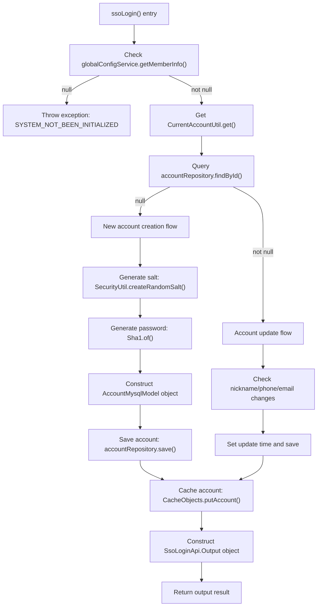

# Basic Information

|      |      |
|------|------|
| Name | AccountService |
| Language | .java |
| Code Path | WeFe/fusion/fusion-service/src/main/java/com/welab/wefe/data/fusion/service/service/AccountService.java |
| Package Name | com.welab.wefe.data.fusion.service.service |
| Dependencies | ['com.welab.wefe.common.SecurityUtil', 'com.welab.wefe.common.StatusCode', 'com.welab.wefe.common.exception.StatusCodeWithException', 'com.welab.wefe.common.util.Sha1', 'com.welab.wefe.common.util.StringUtil', 'com.welab.wefe.common.web.service.account.SsoAccountInfo', 'com.welab.wefe.common.web.util.CurrentAccountUtil', 'com.welab.wefe.common.wefe.enums.AuditStatus', 'com.welab.wefe.data.fusion.service.api.account.SsoLoginApi', 'com.welab.wefe.data.fusion.service.database.entity.AccountMysqlModel', 'com.welab.wefe.data.fusion.service.database.repository.AccountRepository', 'com.welab.wefe.data.fusion.service.service.globalconfig.GlobalConfigService', 'org.springframework.beans.factory.annotation.Autowired', 'org.springframework.stereotype.Service', 'java.util.Date', 'java.util.UUID'] |
| Brief Description | The AccountService handles SSO login, checks system initialization, queries or creates accounts, updates information, and returns login results. |

# Description

The `ssoLogin` method in the `AccountService` class implements the single sign-on functionality. It first checks whether the system is initialized, and throws an exception if not. After obtaining the current account information, if the account does not exist, it creates a new account with a random salt value and a SHA1-encrypted password, while initializing the account attributes. If the account exists, it checks and updates fields such as nickname, phone number, and email. Finally, it stores the account information in the cache and returns an output object containing the ID, token, phone number, and nickname.

# Class Summary

| Name   | Type  | Description |
|-------|------|-------------|
| AccountService | class | The AccountService handles SSO login, checks system initialization, queries or creates account information, updates necessary fields, and returns the login result. |


## Class AccountService

|      |      |
|------|------|
| Access Modifier | @Service;public |
| Type | class |
| Name | AccountService |
| Description | The AccountService handles SSO login, checks system initialization, queries or creates account information, updates necessary fields, and returns the login result. |


### UML Class Diagram

```mermaid
classDiagram
    class AccountService {
        -AccountRepository accountRepository
        -GlobalConfigService globalConfigService
        +ssoLogin() SsoLoginApi$Output
    }

    class AccountRepository {
        <<Interface>>
        +findById(Long id) Optional~AccountMysqlModel~
        +save(AccountMysqlModel entity) AccountMysqlModel
    }

    class GlobalConfigService {
        <<Interface>>
        +getMemberInfo() MemberInfo
    }

    class AccountMysqlModel {
        -Long id
        -String phoneNumber
        -String nickname
        -String email
        -String password
        -String salt
        -boolean superAdminRole
        -boolean adminRole
        -boolean enable
        -AuditStatus auditStatus
        -Date lastActionTime
        -Date updatedTime
        +setter/getter methods
    }

    class SsoAccountInfo {
        -Long id
        -String phoneNumber
        -String name
        -String email
        +getter methods
    }

    class SsoLoginApi$Output {
        -Long id
        -String token
        -String phoneNumber
        -String nickname
        +setter/getter methods
    }

    class CurrentAccountUtil {
        <<Utility>>
        +get() SsoAccountInfo
    }

    class CacheObjects {
        <<Utility>>
        +putAccount(AccountMysqlModel account) void
    }

    AccountService --> AccountRepository : depends
    AccountService --> GlobalConfigService : depends  
    AccountService --> CurrentAccountUtil : uses
    AccountService --> CacheObjects : uses
    AccountService ..> SsoLoginApi$Output : creates
    AccountRepository ..> AccountMysqlModel : operates
    GlobalConfigService ..> MemberInfo : returns
```

Class Diagram Description: This diagram illustrates the core class relationships of AccountService, which depends on AccountRepository and GlobalConfigService interfaces for data access, utilizes CurrentAccountUtil to retrieve current account information, and caches account data via CacheObjects. It primarily handles SSO login flow including account creation/update logic, ultimately returning SsoLoginApi.Output objects. The diagram contains 7 main classes/interfaces and 2 utility classes, clearly demonstrating typical dependency relationships in Spring service layer.


### Internal Method Call Graph



Flowchart description: This flowchart illustrates the complete execution flow of the ssoLogin() method in AccountService. It first checks the system initialization status, throwing an exception if uninitialized; then retrieves current account information and queries the database, branching into either new account creation flow (including salt generation, password hashing, and complete account object construction) or existing account update flow (checking and updating changed fields) based on query results; finally caches account data and constructs the return object. The process includes comprehensive exception handling and branching logic, covering all possible execution paths.

### Field List

| Name  | Type  | Description |
|-------|-------|------|
| accountRepository | AccountRepository | Using @Autowired to automatically inject an AccountRepository instance. |
| globalConfigService | GlobalConfigService | Using @Autowired to automatically inject an instance of GlobalConfigService. |

### Method List

| Name  | Type  | Description |
|-------|-------|------|
| ssoLogin | SsoLoginApi.Output | The method `ssoLogin` handles single sign-on: after checking system initialization, it retrieves or creates account information, updates necessary fields, and returns the login result. |


